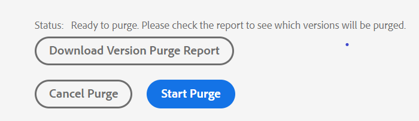
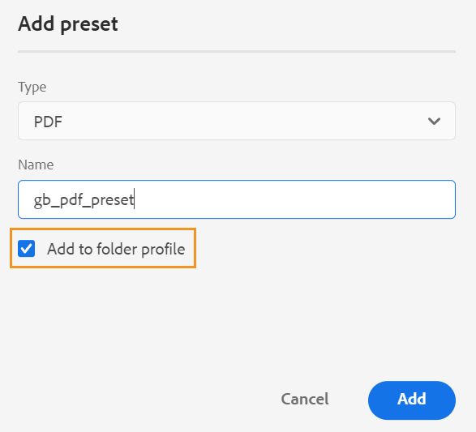

# Adobe Experience Manager Guidesas a Cloud Service11月版

## 升级到11月版

as a Cloud Service升级您当前的Adobe Experience Manager Guides(以后称为 *AEM Guidesas a Cloud Service*)进行设置：
1. 查看Cloud Service的Git代码，并切换到在Cloud Service管道中配置的与要升级的环境对应的分支。
1. 更新 `<dox.version>` 中的属性 `/dox/dox.installer/pom.xml` Cloud ServiceGit代码的文件更改为2022.11.198。
1. 提交更改并运行Cloud Service管道，以升级到AEM Guides的11月版本as a Cloud Service。

## 索引现有内容的步骤(仅当使用的版本早于9月份的AEM Guidesas a Cloud Service版本时)

执行以下步骤来索引现有内容，并在映射级别使用新的查找和替换文本：

* 对服务器运行POST请求（使用正确的身份验证） —  `http://<server:port>/bin/guides/map-find/indexing`.
(可选：您可以传递映射的特定路径来对其进行索引，默认情况下，所有映射都将进行索引 || 示例： `https://<Server:port>/bin/guides/map-find/indexing?paths=<map_path_in_repository>`)

* 该API将返回作业ID。 要检查作业的状态，可以将带有作业ID的GET请求发送到同一端点 —  `http://<server:port>/bin/guides/map-find/indexing?jobId={jobId}`
(例如：http://&lt;_localhost：8080_>/bin/guides/map-find/indexing？jobId=2022/9/15/7/27/7dfa1271-981e-4617-b5a4-c18379f11c42_678)

* 作业完成后，上述GET请求将做出成功响应，并提及是否有任何映射失败。 可以从服务器日志中确认已成功编制索引的映射。

## 兼容性矩阵

本部分列出了AEM Guides 2022年11月as a Cloud Service版本支持的软件应用程序的兼容性矩阵。

### FrameMaker和FrameMaker Publishing Server

| FMPS | FrameMaker |
| --- | --- |
| 不兼容 | 2020更新4及更高版本 |
| | |

*从2020.2开始的FMPS版本支持在AEM中创建的基线和条件。

### 氧气连接器

| AEM Guides即云版本 | 氧气连接器窗口 | 氧气连接器Mac | 在氧气窗口中编辑 | 在氧气Mac中编辑 |
| --- | --- | --- | --- | --- |
| 2022.11.0 | 2.7.13 | 2.7.13 | 2.3 | 2.3 |
|  |  |  |  |

## 新增功能和增强功能

AEM Guidesas a Cloud Service在11月版本中提供了增强功能和新增功能：

### 从存储库面板中删除文件

现在，您可以从以下位置轻松删除文件（一次删除一个文件）： **选项** 存储库面板中选定文件的菜单。

删除文件之前会显示确认提示。 如果文件未从任何其他文件引用，则会将其删除，并显示一条成功消息。

如果所选文件已签出，则无法删除该文件，并会显示一条错误消息。 如果所选文件已添加到收藏夹集合或引用自任何其他文件，AEM guides将检查您的确认，并为您提供强制删除它的选项。 如果删除了引用的主题并且打开了包含要编辑的引用的文件，则将显示被引用文件的断开链接。

**注意**：您也可以使用键盘的Delete键删除选定的文件。

### 清除所选的文件版本

在创建和维护内容时，可能会为存储库中的DITA文件创建多个版本。 AEM Guides允许您从存储库中清除旧版本的DITA文件并释放磁盘空间。

AEM Guides不会删除文件的第一个版本或基线中包含的版本，也不会为其应用标签。 清除操作甚至不会删除翻译或审阅工作流中包含的文件。 您可以选择要保留的版本数量，也可以决定删除早于定义天数的文件。

在开始清除操作之前，您可以预览报表以查看要清除的版本。 然后，您可以决定是启动还是取消清除操作。

清除操作完成后，您可以检查清除报表以查看已清除的文件。

### 管理全局和文件夹配置文件输出预设

AEM Guides为您提供了创建和管理“全局配置文件”和“文件夹配置文件”的输出预设的功能。 然后，您可以轻松地使用这些输出预设为与该全局或文件夹配置文件相关的所有映射生成输出。

**注意** 只有文件夹级别的管理用户可以创建全局和文件夹配置文件预设。

这些全局预设显示在 **输出** 选项卡。 您可以使用它们为所有相关映射生成输出。 您可以选择预设作为默认的PDF预设，以生成PDF输出。 您还可以 **编辑**， **重命名**， **复制**，或 **删除** 来自的现有输出预设 **选项** 菜单。

### 已将“版本标签”列添加到翻译仪表板

在翻译仪表板中，您还可以看到版本标签列。 这将显示源文件的选定版本的标签。 这可以帮助您选择具有特定标签的所有文件并一次性翻译它们。

### 本机PDF | 带有显示文档版本之间差异的更改条的PDF

现在，您可以使用更改栏创建一个PDF，以显示两个版本之间的内容差异。 您可以选择将当前版本与先前版本的基线进行比较，或者将两个选定的基线版本进行比较。

PDF中将显示一个更改栏，以指示已修改、已插入或删除的内容。 您还可以选择执行以下操作：
* 以绿色和带下划线的形式显示插入的内容
* 以红色显示删除的内容并标记删除线

### 本机PDF | 对输出路径和PDF文件名的变量支持

现在，您还可以使用以下现成的变量来定义输出路径和PDF文件。 您可以使用单个变量或变量组合来定义以下选项：
* `${map_filename}`
* `${map_title}`
* `${preset_name}`
* `${language_code}`
* `${map_parentpath}` （仅适用于输出路径）
* `${path_after_langfolder}` （仅适用于输出路径）

### 本机PDF | 为DITA映射生成目录并重新排序页面布局

现在还可以使用模板的高级PDF设置在DITA映射中生成目录。 您可以选择启用或禁用各种页面布局的显示，也可以重新排列它们的位置。

## 修复的问题

修复了多个区域中的错误如下：

* 本机PDF | `conkeyref` 不会在生成的PDF输出中解析。 (10564)
* 本机PDF | 访问PDF输出中的映射元数据时出现问题。 (10556)
* 本机PDF | 使用内联样式而不是类名生成标记。  (10498)
* Web编辑器间歇性地加载空白页。 (10678)
* 如果我们通过复制现有预设来创建预设，则PDF发布失败。 (10584)
* **查看日志** 预设的PDF生成失败时，按钮无法正常工作。 (10576)
* 预览中不会显示para标记内为conref的注释。 (10559)
* 在列表项末尾点击空格会删除整个列表。 (10540)
* 在使用本机PDF导出嵌套时 `<indexterm>` 未嵌套在索引中。 (10521)
* **自动缩进** 源视图中缺少工具栏中的按钮。 (10448)
* 在编辑器中创作列表时，列表项的第一个字符丢失。 (10447)
* 如果在基线编辑窗口中更改并保存了任何DITA资源版本，则会出现多个弹出窗口。 (10399)
* 单击时出现应用程序错误 **编辑** 按钮后，选择所有输出预设。 (10388)
* 从资产UI中执行复制粘贴操作时，不会保留DITA主题的自定义元数据。 (10367)
* 对于资产位于活动翻译项目中的整个语言文件夹，后处理将被阻止。 (10332)
* XML编辑器中的“模板”选项卡对文件夹配置文件管理员不可见。 (10266)
* 升级4.0后，Web编辑器中出现导航问题。 (10159)
* 在预览模式下不会显示SVG文件。 (10010)
* 如果编辑器的输出选项卡包含更多预设，则无法滚动预设部分，并且不会显示所有预设。 (9787)
* **编辑** 和 **批注** 图像选项在列视图中无法正常工作。 (8758)
* 对等链接未解析并在生成的输出中显示为普通文本。 (7774)
