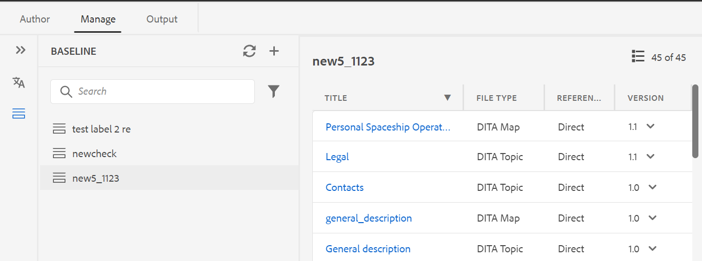
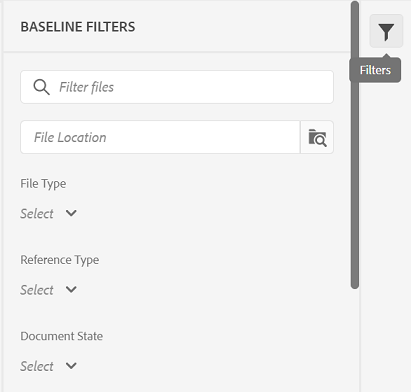

# 3月版的 [!DNL Adobe Experience Manager Guides] as a Cloud Service

## 升级到3月版

升级您当前的 [!DNL Adobe Experience Manager Guides] as a Cloud Service(以后称为 *[!DNL AEM Guides]as a Cloud Service*)进行设置：
1. 查看Cloud Service的Git代码，并切换到在Cloud Service管道中配置的与要升级的环境对应的分支。
1. 更新 `<dox.version>` 中的属性 `/dox/dox.installer/pom.xml` Cloud ServiceGit代码的文件更改为2022.3.123。
1. 提交更改并运行Cloud Service管道，以升级到 [!DNL AEM Guides] as a Cloud Service。

## 兼容性矩阵

本节列出了所支持的软件应用程序的兼容性矩阵 [!DNL AEM Guides] 2022年3月版as a Cloud Service。

### FrameMaker和FrameMaker Publishing Server

| FMPS | FrameMaker |
| --- | --- |
| 不兼容 | 2020更新4及更高版本 |
| | |

### 氧气连接器

| [!DNL AEM Guides] 云版本 | 氧气连接器窗口 | 氧气连接器Mac |
| --- | --- | --- |
| 2022.3.0 | 2.4.0 | 2.4.0 |
|  |  |  |

*从2020.2开始的FMPS版本支持在AEM中创建的基线和条件。

## 新增功能和增强功能

### 新建基线仪表板

[!DNL AEM Guides] 3月as a Cloud Service发行版提供了集成在Web编辑器中的基线功能。 您现在可以从Web编辑器创建基线，并使用它们发布或翻译不同版本的主题。

注意：对于已升级的系统，请更新最新的 **ui_config.json** 用于文件夹配置文件。

使用此功能可使用特定日期和时间提供的主题的特定版本创建基线。 此外，您还获得API支持，可使用为主题版本定义的标签创建或更新基线。

您可以根据文件名或文件位置搜索文件。 您还可以过滤要在基线编辑窗口中显示的主题，并根据特定列对它们进行排序。

基线创建过程的性能已得到进一步改进。 创建基线的过程是异步的，因此，在创建基线时，您可以继续在Web编辑器中编辑其他文件。 有关更多详细信息，请参阅 *从Web编辑器创建和管理基线* （在用户指南中）。

注意：默认情况下，映射操控板上的“基线”选项卡处于隐藏状态。 您的管理员可以在映射仪表板上启用基线选项卡。

### 改进了Web编辑器刷新行为

现在，Web编辑器中的浏览器刷新操作提供了以下增强功能：

* 现在，当您在Web编辑器中编辑内容时，支持您刷新浏览器。 如果在打开一个或多个未保存更改的文件进行编辑时点击浏览器刷新图标，系统将提示您保存文件或取消刷新操作。

* 即使刷新浏览器时，左侧面板和右侧面板的视图也会保留。

* 活动主题或DITA映射将在内容编辑区域中重新打开。

### 发布增强功能

发布流程已通过3月版进一步改进 [!DNL AEM Guides] as a Cloud Service：

* 已对AEM站点输出的元数据应用基线。 您还可以将基线版本的属性作为元数据处理。 如果未定义基线，则最新版本的属性将作为元数据处理。

* 此 **文件名** 和 **DITA-OT命令行参数** 已为HTML5、EPUB和自定义输出预设添加了选项。 现在，您可以指定要用来保存输出的文件名。 您还可以指定在生成输出时希望DITA-OT处理的其他参数。

## 修复的问题

修复了多个区域中的错误如下：

* 无法使用Web编辑器的“作者”视图在书签中添加前置内容、后置内容元素。 (7652)
* 在删除主题并执行移动操作后，引用树断开。 (8804)
* 上传资源后查看内容时收到异常。 (3638)
* 当其父文件夹的文件名中有特殊字符的文件在Oxyor中打开(使用 **在Oxygen中编辑** 按钮)。 (8918)
* 此 **在存储库中找到** 选项不会在XML编辑器中查找并突出显示DITA映射。 (8796)
* 将多个属性添加到XML编辑器中的内容时，筛选不会显示相应的结果。 (8795)
* 当用户ID为数字时，在文件夹配置文件中将用户添加为管理员时出错。 (8908)

## 已知问题

Adobe已发现 [!DNL AEM Guides] as a Cloud Service3月版。

* 删除直接引用上的标签也会从间接引用中删除标签。

* 如果不手动刷新基线面板，则无法反映更新的基线标题。

* “版本历史记录”面板中的版本预览功能不显示选定主题的预览。
