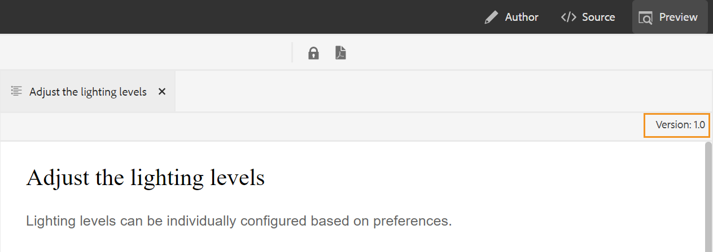

# Adobe Experience Manager Guidesas a Cloud Service于4月发布

## 升级到4月版

升级您当前的 [!DNL Adobe Experience Manager Guides] as a Cloud Service(以后称为 *[!DNL AEM Guides]as a Cloud Service*)进行设置：
1. 查看Cloud Service的Git代码，并切换到在Cloud Service管道中配置的与要升级的环境对应的分支。
1. 更新 `<dox.version>` 中的属性 `/dox/dox.installer/pom.xml` Cloud ServiceGit代码的文件更改为2022.4.133。
1. 提交更改并运行Cloud Service管道，以升级到4月版的 [!DNL AEM Guides] as a Cloud Service。

## 兼容性矩阵

本节列出了所支持的软件应用程序的兼容性矩阵 [!DNL AEM Guides] 2022年4月版as a Cloud Service。

### FrameMaker和FrameMaker Publishing Server

| FMPS | FrameMaker |
| --- | --- |
| 不兼容 | 2020更新4及更高版本 |
| | |

### 氧气连接器

| AEM Guides云版本 | 氧气连接器窗口 | 氧气连接器Mac |
| --- | --- | --- |
| 2022.4.0 | 2.5.6 | 2.5.6 |
|  |  |  |

*从2020.2开始的FMPS版本支持在AEM中创建的基线和条件。

## 新增功能和增强功能

Web编辑器中添加了许多增强功能和新功能：

### 改进了密钥分辨率

DITA内容键引用将部分内容从一个主题插入到另一个主题。 它使用键来查找内容。 需要解决与DITA主题关联的关键引用。 解析关键引用时，所选根映射的优先级最高。

现在，关键引用已根据根映射集按照以下优先级顺序解析：

1. 用户首选项
1. 地图视图面板
1. 文件夹配置文件

有关更多详细信息，请参阅 *解析关键引用* 部分。

### 在左侧面板中添加自定义面板

现在，您可以在Web编辑器的左侧面板中添加自定义面板。 您可以将自定义面板用于各种目的，例如提供帮助或为项目进行测试。 如果自定义面板已配置，则它也会出现在的面板列表中 **编辑器设置**. 您可以切换开关以显示或隐藏自定义面板。

### 能够更改DITA映射中主题的文档状态

现在，您可以轻松地更改DITA映射中选定主题的文档状态。 您还可以从以下位置打开和编辑DITA映射中选定主题的属性 **更多选项** 菜单。

### 在预览模式下显示的版本信息

Web编辑器可帮助您管理版本。 现在，您还可以在主题的“预览”模式中在该主题的“文件”选项卡的右上角看到活动主题或DITA映射的版本。

## 修复的问题

修复了多个区域中的错误如下：

* 新标签不会自动反映在添加/删除标签下拉列表中，而是需要刷新基线。 (9249)
* 如果基线是由标签条件创建的，则无法编辑基线标题。 (9171)
* 如果基线状态更改为“失败”，则使用基线的发布作业将卡在“正在等待”状态。 (9194)
* 删除直接引用上的标签也会从间接引用中删除标签。 (9257)
* 在键入内容时进行搜索会导致在“存储库”视图中产生不需要的搜索请求。 (9307)
* 在选项卡的标题中使用任意关键字时出现问题。 (9318)
* 添加带空格的标签时，基线失败。 (9362)
* AEM站点输出未正确显示glosusage元素。 (8936)
* 打开 **输出** 选项卡。 (8715)
* 通过Salesforce发布手动记录类型时显示的错误消息不是直观的。 (8952)
* 使用条件属性设置进行验证不会立即打开，而是用户需要重新打开文件才能查看验证。 (9300)
* 使用元数据发布DITA映射后，无法删除元数据。  (9178)
* 即使在映射编辑器中打开DITA映射时，翻译面板也可见。 (9053)
* 用户定义的自定义DTD不会优先于嵌入到DITA-OT中的标准DITA DTD。 (9104)
* 在本机PDF功能中，对于非DITA和非图像文件，在模板中上传失败。 (9070)
* 授权机制在某些特殊情况下执行两个查询而不是一个查询。 (9221)
* 使用自定义DTD发布AEM站点输出失败。 (9243)
* 引用脚注不会滚动到AEM站点输出中的脚注部分。 (9234)

## 已知问题

Adobe已发现 [!DNL AEM Guides] 4月版as a Cloud Service。

* 如果创建两个或更多具有相同名称但存在空格或大小写差异的基线，则Web编辑器不报告错误。 例如，“adobe”和“Adobe”或“Adobe”。
* 频繁登录或注销或在不同身份验证类型之间切换时，氧气连接器会间歇性挂起。
