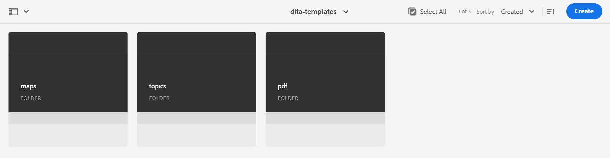
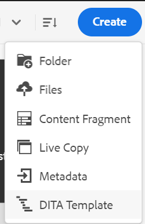
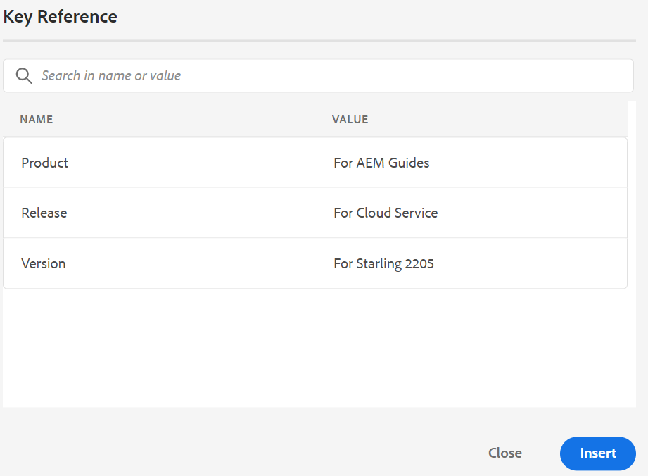
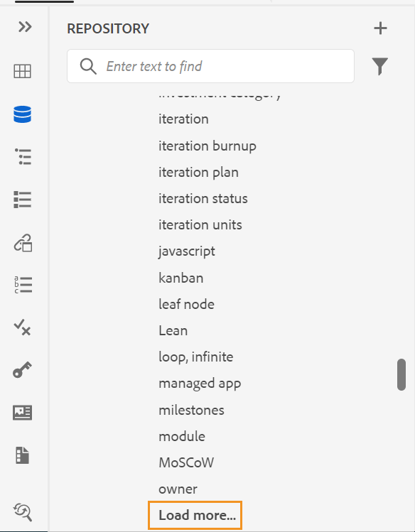
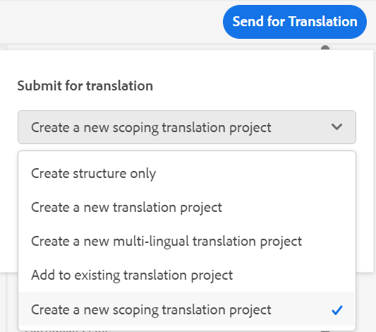
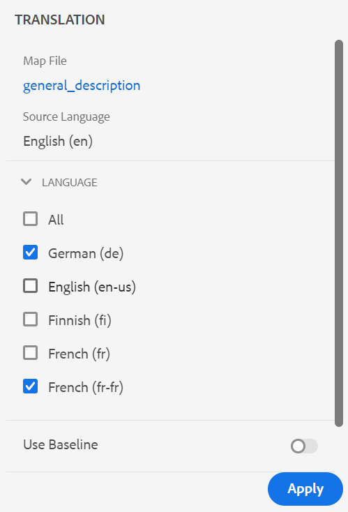
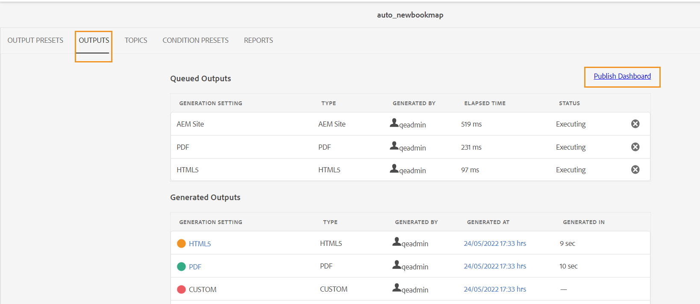

# Adobe Experience Manager Guides的5月版本as a Cloud Service

## 升级到5月版

as a Cloud Service升级您当前的Adobe Experience Manager Guides(以后称为 *AEM Guidesas a Cloud Service*)进行设置：
1. 查看Cloud Service的Git代码，并切换到在Cloud Service管道中配置的与要升级的环境对应的分支。
1. 更新 `<dox.version>` 中的属性 `/dox/dox.installer/pom.xml` Cloud ServiceGit代码的文件更改为2022.5.144。
1. 提交更改并运行Cloud Service管道，以升级到AEM Guides的5月版本as a Cloud Service。

## 兼容性矩阵

本节列出了AEM Guides 2022年5月as a Cloud Service版本支持的软件应用程序的兼容性矩阵。

### FrameMaker和FrameMaker Publishing Server

| FMPS | FrameMaker |
| --- | --- |
| 不兼容 | 2020更新4及更高版本 |
| | |

*从2020.2开始的FMPS版本支持在AEM中创建的基线和条件。

### 氧气连接器

| AEM Guides即云版本 | 氧气连接器窗口 | 氧气连接器Mac |
| --- | --- | --- |
| 2022.5.0 | 2.6.9 | 2.6.9 |
|  |  |  |

## 新增功能和增强功能

AEM Guidesas a Cloud Service在5月版本中提供了许多增强功能和新功能：

### 增强的Web编辑器

* **根据自定义模板创建映射**

现在，您有了创建自定义映射模板的强大功能。 您可以使用它们创建DITA映射以及映射模板中引用的主题模板和映射模板。

您还可以引用来自自定义映射模板的其他映射模板和主题模板。 引用的映射模板可以引用各种映射模板、主题模板、主题、映射、图像、视频和其他资源。

自定义的映射模板可以帮助您非常轻松地复制映射模板和整个引用的文件夹结构。 这些自定义模板对于创建和重新创建具有递归结构和引用的多个映射特别有用。

* 此 **插入关键字** 功能已得到改进。 现在，您可以更轻松地找到要插入的关键字，因为关键字按字母顺序列出。 您还可以通过在“搜索”框中键入搜索字符串来搜索关键词。

* 现在在“存储库视图”中，文件将分批加载。 一次加载75个文件。 批量加载非常高效，与加载文件夹中存在的所有文件相比，您可以更快地访问文件。

* 您可以在所有XML编辑器屏幕中渲染包含嵌入数据或链接的SVG图像，这些屏幕包括但不限于预览和创作视图。

* 默认XSD/DTD可以更新到最新版本

### 改进了翻译流程

* **能够创建范围设定翻译项目**
如果只需要为要翻译的项目创建范围，则可以选择 **创建新的范围设定翻译项目**. 这不会发送副本以供翻译，并且文件的原始翻译状态将保持不变。

* 如果您拒绝翻译作业中一个或多个主题的翻译，则所有已拒绝主题的正在进行翻译状态将恢复到其原始状态。

* 此 **语言** 列表显示语言文件夹及其语言代码。 例如，法语(fr)和德语(de)。

* 翻译功能现在还支持包含国家和语言的语言代码。 例如， `fr-fr`， `en-us`.

* 加载语言文件夹以外的DITA映射时，后端不会记录任何异常。

有关翻译的更多详细信息，请参阅 *从Web编辑器翻译文档* 部分(在使用Adobe Experience Manager Guidesas a Cloud Service中)。

### 增强型发布

* 您还可以访问 **发布功能板** 从映射仪表板生成输出时，从“输出”选项卡生成输出。 发布功能板中提供了所有活动发布任务的列表。

* 从映射仪表板中，您可以选择多个DITAVAL文件来生成条件化内容。 您可以通过添加或删除文件来维护文件顺序。 您还可以将鼠标悬停在文件名上以查看存储该文件的AEM存储库中的路径。

* **已弃用功能**
AEMas a Cloud Service不再支持为FrameMaker文档生成DITA输出格式。 此DITA选项也已从“映射”操控板的“输出预设”中删除。

### 改进了基于文章的发布

XML编辑器提供了在发布到Salesforce配置文件时将多个产品类别映射到文章的功能。

### 其他功能增强

* 预览模式还支持 `deliveryTarget` DITA中的条件处理属性。 它作为下拉过滤器中的一个选项与一起提供 **受众**， **平台**， **产品**、道具、 **其他prop**.
* 提供了用于在Oxyo中的AEM服务器与本地系统之间强制同步的选项。

## 修复的问题

修复了多个区域中的错误如下：

* 在Web编辑器的审阅面板上，用户无法回复审阅注释。 (9667)
* 在通过“选项”菜单刷新空白文件夹后，单击该文件夹时，应用程序会变为空白。 (9639)
* 在以下情况下将创建一个新版本： **保存并关闭** 签入的文件。 (9638)
* 关闭按钮在以下情况下不显示 **另存为新版本** 复选框已启用。 (9637)
* 如果首先通过每个章节的单独PDF发布正确的PDF，然后又发布了一个PDF文件(取消选中创建单独的PDF文件)，则不会发布正确的文档。 (9632)
* 地图仪表板给非管理员用户带来元数据问题。 (9620)
* 创建基线后，如果服务器拥有超过10000个文件，则在UI上将状态设置为“失败”（获取状态调用失败）。 (9608)
* 在属性中存储大数据会导致发布错误，因为拆分发布工作流失败。 (9586)
* 在预览到源和再次预览模式之间切换时，不会保留条件属性过滤器状态。 (9553)
* 如果未通过指定名称，则存储库视图中的书签名称将为空白 `mainbooktitle` 标记之前。 (9538)
* 打开使用氧气上传的文件时发生HTTP 400错误。 (9535)
* 打开未定义预设的地图时，以前打开的地图的预设在“输出”选项卡中保持可见。 (9523)
* 在“大纲”面板中，“标记”和“属性”的搜索功能不起作用。 (9506)
* 新创建的收藏集在浏览器刷新浏览器之前不可见。 (9505)
* 通过“添加所有prop”选项添加所有条件时，条件属性标签（不是值）会以源模式显示。 (9501)
* 文件在恢复到任何版本时会自动签出。 (9482)
* 还原文件版本时，资产UI中显示不正确的时间戳差异。 (9480)
* 在DITA映射的topicref元素中插入项目时，会添加搜索结果中的多个项目。 (9474)
* 如果设置 **为上载的文件创建新版本** 开启，则会在任何冻结节点上还原并保存时创建一个新版本。 (9473)
* 如果在定义键引用时未添加显示文本，则在更改链接URL时，不会保留“键引用”和“内容键引用”的显示文本。 (9458)
* 在版本历史记录中，不会显示当前版本的版本号和标签。 (9446)
* 在编辑器中打开某些内容文件时，编辑器冻结。 (9443)
* 在存储库面板中搜索和topicref浏览对话框在内容较大时冻结屏幕。 (9432)
* 传递给AEM站点输出的元数据不遵循内容的基线。 (9416)
* 在AEM中还原版本后，氧气会签出主题的不正确版本。 (9411)
* 基线失败会在地图仪表板的“预设”选项卡中禁用编辑功能。 (9403)
* 创建新内容时始终记录错误。 (9388)
* 新创建的DITA资产始终由其他用户签出。 (9387)
* 将topicref转换为glossref时，重命名元素无法正常工作。 (9380)
* 版本标签未作为中的下拉菜单提供 **另存为新版本** 对话框。 (9379)
* 在从切换不同版本时，未应用条件 **显示差异** 下拉菜单。 (9366)
* 使用预览过滤器时出现多个问题。 (9365)
* 无法在topicref中插入非DITA和DITAVAL资产。 (9363)
* 当目标语言代码包含五个字符(如 `fr_ca`. (9357)
* 无法使用搜索文件 **在文件夹中查找文件** 从 **更多选项** 菜单打开后，应用程序将变得无响应。 (9337)
* 如果存在大量键，则浏览对话框挂起。 (9332)
* 进行基于文章的发布时，DITAVAL文件不起作用。 (9330)
* AEM Site输出中的脚注顺序不正确。 (9327)
* 更改所选路径时，不会自动执行搜索。 (9323)
* 完成翻译后，将为已翻译资产创建附加版本。 (9310)
* 无法删除文件夹配置文件中的管理员用户。 (9306)
* 在刷新页面之前，不会设置从内容键引用更新的根映射。 (9302)
* Web身份验证在Oxygen中不起作用。 (9296)
* 包含编码字符的Web链接无法正常工作。 (9227)
* 文件在氧气中打开时未签出。 (9217)
* 在Oxygon中刷新签出的文件无法用于使用Web身份验证进行日志记录。 (9179)
* “翻译”和“基线”选项卡在“映射”功能板中可见一段时间。 (9146)
* 重新加载文件夹配置文件时出现体验或功能问题。 (9103)
* 删除页面布局编辑器时，不会将其从创作视图的中心面板中关闭。 (9087)
* 在Web编辑器中删除图像然后保存文档的新版本时出现验证错误。 (8985)
* 无法查看所有 `glossrefs` 在“术语表”面板（特定于内容）中。 (8886)
* `xref` 没有文本时，基于文章的发布输出中不会显示。 (8764)
* 引用在文件名中有空格的活动图像或多媒体文件上中断。 (8624)
* 选择时引用中断 `Select All` 并将多媒体文件或DITA内容移动到另一个文件夹。 (8622)
* 在发布功能板中，不会清理状态为“等待”或“正在执行”的输出作业。  (8569)
* 如果存在大量剩余的输出历史记录节点，则输出清除功能会失败。 (8568)
* DITA附加组件包可防止DAM重复资产检测。 (8417)
* 已为非DITA文件启用创建审阅任务按钮。 (8401)
* 插入引用对话框在使用UI将subjectref添加到映射时打开。 (8212)
* 在每一空白处发现意外的空间 `entry` 元素(在将outputclass属性添加到 `tgroup` 元素。 (7532)
* “存储库”面板不会在操作完成后立即显示签入或签出的文件锁定图标。 (5817)
* 即使从编辑器中签入了文件，“锁定”图标也会显示在存储库视图中。  (5756)
* “输出”选项卡下的AEM预设中缺少站点。 (9567)
* XML编辑器在尝试编辑某些DITA文件时挂起。 (9537)
* 在XML编辑器中执行搜索会导致页面冻结。 (9452)
* 如果内容被移至其他文件夹，下载带有基线的映射将无法正常工作。 (9331)
* 当文件已存在于AEM的同一位置时，在Oxygen中重新上传失败。 (9328)
* 在并排视图中，突出显示位置不正确。 (9305)
* 将文档从“氧”签入到AEM后，文档中的日语内容将被问号(???)替换。 (9276)
* 将文件从Oxyor上传到AEM失败。 (9157)
* 在收件箱中重新分配审核任务时，未发送电子邮件通知。 (8376)

## 已知问题

打开编辑器时间歇性地显示空白页。
