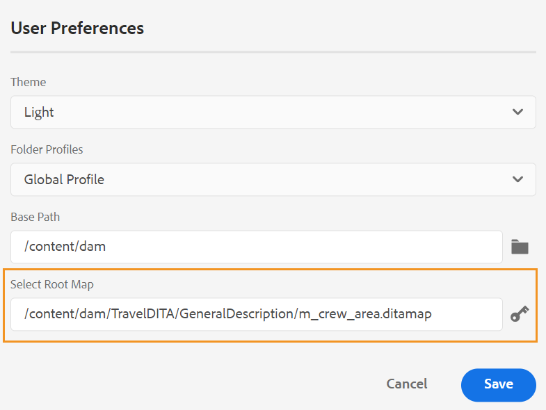

# Adobe Experience Manager Guides的4.1.x版

此发行说明涵盖了Adobe Experience Manager Guides版本4.1.x中的升级说明、新增功能和增强功能(以下简称 *AEM指南*)。

## 升级到最新版本

您可以轻松将AEM Guides的当前版本升级到版本4.1.3。在继续升级到4.1.3版本的AEM Guides之前，您必须考虑以下几点：
* 如果您使用的是版本4.1或4.1.x，则可以直接升级到版本4.1.3。
* 如果您使用的是版本4.0.x，则需要先升级到版本4.1或4.1.x，然后再升级到4.1.3。
* 如果您使用的是版本3.8.5，则需要在升级到4.1之前升级到4.0.x版。
* 如果您使用的版本低于3.8.5，请参阅特定于产品的安装指南中的升级部分。

有关详细信息，请参阅 [升级说明](assets/Adobe-Experience-Manager-Guides-Upgrade-Instructions-EN.pdf).

## 4.1.3 | 发行说明

## 兼容性矩阵

本节列出了AEM Guides 4.1.3版本支持的软件应用程序的兼容性矩阵。

### Adobe Experience Manager

**非UUID**
版本6.5 Service Pack 13、12、11或10

**UUID**
版本6.5 Service Pack 13、12、11或10

有关更多详细信息，请参阅安装和配置Adobe Experience Manager Guides指南中的技术要求部分。

### FrameMaker和FrameMaker Publishing Server

| 发行版本 | FMPS 2020 | FMPS 2019 | Fm 2020 | Fm 2019 |
| --- | --- | --- | --- | --- |
| 4.1.3（非UUID） | 2020.2或更高版本* | 2019 | 2020.3或更高版本 | 2019.8（最新更新） |
| 4.1.3 (UUID) | 2020.2或更高版本* | 不兼容 | 2020.4或更高版本 | 不兼容 |
| | | | |

*从2020.2开始的FMPS版本支持在AEM中创建的基线和条件。

### 氧气连接器

| 发行版本 | 氧气连接器窗口 | 氧气连接器Mac | 在氧气窗口中编辑 | 在氧气Mac中编辑 |
| --- | --- | --- |--- |--- |
| 4.1.3（非UUID） | 2.0 | 2.0 | 1.6 | 1.6 |
| 4.1.3 (UUID) | 2.7 | 2.7 | 2.3 | 2.3 |
|  |  |   |

## 修复的问题

以下列出了已修复的错误：

* Web编辑器间歇性地加载空白页。 (10678)

## 4.1.2 | 发行说明

## 兼容性矩阵

本部分列出了AEM Guides 4.1.2版本支持的软件应用程序的兼容性矩阵。

### Adobe Experience Manager

**非UUID**
版本6.5 Service Pack 13、12、11或10

**UUID**
版本6.5 Service Pack 13、12、11或10

有关更多详细信息，请参阅安装和配置Adobe Experience Manager Guides指南中的技术要求部分。

### FrameMaker和FrameMaker Publishing Server

| 发行版本 | FMPS 2020 | FMPS 2019 | Fm 2020 | Fm 2019 |
| --- | --- | --- | --- | --- |
| 4.1.2（非UUID） | 2020.2或更高版本* | 2019 | 2020.3或更高版本 | 2019.8（最新更新） |
| 4.1.2 (UUID) | 2020.2或更高版本* | 不兼容 | 2020.4或更高版本 | 不兼容 |
| | | | |

*从2020.2开始的FMPS版本支持在AEM中创建的基线和条件。

### 氧气连接器

| 发行版本 | 氧气连接器窗口 | 氧气连接器Mac | 在氧气窗口中编辑 | 在氧气Mac中编辑 |
| --- | --- | --- |--- |--- |
| 4.1.2（非UUID） | 2.0 | 2.0 | 1.6 | 1.6 |
| 4.1.2 (UUID) | 2.7 | 2.7 | 2.3 | 2.3 |
|  |  |   |

## 修复的问题

修复了多个区域中的错误如下：

* 选择所有文件夹配置文件时，会显示不可见的文件夹配置文件（不正确）。 (10393)
* 当用户的时区与服务器时区不同时，创建基线不会选择最新版本。 (10336)
* 安装AEM Guides 4.1后，Control+F快捷键无法在Assets Console上打开浏览器搜索模式。 (10339)
* 引用了文件夹的主题出现基线创建错误。 (10383)
* “输出预设”选项卡间歇性地显示空白屏幕，并且在某些情况下会显示不可编辑的预设。 (10390)
* 密钥空间管理会导致异常情况和错误。 (10449)

### 存在已知问题的解决方法

* 在翻译过程中导出的基线不会在编辑器的基线选项卡中加载。

  **解决方法**：使用DITA映射仪表板的基线选项卡。

## 4.1 | 发行说明

此发行说明涵盖了Adobe Experience Manager Guides版本4.1.x中的升级说明、新增功能和增强功能(以下简称 *AEM指南*)。

## 兼容性矩阵

本节列出了AEM Guides 4.1版本支持的软件应用程序的兼容性矩阵。

### Adobe Experience Manager

**非UUID**
版本6.5 Service Pack 13、12、10或11

**UUID**
版本6.5 Service Pack 13、12、10或11

有关更多详细信息，请参阅安装和配置Adobe Experience Manager Guides指南中的技术要求部分。

### FrameMaker和FrameMaker Publishing Server

| 发行版本 | FMPS 2020 | FMPS 2019 | Fm 2020 | Fm 2019 |
| --- | --- | --- | --- | --- |
| 4.1（非UUID） | 2020.2或更高版本* | 2019 | 2020.3或更高版本 | 2019.8（最新更新） |
| 4.1 (UUID) | 2020.2或更高版本* | 不兼容 | 2020.4或更高版本 | 不兼容 |
| | | | |

*从2020.2开始的FMPS版本支持在AEM中创建的基线和条件。

### 氧气连接器

| 发行版本 | 氧气连接器窗口 | 氧气连接器Mac | 在氧气窗口中编辑 | 在氧气Mac中编辑 |
| --- | --- | --- |--- |--- |
| 4.1（非UUID） | 2.0 | 2.0 | 1.6 | 1.6 |
| 4.1 (UUID) | 2.7 | 2.7 | 2.3 | 2.3 |
|  |  |  |

## 新增功能和增强功能

AEM Guides在4.1版本中提供了许多增强功能和新功能：

### 本机PDF发布

AEM Guides 4.1版中还添加了创建本机PDF的支持。 引入了新的发布引擎，其具有以下功能：
* 创建CSS模板
* 创建其他页面模板
* 设计包含CSS和PDF模板的模板
* 以PDF格式发布映射和主题内容

### 在基于文章的发布中支持知识库网站路径

AEM Guides提供了基于文章的发布功能，可增量生成一个或多个主题的输出，或将您的内容发布到知识库平台。 在4.1版本中，您还有一个选项，可用于选择主题/地图需要发布到的知识库网站路径。 选择路径后，将在指定的路径下生成输出。

### 增强的Web编辑器

* **改进了密钥分辨率**

DITA内容键引用将部分内容从一个主题插入到另一个主题。 它使用键来查找内容。 需要解决与DITA主题关联的关键引用。 解析关键引用时，所选根映射的优先级最高。

现在，关键引用已根据根映射集按照以下优先级顺序解析：

1. 用户首选项
1. 地图视图面板
1. 文件夹配置文件

有关更多详细信息，请参阅 *解析关键引用* Adobe Experience Manager部分。

* **在左侧面板中添加自定义面板**

现在，您可以在Web编辑器的左侧面板中添加自定义面板。 您可以将自定义面板用于各种目的，例如提供帮助或为项目进行测试。 如果自定义面板已配置，则它也会出现在的面板列表中 **编辑器设置**. 您可以切换开关以显示或隐藏自定义面板。

* **能够更改DITA映射中主题的文档状态**

现在，您可以轻松地更改DITA映射中选定主题的文档状态。 您还可以从以下位置打开和编辑DITA映射中选定主题的属性 **更多选项** 菜单。

* **在预览模式下显示的版本信息**

Web编辑器可帮助您管理版本。 现在，您还可以在主题的“预览”模式中在该主题的“文件”选项卡的右上角看到活动主题或DITA映射的版本。

* **改进了Web编辑器刷新行为**

现在，Web编辑器中的浏览器刷新操作提供了以下增强功能：

* 现在，当您在Web编辑器中编辑内容时，支持您刷新浏览器。 如果在打开一个或多个未保存更改的文件进行编辑时点击浏览器刷新图标，系统将提示您保存文件或取消刷新操作。

* 即使刷新浏览器时，左侧面板和右侧面板的视图也会保留。

* 活动主题或DITA映射将在内容编辑区域中重新打开。

* **根据自定义模板创建映射**

现在，您有了创建自定义映射模板的强大功能。 您可以使用它们创建DITA映射以及映射模板中引用的主题模板和映射模板。

您还可以引用来自自定义映射模板的其他映射模板和主题模板。 引用的映射模板可以引用各种映射模板、主题模板、主题、映射、图像、视频和其他资源。

自定义的映射模板可以帮助您非常轻松地复制映射模板和整个引用的文件夹结构。 这些自定义模板对于创建和重新创建具有递归结构和引用的多个映射特别有用。

* **架构支持**
“架构”是指用于定义XML文件测试的基于规则的验证语言。 使用Schematron文件，您可以定义某些规则，然后针对DITA主题或映射验证这些规则。 Web编辑器支持Schematron文件。 您可以导入Schematron文件，也可以在Web编辑器中编辑它们。 Web编辑器中的架构支持可帮助您根据一组规则验证文件并维护主题的一致性和正确性。

* **改进了文件关闭对话框**

当您尝试关闭在Web编辑器中打开的文件时，AEM Guides会提示您保存更改并解锁锁定的文件。 提示的显示基于 **关闭时要求签入** 和 **关闭时询问新版本** 由管理员配置的设置。

根据配置，您可以选择保存更改并创建文档的新版本。 或者，您也可以检入文件并将更改保存到当前版本。

有关更多详细信息，请参阅 *文件关闭并保存方案* Adobe Experience Manager部分。*此 **插入关键字** 功能已得到改进。 现在，您可以更轻松地找到要插入的关键字，因为关键字按字母顺序列出。 您还可以通过在“搜索”框中键入搜索字符串来搜索关键词。

* **支持Markdown文档**
Markdown是一种轻量级的标记语言，可帮助您将格式元素添加到纯文本文档。 Web编辑器允许您使用Markdown文档(.md)以及DITA文档。 您可以轻松地在Web编辑器中创作和预览Markdown文档，还可以通过DITA映射编辑器将其添加到映射文件中。  有关更多详细信息，请参阅 *从Web编辑器创作Markdown文档* 使用Adobe Experience Manager Guides指南中的部分。

* **能够配置默认标记视图**
如果用户从Web编辑器中启用标记视图，则即使跨会话，该视图也会保持启用状态。  这意味着您无需再次启用标记视图即可稍后访问它。 管理员可以在Web编辑器中配置标记视图的默认状态。 新用户会话的“标记视图”的默认值由ui_config.json文件中的tagsView属性决定。

* 现在在“存储库视图”中，文件将分批加载。 主或中存在的所有文件 `/content/dam folder` 中列出。 但从下一级或辅助文件夹一次加载75个文件。 批量加载非常高效，与加载文件夹中存在的所有文件相比，您可以更快地访问文件。

### 新建基线仪表板

AEM Guides 4.1版本提供了集成在Web编辑器中的基线功能。 您现在可以从Web编辑器创建基线，并使用它们发布或翻译不同版本的主题。

**注意**：对于已升级的系统，请更新最新的 **ui_config.json** 用于文件夹配置文件。

使用此功能可使用特定日期和时间提供的主题的特定版本创建基线。 此外，您还获得API支持，可使用为主题版本定义的标签创建或更新基线。

您可以根据文件名或文件位置搜索文件。 您还可以过滤要在基线编辑窗口中显示的主题，并根据特定列对它们进行排序。

基线创建过程的性能已得到进一步改进。 创建基线的过程是异步的，因此，在创建基线时，您可以继续在Web编辑器中编辑其他文件。 有关更多详细信息，请参阅 *从Web编辑器创建和管理基线* 《使用Adobe Experience Manager指南》中的。

注意：默认情况下，映射操控板上的“基线”选项卡处于隐藏状态。 您的管理员可以在映射仪表板上启用基线选项卡。

* 要下载的API映射中的基线参数现在使用基线的标题来检索版本控制内容。

### 改进了翻译流程

* **能够创建范围设定翻译项目**
如果只需要为要翻译的项目创建范围，则可以选择 **创建新的范围设定翻译项目**. 这不会发送副本以供翻译，并且文件的原始翻译状态将保持不变。

* 此 **语言** 列表显示语言文件夹及其语言代码。 例如，法语(fr)和德语(de)。

有关翻译的更多详细信息，请参阅 *从Web编辑器翻译文档* 使用Adobe Experience Manager Guides指南中的部分。

### 增强型发布

* 您还可以访问 **发布功能板** 从映射仪表板生成输出时，从“输出”选项卡生成输出。 发布功能板中提供了所有活动发布任务的列表。

* 从映射仪表板中，您可以选择多个DITAVAL文件来生成条件化内容。 您可以通过添加或删除文件来维护文件顺序。 您还可以将鼠标悬停在文件名上以查看存储该文件的AEM存储库中的路径。

* 已对AEM站点输出的元数据应用基线。 您还可以将基线版本的属性作为元数据处理。 如果未定义基线，则最新版本的属性将作为元数据处理。

* 此 **文件名** 和 **DITA-OT命令行参数** 已为HTML5、EPUB和自定义输出预设添加了选项。 现在，您可以指定要用来保存输出的文件名。 您还可以指定在生成输出时希望DITA-OT处理的其他参数。

### 映射仪表板

当您选择下载DITA映射时，请求将排入队列，并且您会在映射准备下载时收到通知。 您可以选择立即下载映射文件，或稍后从AEM通知收件箱中提供的链接下载该文件。

### 其他功能增强

* AEM Guides现在支持Oxygen XML Author版本24.1。
* 要下载的API映射中的基线参数现在使用基线的标题来检索版本控制内容。

### 已弃用功能

AEM Guides不再支持为FrameMaker文档生成DITA输出格式。 此DITA选项也已从“映射”操控板的“输出预设”中删除。

## 修复的问题

修复了多个区域中的错误如下：

* 对于基于文件路径的发布引用，不支持使用创作作为替代。 (8076)
* DITA附加组件包可防止DAM重复资产检测。 (8417)
* 将文档从“氧”签入到AEM后，文档中的日语内容将被问号(???)替换。 (9124)
* 在Oxygon中刷新签出的文件无法用于使用Web身份验证进行日志记录。 (9179)
* 文件在氧气中打开时未签出。 (9192)
* 将文档从“氧”签入到AEM后，文档中的日语内容将被问号(???)替换。 (9276)
* Web身份验证在Oxygen中不起作用。 (9296)
* 当文件已存在于AEM的同一位置时，在Oxygen中重新上传失败。 (9328)
* 选项不可用于在AEM与本地系统之间强制同步内容。 (9439)
* 对于使用添加的元素，不会自动生成ID **插入可重用内容** 对话框。 (5826)
* 通过编辑器上传与现有文件同名的图像时不会显示确认对话框。 (6011)
* 字符托盘中不可用的不间断空格。 (7523)
* 元素列表(Alt+Enter)以深色/最深的主题显示为灰色。 (7913)
* 从映射面板工具栏保存主题的修订版本时未更新。 (8228)
* 即使在有效位置也无法插入xref。 (8354)
* “getversionlabels”操作具有限制，因此未提供预期的性能。 (8513)
* 关闭当前未在编辑器中打开的锁定或编辑的文件时出现确认对话框问题。 (8692)
* 当用户ID为数字时，在文件夹配置文件中将用户添加为管理员时出错。 (8908)
* 即使在映射编辑器中打开DITA映射时，翻译面板也可见。 (9053)
* 语言代码不会与翻译面板中的语言一起显示。 (9108)
* “翻译”和“基线”选项卡在“映射”功能板中可见一段时间。 (9146)
* 完成翻译后，将为已翻译资产创建附加版本。 (9310)
* 当目标语言代码包含五个字符(如 `fr_ca`. (9357)
* 将创建的目标语言代码称为 `fr-fr, `， `en-us`. (9527)
* 加载语言文件夹以外的DITA映射时，后端会记录异常。(9543)
* 无法从编辑器中使用自定义DITA模板创建DITA文件。 (7262)
* 通过FMPS发布UUID DITA映射时，DITA映射丢失。 (7278)
* 复制并粘贴资产时，AEM Guides不会复制资产的非唯一属性。 (8241)
* DITA映射文件名在创建时未转换为小写。 (8383)
* 分配新的审阅任务时，审阅任务描述未出现在正在发送的电子邮件通知中。 (8507)
* 下载地图API | 如果下载过程出错，不会清理临时文件夹。 (8523)
* `columnpreview.jsp` 依赖于SP。  (8543)
* 在发布功能板中，不会清理状态为“等待”或“正在执行”的输出作业。  (8569)
* 在使用“生成”按钮生成报告时选择的默认图标，即使定义了图标属性也是如此。 (8573)
* 从3.8.X升级到4.0时，审核过程中出现问题。 (8788)
* 在Web编辑器的“审阅”面板中，如果用户名较长，则接受/拒绝的图标不会清晰显示。 (8793)
* 在删除主题并执行移动操作后，引用树断开。 (8804)
* 用户定义的自定义DTD不会优先于嵌入到DITA-OT中的标准DITA DTD。 (9104)
* 在并排视图中，突出显示位置不正确。 (9305)
* 引用脚注不会滚动到AEM站点输出中的脚注部分。 (9061)
* AEM Site输出中的脚注顺序不正确。 (9327)
* 新创建的DITA资产始终由其他用户签出。 (9387)
* 创建新内容时始终记录错误。 (9388)
* 审核任务创建过程中的第三个屏幕不显示术语表。 (4558)
* 从FrameMaker/氧气连接器上传多个文件时分配的UUID引用不正确。 (8269)
* 在收件箱中重新分配审核任务时，未发送电子邮件通知。 (8376)
* 无法将第二个管理员用户作为第一个管理员用户添加到文件夹。 (8430)
* **应用标签** 基线选项卡上的对话框在下拉列表中不显示标签。 (8455)
* 在主题中使用将图像作为conref的基线发布时，图像不会发布在输出中。 (8564)
* 如果存在大量剩余的输出历史记录节点，则输出清除功能会失败。 (8568)
* 在版本历史记录面板中，“当前版本”部分显示不正确的时间戳和修改者信息。 (8765)
* 未根据定义的标签更新基线。 (8799)
* 当其父文件夹的文件名中有特殊字符的文件在Oxyor中打开(使用 **在Oxygen中编辑** 按钮)。 (8918)
* 将文件从Oxyor上传到AEM失败。 (9157)
* 如果内容被移至其他文件夹，下载带有基线的映射将无法正常工作。 (9331)
* 在AEM中还原版本后，氧气会签出主题的不正确版本。 (9411)
* 在存储库面板中搜索和topicref浏览对话框在内容较大时冻结屏幕。 (9432)
* 如果设置 **为上载的文件创建新版本** 开启，则会在任何冻结节点上还原并保存时创建一个新版本。 (9473)
* 还原文件版本时，资产UI中显示不正确的时间戳差异。 (9480)
* 文件在恢复到任何版本时会自动签出。 (9482)
* 即使从编辑器中签入了文件，“锁定”图标也会显示在存储库视图中。  (5756)
* 无法使用Web编辑器的“作者”视图在书签中添加前置内容、后置内容元素。 (7652)
* 预览模式不支持 `deliveryTarget` DITA中的条件处理属性。 (7685)
* 在XML编辑器中打开术语表主题时，即使未对其进行修改，AEM也会强制保存该主题。 (8105)
* 插入引用对话框在使用UI将subjectref添加到映射时打开。 (8212)
* 在搜索特殊字符时重用内容面板崩溃 `[` 或 `*` .(8279)
* 在创作Glossentry时，Web编辑器将内容显示为注释。 (8384)
* XML编辑器删除代码块中的新行。 (8522)
* 在源模式和创作模式之间切换会将主题标记为已修改，并需要再次保存内容。(8524)
* 无法关闭已解锁的主题。 (8545)
* 在基于文章的发布预设中，不存在用于选择知识库路径的选项。 (8636)
* 使用从收藏夹视图拖放将章节添加到书签映射时缺少属性。 (8746)
* “插入关键字”对话框没有搜索功能，关键字未按排序顺序列出。 (9094)
* 在XML编辑器中执行搜索会导致页面冻结。 (9452)
* “输出”选项卡下的AEM预设中缺少站点。 (9567)
* 在XML编辑器的创作模式下无法正确呈现的SVG图像。 (9426)
* 通过Salesforce发布时不遵循基线。 (8953)
* 无法从用户首选项设置中清除根地图。 (8534)
