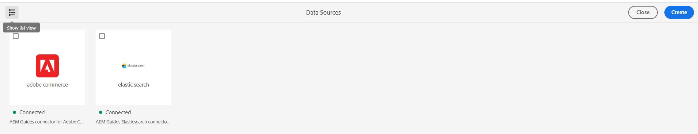
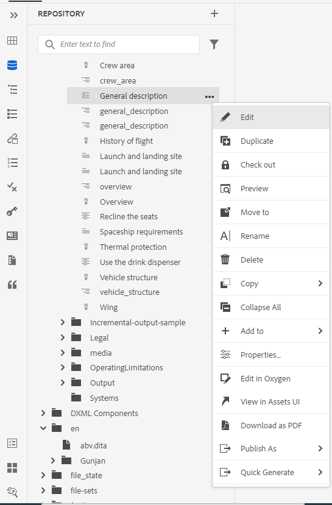

# Adobe Experience Manager Guidesas a Cloud Service版2023年10月版的新增功能

本文介绍2023年10月版本的Adobe Experience Manager Guides(以后称为 *AEM Guidesas a Cloud Service*)。

有关升级说明、兼容性矩阵以及此版本中修复的问题的更多详细信息，请参阅 [发行说明](release-notes-2023-10-0.md).

## 从用户界面配置数据源连接器

《Experience Manager指南》现在提供了 **数据源** 此工具可帮助您为数据源配置现成的连接器。 您可以轻松为JIRA、SQL(MySQL、PostgreSQL、Microsoft SQL Server、SQLite、MariaDB、H2DB)、AdobeCommerce和Elasticsearch数据库创建连接器。

您还可以轻松地编辑、重新连接、复制或删除数据源连接器。 了解如何 [从用户界面轻松配置数据源连接器](../cs-install-guide/conf-data-source-connector-tools.md).

{width="550" align="left"}

*从数据源面板创建和查看数据源连接器。*

## 查看主题生成器的日志

您现在还可以查看内容生成日志文件。 此日志文件可帮助您检查警告、错误和异常。  进一步了解 [主题生成器的选项](../user-guide/web-editor-content-snippet.md#options-for-a-topic-generator) 帮助您轻松生成和管理主题生成器。

## 数据源模板中支持Velocity工具

现在，您可以使用“Experience Manager参考线”模板中的Velocity工具。 这些工具可帮助您将各种功能应用于从数据源获取的数据。 在创建内容片段或主题时，可以使用模板。 此功能可帮助您节省将同一函数手动应用于每个数据集的时间和精力。  这样还可以确保获得准确的结果。
例如，可以使用$mathTool执行数学函数。
详细了解如何 [在数据源模板中使用Velocity工具](../user-guide/web-editor-content-snippet.md#use-velocity-tools).

## 本机PDF增强功能

2023年10月版本中完成了以下本机PDF增强功能：

### 重置布局第一页的页码

在本机PDF输出中，您可以重新启动页码并指定开始编号的编号。 现在，也可以仅对第一次出现的截面开始编号。
详细了解如何 [使用页面布局的页面属性](../native-pdf/design-page-layout.md#page-props-page-layout).

### 在目录中查看没有自动编号的章节

Experience Manager指南在目录(TOC)中显示章节编号和章节名称。 现在，您可以选择仅发布章节名称，而不发布章节编号。 查看有关如何配置 [模板的高级PDF设置](../native-pdf/components-pdf-template.md#advanced-pdf-settings).

## 从Web编辑器下载映射

现在，您不仅可以在Web编辑器的映射视图中编辑映射，还可以下载它。 您可以选择使用特定的基线下载映射。 您还可以选择将层次结构扁平化并将所有文件和文件夹保存在单个文件夹中。

欲知更多详情，请参见 **映射视图** 中的功能描述 [左侧面板](../user-guide/web-editor-features.md#id2051EA0M0HS) 部分。

{width="550" align="left"}

*在存储库视图中选择一个文件，然后选择选项以对该文件执行操作。*

## 在氧气连接器插件中编辑文件

Experience Manager指南现在允许您在Web编辑器中选择文件，然后选择在氧气连接器插件中编辑该文件。 此选项不是现成支持的一部分。

欲知更多详情，请参见 **文件选项** 中的功能描述 [左侧面板](../user-guide/web-editor-features.md#id2051EA0M0HS) 部分。
