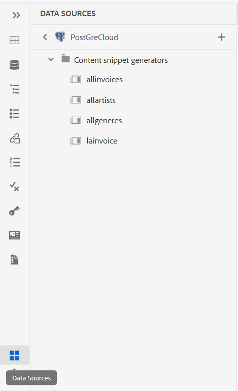
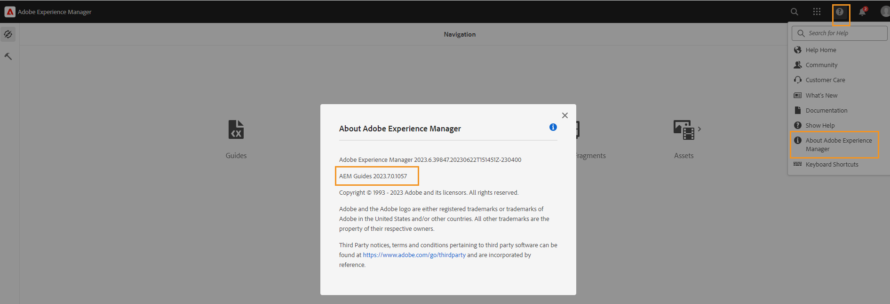

# Adobe Experience Manager Guidesas a Cloud Service版2023年7月版的新增功能

本文介绍2023年7月版Adobe Experience Manager Guides(以后称为 *AEM Guidesas a Cloud Service*)。

有关升级说明、兼容性矩阵以及此版本中修复的问题的更多详细信息，请参阅 [发行说明](release-notes-2023-7-0.md).

## 连接到数据源并将数据插入主题

现在，您可以使用AEM Guides中的现成连接器快速连接到数据源。 连接到数据源使您能够保持与源同步的信息，并且任何数据更新都会自动反映出来，从而使AEM Guides成为真正的内容中心。 此功能可帮助您节省手动添加或复制数据的时间和精力。

现在，AEM Guides允许管理员为JIRA和SQL(MySQL、PostgreSQL、SQL Server、SQLite)数据库配置现成的连接器。 它们还可以通过扩展缺省接口来添加其它连接器。

添加后，您可以查看 **数据源** 面板。

{width="300" align="left"}

您可以创建一个内容片段生成器，以从连接的数据源中获取数据。 然后，您可以将数据插入主题并进行编辑。

创建内容片段生成器后，您可以重复使用它来将数据插入任何主题。 有关详细信息，请查看 [插入数据源中的内容片段](../user-guide/web-editor-content-snippet.md).

## 用于显示审阅项目和活动审阅任务的审阅面板

现在，AEM Guides可让您的评论更加顺畅。 它在Web编辑器中提供“审阅”面板。 “审阅”面板显示您所属的审阅项目中的所有审阅项目和活动审阅任务。

作为作者，此功能可帮助您轻松地打开审阅任务、查看注释并在集中视图中快速处理注释。
{width="800" align="left"}
有关更多详细信息，请查看 **审核** 中的功能描述 [左侧面板](../user-guide/web-editor-features.md#id2051EA0M0HS) 部分。

## 映射收藏集增强

地图收藏集可帮助您组织多个地图并批量发布它们。 已对地图收藏集进行多项新的增强：

- 现在，您还可以将本机PDF输出预设添加到映射集合中，并使用它们生成PDF输出。
- 您可以查看管理员创建的全局配置文件预设和文件夹配置文件预设，并使用它们生成PDF输出。
- 现在，您不仅可以选择单个预设，还可以一次性为DITA映射启用所有文件夹配置文件预设。
  {width="800" align="left"}

有关详细信息，请查看 [使用映射集合生成输出](../user-guide/generate-output-use-map-collection-output-generation.md).

## 能够在生成本机HTML输出时访问临时PDF文件

现在，AEM Guides允许您下载在生成本机HTML输出时创建的临时PDF文件。 在输出预设设置中，选择用于下载临时文件的选项。  然后，AEM Guides允许您下载在使用该预设生成输出时创建的临时文件。

此功能通过访问临时样式和布局，使您能够更好地分析生成过程，并帮助您根据自己的要求更正或更改CSS样式。

{width="800" align="left"}

有关详细信息，请查看 [创建PDF输出预设](../web-editor/native-pdf-web-editor.md#create-output-preset).

## 基于微服务的发布以生成HTML5和自定义输出

新的发布微服务使您能够在AEM Guidesas a Cloud Service上同时运行大量发布工作负载，并利用业界领先的Adobe I/O Runtime无服务器平台。 现在使用微服务，您还可以生成HTML5和自定义输出。
您可以运行多个发布请求并获得改进的性能来生成这些输出格式。
有关详细信息，请查看 [为AEM Guidesas a Cloud Service配置基于微服务的发布](../knowledge-base/publishing/configure-microservices.md).

## 查看关于信息中的AEM Guides版本详细信息

现在与AEM一起 **关于** 另外，您还可以查看AEM Guides的版本详细信息。 您可以在以下位置查看当前版本的详细信息： **关于** 的选项 **帮助** 在AEM导航页面上。

(width=&quot;800&quot; align=&quot;left&quot;)
