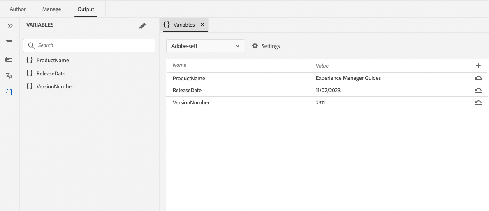
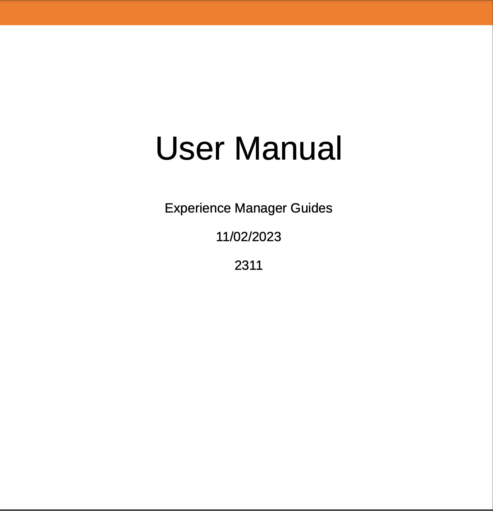
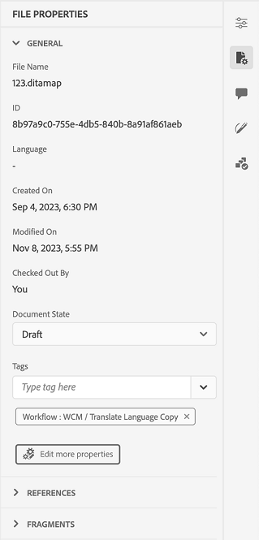
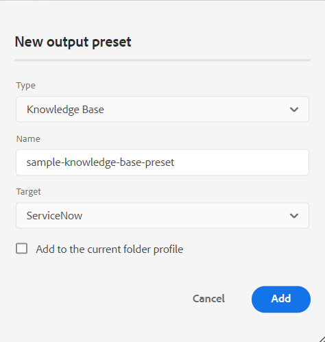
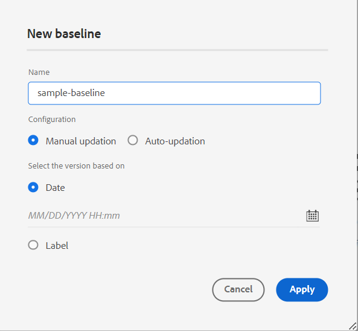
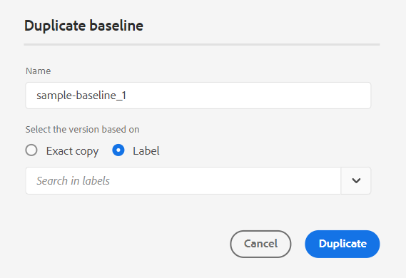

# Adobe Experience Manager Guidesas a Cloud Service版2023年12月版的新增功能

本文介绍2023年12月版本的Adobe Experience Manager Guides(以后称为 *Experience Manager指南as a Cloud Service*)。

有关升级说明、兼容性矩阵以及此版本中修复的问题的更多详细信息，请查看 [发行说明](release-notes-2023.12.0.md).

## 在本机PDF输出中使用变量

您可以使用变量集动态插入和管理可能根据特定条件（如产品名称和版本）发生更改的信息。 此功能可帮助您使用相同的PDF布局并生成具有不同值的输出。 您不必为每一组值创建单独的布局。

例如，您可以为每个产品创建一个变量集。 此变量集可由用于不同产品详细信息（如ProductName、VersionNumber和ReleaseDate）的变量组成。 然后，您可以为这些变量添加不同的值。

**变量集1：Adobe集1**

* ProductName：Experience Manager指南
* 版本号：2311
* 发行日期： 2023年11月2日

**变量集1：Adobe集2**

* ProductName：Experience Manager指南
* 版本号：2310
* 发行日期： 2023年9月27日

{width="800" align="left"}

*从Web编辑器的“输出”选项卡中创建变量。*

您还可以使用具有HTML标记的值创建变量。 例如，使用从内容DAM添加图像 `` 标记之前。

创建变量后，可以使用输出模板中的页面布局将变量添加到文档中的相应位置。 系统会根据您在输出预设中选择的PDF集，在变量输出中自动选取值。

*使用PDF布局中的变量生成本机PDF输出。*

此功能有助于使用文档中的动态内容生成自定义输出并高效管理更改。 您还可以应用样式并使用HTML标记来设置变量的格式。

您还可以在需要时快速更新任何变量集的值并重新生成输出。 例如，如果需要更新版本的详细信息，可以在VersionNumber中更新版本值并重新生成输出。

## 改进了编辑属性的体验

现在，您可以从以下位置获得改版后的体验：添加或编辑元素的属性， **内容属性** 面板。

{width="300" align="left"}

*从“内容属性”面板添加属性。*

您还可以轻松地编辑和删除属性。

欲知更多详情，请参见 **内容属性** 中的功能描述 [右侧面板](../user-guide/web-editor-features.md#id2051EB003YK) 部分。

## 创作时编辑元数据

现在，在创作时，您可以使用中的下拉菜单更新文件元数据标记 **文件属性** 在右侧面板中。 您还可以选择 **编辑更多属性** 以更新更多元数据。

{width="300" align="left"}

*从右侧面板更新元数据和编辑文件属性。*

欲知更多详情，请参见 **文件属性** 中的功能描述 [右侧面板](../user-guide/web-editor-features.md#id2051EB003YK) 部分。

## 能够将内容发布到ServiceNow知识库

您现在还可以将内容发布到ServiceNow知识库平台。

在2023年12月版中，管理员可以创建ServiceNow知识库服务器的发布配置文件。 然后，作为作者或发布者，您可以选择输出预设中的ServiceNow发布配置文件，以将输出发布到指定的知识库。

此功能可帮助您将内容（如文本、视频和图像）发布到ServiceNow知识库平台并维护一个全面的存储库。

{width="300" align="left"}

*为ServiceNow知识库创建输出预设。*

## 增强地图收藏集仪表板

《Experience Manager指南》提供了一个增强的“地图收集”功能板。 在映射集合中，可以快速为DITA映射批量配置元数据属性。 此功能非常方便，因为您不必分别更新每个DITA映射的元数据属性。

现在，您可以查看DITA映射的文件名。 您还可以查看基线。 这有助于快速找到用于预设的基线。

{width="800" align="left"}

*从地图集合仪表板查看、编辑和生成输出。*

了解如何 [使用映射集合生成输出](../user-guide/generate-output-use-map-collection-output-generation.md).

## 在映射视图中查看关键属性

为主题或映射引用定义键属性时，还可以在左侧面板中查看标题、相应图标和键。 键显示为 `key=<key-name>`.

欲知更多详情，请参见 **映射视图** 中的功能描述 [左侧面板](../user-guide/web-editor-features.md#id2051EA0M0HS) 部分。

 {width="300" align="left"}

*在“映射视图”中查看键属性。*

## 能够根据标签复制基线

Experience Manager指南现在为从Web编辑器创建基线提供了增强的用户体验。\
 {width="300" align="left"}
*从Web编辑器创建基线。*

它还允许您根据标签复制基线。 复制时根据给定的标签（如果存在）选取引用版本，否则从复制的基线中选取版本。

 {width="300" align="left"}

*复制基于标签的基线或创建精确副本。*

## 改进了批量激活图集合的创建流程

现在，创建批量激活地图集合的过程更加协调。 现在，当显示“激活结果”页面时，您可以查看激活结果和日志。
有关更多详细信息，请参阅 [创建批量激活映射集合](../user-guide/conf-bulk-activation-create-map-collection.md).

## 解析AEM网站输出中的交叉映射链接

现在，可以按照为生成映射设置的发布上下文的文件标题，解析在AEM站点输出中渲染的交叉映射链接（具有范围对等的XREF）。

## 配置AEM站点输出的URL以使用文档标题

Experience Manager指南允许您作为管理员配置AEM Site输出的URL。 如果文件名不存在或包含所有特殊字符，则可以配置以在AEM Site输出的URL中使用分隔符替换它们。 您也可以使用第一个子主题名称替换它们。 了解如何 [配置AEM站点输出的URL以使用文档标题](../cs-install-guide/conf-output-generation.md#configure-the-url-of-the-aem-site-output-to-use-the-document-title).

