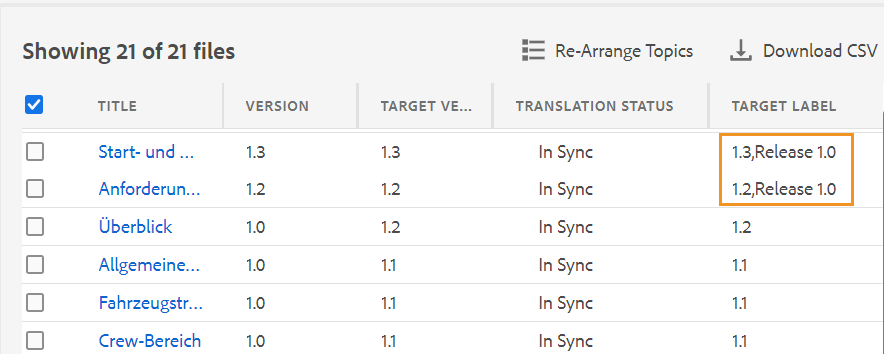
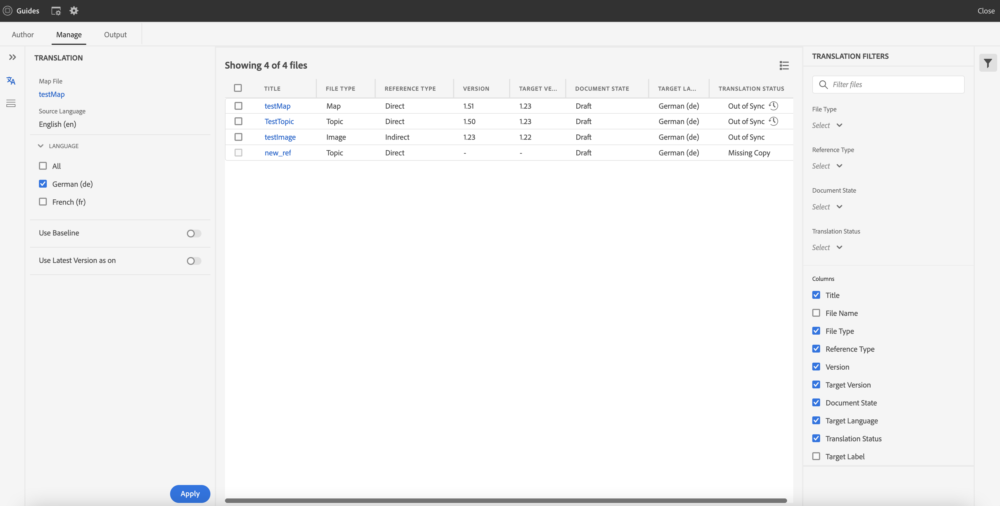
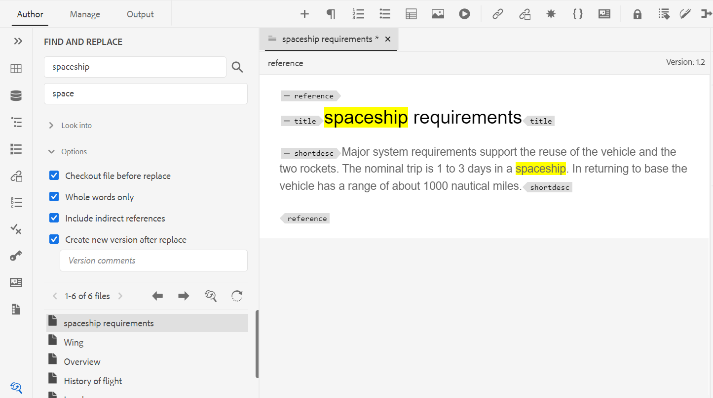
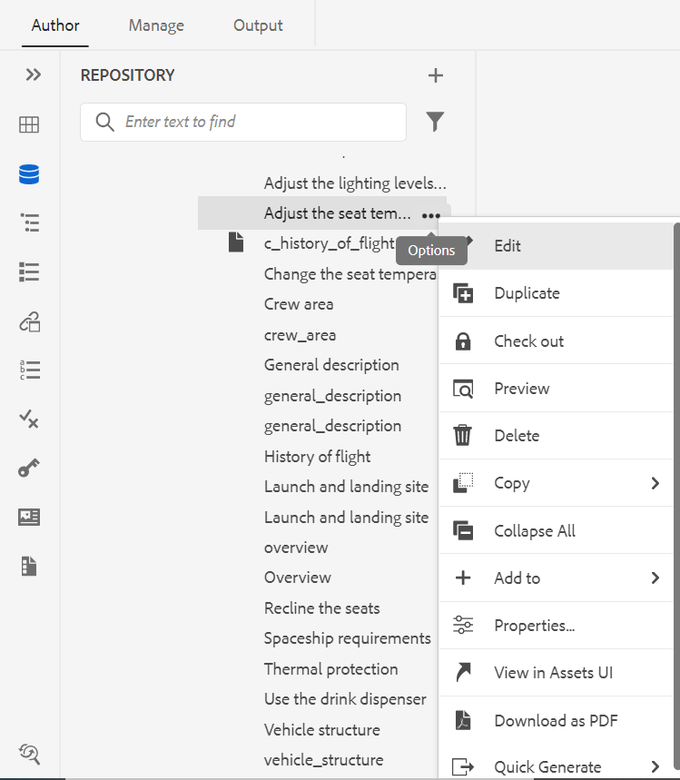

# Adobe Experience Manager Guidesas a Cloud Service版2023年2月版的新增功能

本文介绍2023年2月版Adobe Experience Manager Guides(以后称为 *AEM Guidesas a Cloud Service*)。

有关升级说明、兼容性矩阵以及此版本中修复的问题的更多详细信息，请参阅 [发行说明](release-notes-2023.2.0.md) 文章。

## 从Web编辑器生成报表

AEM Guides在Web编辑器中提供的功能使您能够检查技术文档的整体完整性并为其生成报告。
您可以从以下位置查看主题列表、管理元数据以及查看当前映射的所有引用中使用的多媒体：
**报表** 选项卡。

**生成主题列表视图**

可生成“主题列表”，其中提供有关主题的详细信息，如引用类型、文档状态和作者。 您还可以生成CSV来下载DITA映射中主题的当前快照。

**管理元数据和更改文档状态**

可以在单个主题中应用标记，也可以使用批量标记功能在多个主题、DITA映射或子映射中应用多个标记。 您也可以将所有选定主题的文档状态更改为下一个可能的公共文档状态。

**生成多媒体报告**

您可以生成多媒体报告，该报告包含有关当前映射中引用使用的多媒体的详细信息。 您可以灵活地筛选和排序报表中列出的多媒体文件。
您还可以生成CSV来下载DITA映射中使用的多媒体的当前快照。

## UX的审阅功能经过了改版

现在，AEM Guides提供了一个改进的UX，可帮助您查看共享以供查看的主题。 在最新体验中，审阅功能具有以下增强功能：

* 已刷新用户界面
* 条件面板，允许您根据主题中的可用条件突出显示内容
* 评论面板中的每个评论都链接到当前主题中的相应文本。 它有助于您识别注释的文本。
* 注释按文档中注释文本的顺序显示。
* 审核任务的名称显示在审核工作流中。
* 选择审阅任务的根图，该根图用于解析审阅内容中使用的所有关键引用和术语表。
* 上下文工具栏可帮助您快速高亮显示或删除文本
* 用于编辑或删除您自己的评论的“选项”菜单
* 对于过时的注释，您可以访问并排视图，这有助于将主题的先前版本与当前审阅版本进行比较。
* 使用过滤器时，右侧面板上的注释将根据所选内容进行过滤，左侧面板中的注释数量将相应地更新。

  

## 翻译增强功能

现在，翻译仪表板中提供了对用户更友好的增强功能，可帮助您从Web编辑器轻松翻译文档。

**将版本标签传递到目标版本**

AEM Guides允许您将源文件的标签传递到目标文件。 这有助于您轻松识别已翻译文件的源版本。

例如，如果您有一些源文件应用了版本标签发行版本1.0，那么您还可以将源标签（发行版本1.0）传递到已翻译的文件。

**强制同步不同步的资产**

如果对某些资源进行了更改，AEM Guides会将它们标记为不同步。 您可以重新翻译修改的资产，也可以选择取消不同步状态。 例如，如果您进行了一些确实不需要翻译的细微更改，则可以将其状态标记为同步。

**查看正在进行中的主题或地图翻译项目**

您的翻译仪表板上的某些引用可能正在进行中。 现在，AEM Guides提供了一项功能，可帮助您查看包含所选引用的所有正在进行的翻译项目（以及目标语言）的列表。

## 从Web编辑器生成各种格式的输出

现在，您可以从Web编辑器轻松生成主题或DITA映射的输出。 您可以配置各种输出预设，如AEM Site、PDF、HTML5、JSON（一种Headless输出格式）和自定义输出。 然后，您可以使用这些组件生成各自的输出。

您可以在DITA主题中定义属性，然后使用条件预设在发布输出时应用条件。 也可以使用基线发布功能有选择地发布DITA映射或主题的特定版本。

## 在映射级别查找和替换文本

AEM Guides允许您在映射中搜索包含特定文本的文件。 搜索到的文本将在文件中突出显示。 现在，您还可以用所有文件中的其他单词或短语替换搜索的单词或短语。 您可以选择 **全部替换** 图标，以替换所有文件中搜索词的所有匹配项。

## 从存储库面板删除和复制文件

现在，您可以轻松地从创建文件的副本或副本 **选项** 存储库面板中选定文件的菜单。 默认情况下，创建文件时带有后缀(如 `filename_1.extension`)。

## 其他Web编辑器增强功能

* 在AEM Guides中，您可以使用上下文菜单对图像和媒体文件执行一些常见操作。 现在，您还可以在存储库中找到选定的图像或媒体，或者在Assets UI中查看文件预览。

* 当前文件夹配置文件的名称在主工具栏中显示为“用户首选项”图标的标签。 这有助于您识别正在处理的文件夹配置文件。

* 在地图视图中打开地图时，当前地图的标题将显示在主工具栏的中央。 这有助于让用户知道哪个映射当前处于打开状态。

## 在氧气编辑器中查看标题以取代UUID

现在，AEM Guides允许您选择 **在编辑器和映射管理器中使用标题** 选项。 如果选择此选项，则在编辑器或DITA映射管理器中打开文件时，文件的标题将显示在文件的选项卡上。 如果不选择此选项，则文件的UUID将显示在文件的选项卡上。

## AEM Guidesas a Cloud Service基于微服务的发布

新的发布微服务使您能够在AEM Guidesas a Cloud Service上同时运行大量发布工作负载，并利用业界领先的Adobe I/O Runtime无服务器平台。

对于每个发布请求，AEM Guidesas a Cloud Service会运行一个单独的容器，该容器会根据用户请求水平缩放。 这使您能够运行多个发布请求并获得改进的性能。

有关更多详细信息，请参阅 [为AEM Guidesas a Cloud Service配置新的基于微服务的发布](https://experienceleague.adobe.com/docs/experience-manager-guides-learn/tutorials/knowledge-base/publishing/configure-microservices.md).

## 本机PDF | 在PDF输出中添加自定义书签

现在，您可以在最终PDF输出中为特定内容添加自定义书签以便轻松导航。 这将添加到从DITA映射中的主题或节标题创建的目录。

## 本机PDF | 对目录条目和主题内容应用自定义样式

AEM Guides提供了对目录条目或PDF输出中的特定主题应用自定义样式的功能。 例如，您可以更改目录中的文本颜色和主题标题。 您还可以在主题的整个内容中应用样式。

## 本机PDF | 设置脚注组件中页面标记的样式

现在，您可以在脚注中设置页面标记的样式。 例如，您可以添加括号或更改其颜色。 这些样式可帮助用户轻松识别文档中的页面标记。

## 本机PDF | 更改栏以指示目录中已更改的主题

AEM Guides现在允许您快速识别PDF输出目录中的已更改主题。  它会在目录中已更改的主题左侧显示更改栏。 您可以单击目录中的主题并查看详细更改。

