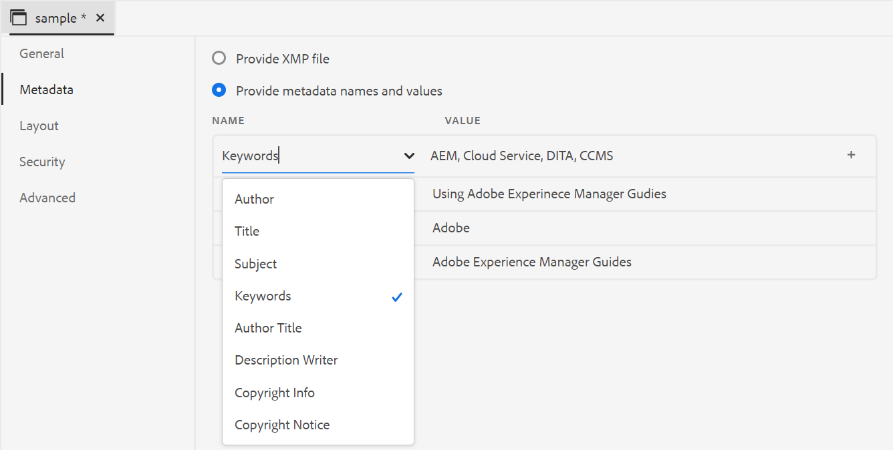
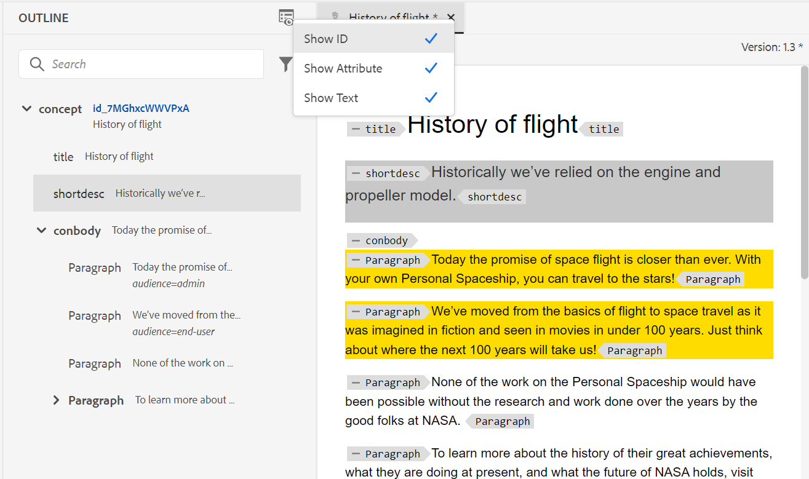

# Adobe Experience Manager Guidesas a Cloud Service版2023年4月版的新增功能

本文介绍2023年4月版Adobe Experience Manager Guides(以后称为 *AEM Guidesas a Cloud Service*)。

有关升级说明、兼容性矩阵以及此版本中修复的问题的更多详细信息，请参阅 [发行说明](release-notes-2023.4.0.md) 文章。

## PDF发布中的高级元数据支持

AEM Guides现在为映射到PDF输出中元数据的元数据提供高级支持。 元数据选项包括有关文档及其内容的信息，如作者姓名、文档标题、关键字、版权信息和其他数据字段。

您可以导入XMP文件，AEM Guides可以从文件中选取信息。 您还可以选择使用下拉菜单提供元数据名称和值。 您还可以通过直接在名称字段中键入来添加自定义元数据。

## 增强的大纲视图面板

AEM Guides提供了一个改进的“大纲视图”面板，您可以在其中获得文档中所用元素的分层视图。

“大纲视图”提供了以下增强功能：

* “视图选项”下拉列表显示在“大纲视图”面板的顶部。 如果元素具有ID、属性和文本，则可以从下拉列表中选择它们，以与元素一起显示它们。 可以在“大纲视图”面板中显示的属性由管理员在 **编辑器设置**.

* 使用搜索功能，您可以按元素的名称、ID、文本或属性值搜索元素。

## AEM Guidesas a Cloud Service基于微服务的发布

AEM Guidesas a Cloud Service提供了与基于微服务的发布同时运行大型发布工作负载的功能，并利用业界领先的Adobe I/O Runtime无服务器平台。

现在，在4月版中，您可以使用基于微服务的本机PDF发布同时运行多个发布PDF并非常高效地生成批量请求输出。
有关更多详细信息，请参阅 [为AEM Guidesas a Cloud Service配置新的基于微服务的发布](../knowledge-base/publishing/configure-microservices.md).
