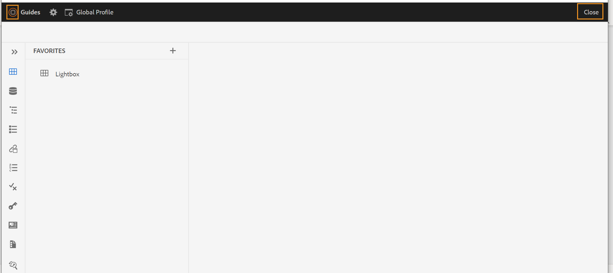

# Adobe Experience Manager Guidesas a Cloud Service版2023年6月版的新增功能

本文介绍2023年6月版Adobe Experience Manager Guides(以后称为 *AEM Guidesas a Cloud Service*)。

有关升级说明、兼容性矩阵以及此版本中修复的问题的更多详细信息，请参阅 [发行说明](release-notes-2023.6.0.md).

## Web编辑器中的“断开链接”报表

AEM Guides允许您检查技术文档的整体完整性，并从Web编辑器生成报告。 2023年6月版AEM Guides现在提供了查看和修复断开链接的功能。 这是一个有用的报表，可帮助您管理断开的链接。 您可以轻松地查看DITA映射中存在的断开链接并进行修复。
{width="800" align="left"}

修复链接后，该链接不会显示在断开链接列表下。

有关更多详细信息，请参阅 [查看和修复断开的链接](../user-guide/reports-web-editor.md#report-broken-links).

## 重命名和移动存储库视图中的文件

现在，您还可以从存储库面板重命名或移动文件。 此功能非常方便，有助于从“存储库”面板轻松管理文件。 您可以选择文件，然后使用 **选项** 菜单。 当您移动或重命名文件时，AEM Guides会显示一条成功消息。

{width="650" align="left"}

有关文件“选项”菜单的更多详细信息，请参见 **存储库视图** 中的功能描述 [左侧面板](../user-guide/web-editor-features.md#id2051EA0M0HS) 部分。

## 本机PDF增强功能

### 为草稿文档的PDF输出添加水印

现在，您可以向尚未批准的文档的PDF输出添加水印。 如果您为“已批准”文档生成的文档PDF，则不会显示此水印。 例如，您可以为PDF输出添加水印“草稿”。

有关更多详细信息，请参阅 [为草稿文档的PDF输出添加水印](../native-pdf/use-javascript-content-style.md#watermark-draft-document).

### 支持语言变量

AEM Guides提供对语言变量的支持。 您可以使用语言变量来定义开箱即用标签的本地化版本，例如PDF输出中的“注意”、“注意”和“警告”或静态文本。
您可以将语言变量或本地化的标签版本添加到PDF输出和输出模板中的相应部分。

#### PDF输出中的语言变量

您可以使用语言变量为“注意”、“警告”等元素定义本地化标签。 您可以用一种或多种语言更新这些变量的值，然后在PDF输出中自动选取本地化值。
例如，您可以通过以下方式在PDF输出中显示标签“注释”：

* 英文：注释
* 法语：雷马克
* 德语：欣威语

#### 输出模板中的语言变量

如果要创建各种语言的PDF输出，则必须创建包含每种语言的本地化文本的各种PDF模板。 现在，使用语言变量功能，您只需创建模板一次。 然后，对于需要本地化的任何静态文本，您可以创建相应的语言变量并在模板中使用它们。
您可以为较长的文本创建语言变量，例如整个句子甚至段落。 您还可以应用样式并使用HTML标记来设置这些语言变量的格式。

有关详细信息，请查看 [支持语言变量](../native-pdf/native-pdf-language-variables.md).

### 能够在PDF布局中使用AEM元数据

元数据是内容的描述或定义。 此元数据存储在源DITA映射内容中。

现在，在AEM Guides中，您还可以选择资源的元数据属性，并将它们添加到页面布局中。 然后，AEM Guides会选取资源的这些元数据属性，并将它们发布在PDF输出中。

{width="550" align="left"}

>[!NOTE]
>
> AEM Guides还支持DITA映射的元数据属性。

有关更多详细信息，请参阅 [添加字段和元数据](../native-pdf/design-page-layout.md#add-fields-metadata).

## 模式增强功能

### 使用报表语句检查Schematron中的规则

AEM Guides现在也支持带有架构的报表语句。 当测试语句的计算结果为true时，报表语句会生成消息。 例如，如果希望简要说明少于或等于150个字符，则可以定义报告语句以检查简要说明超过150个字符的主题。

有关更多详细信息，请参阅 [使用声明和报表语句检查规则](../user-guide/support-schematron-file.md#schematron-assert-report).

### 使用正则表达式

您还可以使用Regex表达式定义包含matches()函数的规则，然后使用Schematron文件执行验证。

有关更多详细信息，请参阅 [使用正则表达式](../user-guide/support-schematron-file.md#schematron-assert-report).

### 定义抽象模式

AEM Guides还支持Schematron中的抽象模式。 您可以定义通用抽象模式并重用这些抽象模式。 抽象模式可以简化您的Schematron模式，并帮助您管理和更新验证逻辑。

有关更多详细信息，请参阅 [定义抽象模式](../user-guide/support-schematron-file.md#schematron-abstract-patterns).

## 从Web编辑器导航到AEM主页

现在，您可以轻松地从Web编辑器导航到AEM主页。

{width="800" align="left"}

* 单击 **指南** 图标( )，以返回到“AEM导航”页面。

有关更多详细信息，请参阅 [AEM导航页面](../user-guide/web-editor-launch-editor.md#id2056BG00RZJ).

## 处理主题定义和枚举的分层定义

AEM Guides附带了创建主题方案映射的强大功能，这些主题方案映射是DITA映射的一种特殊形式，用于定义分类主题和控制值。 现在，AEM Guides还允许您在映射中定义主题定义，以及在其他映射中定义枚举定义。 然后，可以添加映射引用并使用主题方案。
主题枚举引用在同一映射或引用的映射中进行解析。

有关处理主题定义和枚举的分层定义的更多详细信息，请参见 **主题方案** 中的功能描述 [左侧面板](../user-guide/web-editor-features.md#id2051EA0M0HS) 部分。

## 在翻译中支持XLIFF格式

AEM Guides还支持翻译中的XML本地化交换文件格式(XLIFF)格式。 现在您还可以选择 **创建新的XLIFF翻译项目** 将XML内容转换为XLIFF格式。
使用此格式，您可以将内容导出为行业标准XLIFF格式，然后将其提供给翻译供应商。 有关更多详细信息，请参阅 [创建翻译项目](../user-guide/translate-documents-web-editor.md#create-translation-project).

{width="350" align="left"}

## “收藏夹”面板已改进

AEM Guides可帮助您创建文件和文件夹的收藏集或收藏夹列表，并轻松使用它们。 现在 **选项** 菜单也可在 **收藏夹** 面板。 您可以重命名选定的收藏集，也可以将其从 **选项** 菜单。 您可以选择 **刷新** 选项，用于从存储库中获取文件或文件夹的刷新列表。 您还可以在Assets UI中查看文件夹内容。

{width="650" align="left"}

>[!NOTE]
>
> 您也可以使用 **刷新** 图标。

欲知关于 **选项** 收藏夹的菜单，请参阅 **收藏夹** 中的功能描述 [左侧面板](../user-guide/web-editor-features.md#id2051EA0M0HS) 部分。

## 切换到系统主题

您现在还可以使用设备主题。 使用 **用户首选项**，您可以将AEM Guides配置为根据设备的主题在浅色和深色主题之间自动切换。

{width="550" align="left"}

欲知更多详情，请参见 **用户首选项** 中的功能描述 [主工具栏](../user-guide/web-editor-features.md#id2051EA0G05Z) 部分。
