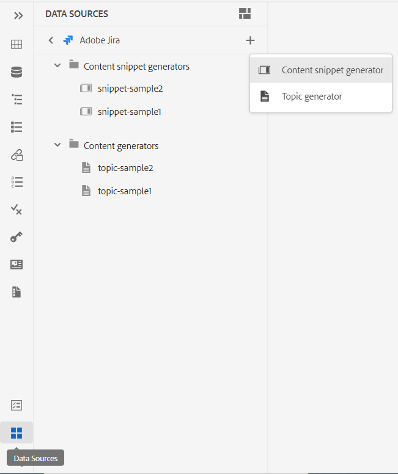
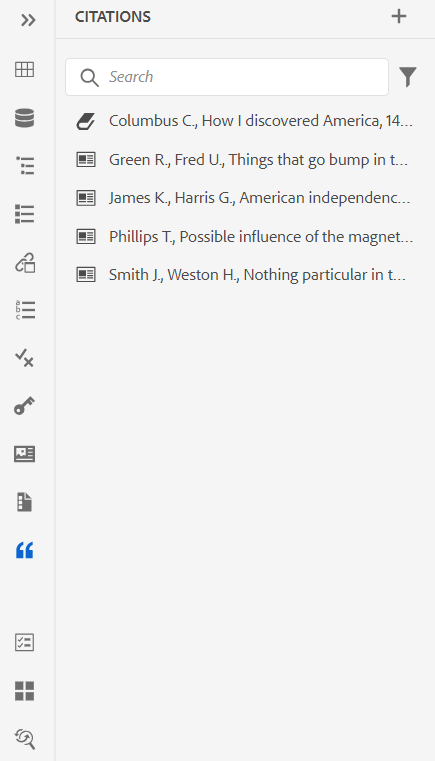
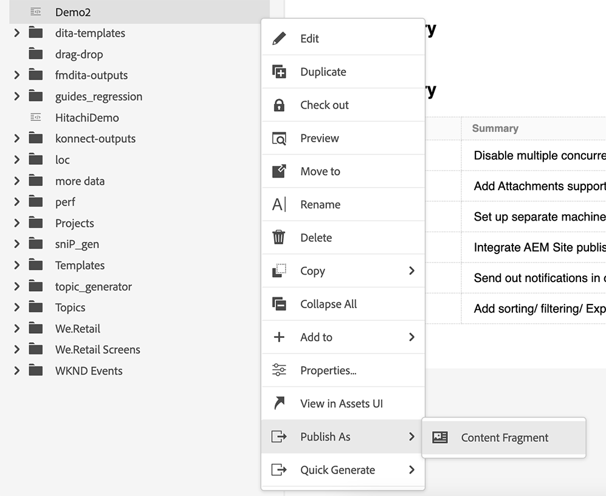
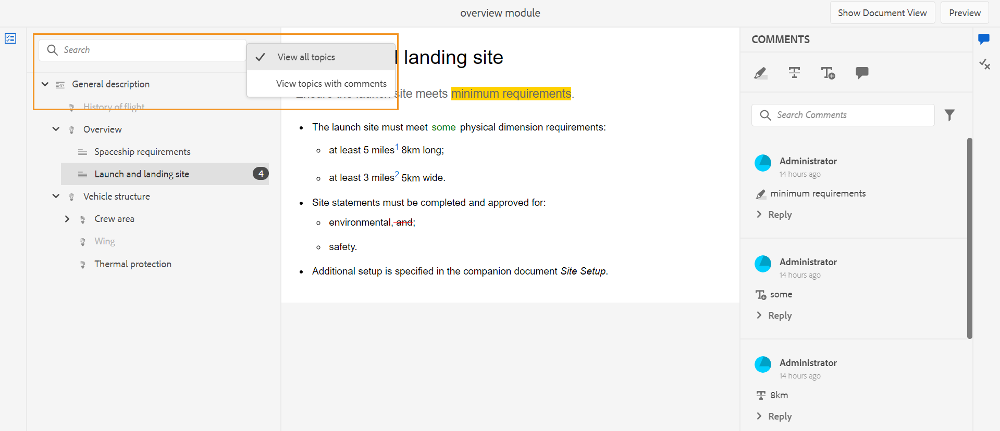
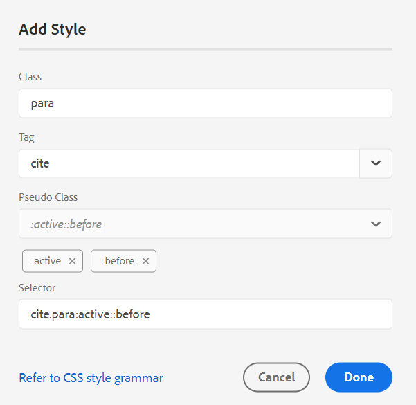
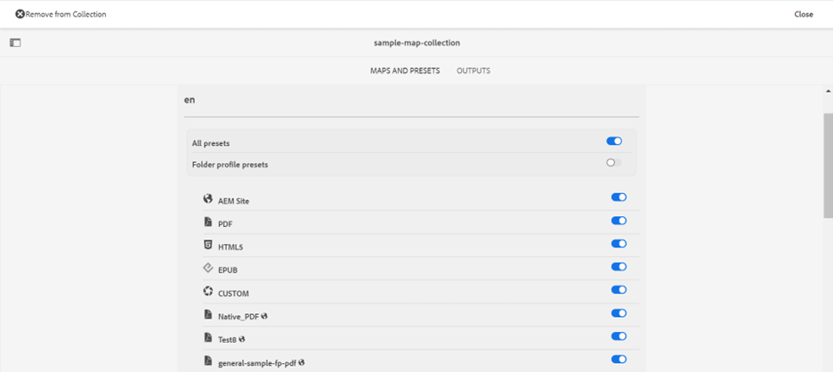
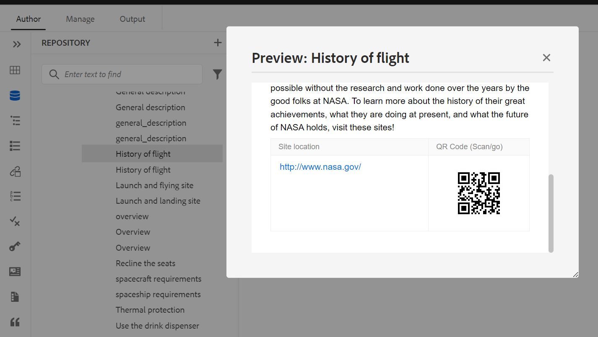

# Adobe Experience Manager Guidesas a Cloud Service版2023年9月版的新增功能

本文介绍2023年9月版Adobe Experience Manager Guides(以后称为 *AEM Guidesas a Cloud Service*)。

有关升级说明、兼容性矩阵以及此版本中修复的问题的更多详细信息，请参阅 [发行说明](release-notes-2023.9.0.md).

## 连接到数据源并插入主题

AEM Guides提供了现成的连接器，可帮助您连接数据源，从而使AEM Guides成为真正的内容中心。 这为您提供了省时省力的优势，否则您将需要花在手动数据添加或复制上。

除了现有的现成连接器（如JIRA和SQL）(MySQL、PostgreSQL、SQL Server、SQLite)之外，管理员还可以为MariaDB、H2DB、AdobeCommerce和Elasticsearch数据库配置连接器。 它们还可以通过扩展缺省接口来添加其它连接器。

您可以在下面查看已配置的连接器 **数据源** 面板。

*查看连接的数据源。*

您现在还可以从连接的数据源创建主题。 主题可以包含各种格式的数据，如表、列表和段落。 它还允许您为所有主题创建DITA映射。 从数据源提取时，您可以将元数据与主题相关联。

有关详细信息，请查看 [使用来自数据源的数据](../user-guide/web-editor-content-snippet.md).

## 将引用添加到您的内容

引用是指对添加到内容的信息源的引用。 引用内容有助于建立可信度，防止抄袭。 引文可帮助读者找到源文件并验证文本中提供的信息。

在AEM Guides中，您可以添加引文或导入引文，并将它们应用到您的内容。 您可以从任何书籍、网站和日记帐来源添加这些引文。

将引文插入主题后，您可以在Web编辑器中预览它们。 您还可以使用本机PDF发布包含引文的内容。

{width="300" align="left"}

*在“引文”面板中查看引文列表。*

有关详细信息，请查看 [在内容中添加和管理引文](../user-guide/web-editor-apply-citations.md).

## 发布到内容片段

内容片段是AEM中的离散内容片段。 它们是基于内容模型的结构化内容。 内容片段是纯内容，没有设计或布局信息。 它们可以独立于AEM支持的渠道进行创作和管理。 内容片段的模块化和重用性带来了更大的灵活性、一致性、效率和更简单的管理。

现在，AEM Guides提供了一种将主题或主题中的元素发布到内容片段的方法。 您可以在主题和内容片段模型之间创建基于JSON的映射。 使用此映射将主题中部分或所有元素中存在的内容发布到内容片段。

利用AEM Guides和内容片段的强大功能，并在任何AEM站点中使用内容片段。 您还可以通过内容片段支持的API提取详细信息。

{width="550" align="left"}

*将主题发布到内容片段。*

有关详细信息，请查看 [发布到内容片段](../user-guide//publish-content-fragment.md).

## 审核增强功能

AEM Guides现在提供了改进的审阅功能，具有以下功能：

### 搜索审核主题

审查是AEM Guides的关键功能。 它有助于查看者查看分配给他们的文档。
现在，通过在审阅面板的主题视图的搜索栏中输入标题或文件路径的文本的一部分来搜索主题。 您还可以选择查看所有主题或查看包含注释的主题。 默认情况下，可以查看审阅任务中存在的所有主题。 有关详细信息，请查看 [查看主题](../user-guide/review-topics.md).

{width="800" align="left"}

*在审阅面板中搜索审阅主题。*

## Guides扩展框架

在AEM Guides上创建自定义包，以便使用AEM Guides Extension Framework实现可扩展性。 这些包对开发人员和顾问非常有用，并且可为编辑器中的组件提供可扩展性。 他们可以定位按钮、对话框和下拉列表，并添加可轻松与AEM Guides UI交互操作的自定义JavaScript。

## 本机PDF增强功能

2023年9月版中完成了以下本机PDF增强，使AEM Guides成为一个更强大的产品：

### 对PDF输出中的页进行排序

您可以在PDF中显示或隐藏以下部分，还可以排列它们在最终PDF输出中的显示顺序：

* 目录
* 章节和主题
* 数字列表
* 表列表
* 索引
* 术语表
* 引用
* 页面布局

如果不想在PDF输出中显示特定截面，可以通过关闭切换开关来隐藏该截面。

有关详细信息，请查看 [页面顺序](../native-pdf/components-pdf-template.md#page-order).

### 合并页面

默认情况下，在本机PDF输出中，所有部分都从新页面开始。 现在，您可以将部分合并到其上一页或下一页。 此操作将发布与PDF输出中选择的页面一致的部分，并且中间没有分页符。

有关更多详细信息，请查看 **合并页面** 中的功能描述 [页面顺序](../native-pdf/components-pdf-template.md#page-order) 部分。

### 从当前页面开始任何章节

可以设置从奇数页或偶数页开始章节的基本配置设置、目录结构，并定义目录条目的引线格式。

现在，您还可以从当前页面开始一个章节。 如果选择这样做，则所有章节将继续发布，而不带任何分页符。 例如，如果章节在页面15的中间结束，则下一章节也会从第15页本身开始。

有关更多详细信息，请查看 **常规** 中的选项卡说明  [高级PDF设置](../native-pdf/components-pdf-template.md#advanced-pdf-settings-advanced-pdf-settings).

### 静态页面

您还可以创建自定义页面布局，并将其发布为PDF输出中的静态页面。 这有助于您添加任何静态内容，如注释或空白页面。

有关更多详细信息，请查看 **静态页面** 中的功能描述 [页面顺序](../native-pdf/components-pdf-template.md#page-order) 部分。

### 交叉引用中的变量

您可以使用变量来定义交叉引用。 使用变量时，将从属性中提取其值。

现在您还可以使用 {figure} 和 {table}.
使用 {figure}添加对图编号的交叉引用。 它从您为数字定义的自动编号样式中选取数字编号。

使用 {table} 添加对表编号的交叉引用。 它会从您为题注定义的自动编号样式中选取表格编号。

有关详细信息，请查看 [交叉引用](../native-pdf/components-pdf-template.md##cross-references).

### 重新设计CSS编辑器

现在，CSS编辑器经过重新设计，可提供更好的选择器和样式属性用户体验。

#### 增强“添加样式”对话框

您现在可以使用自定义选择器添加复杂样式。 新的Selector字段可帮助您添加除Class 、 Tag和Pseudo Class组合之外的自定义选择器。 例如，您可以创建 `table a.link` 表内所有超链接的样式。

{width="300" align="left"}

*添加新样式的详细信息。*

#### 自定义样式的属性

现在，AEM Guides将向您介绍样式预览部分下的新属性面板。 您可以在“属性”面板中更有效、更快速地编辑样式的属性。

## 在单个枚举定义中支持多个主题定义

现在，您可以在一个映射中定义一个或多个主题定义，在另一个映射中定义枚举定义，然后添加映射引用。 主题枚举引用在同一映射或引用的映射中进行解析。

您现在还可以定义条件并将其应用于主题中的某些特定元素。  条件仅对这些特定元素可见，对于所有其他元素则不可见。

有关处理主题定义和枚举的分层定义的更多详细信息，请参阅 [左侧面板](../user-guide/web-editor-features.md#id2051EA0M0HS) 部分。

## 选择地图收藏集中的所有预设

您不仅可以启用单个预设和所有文件夹配置文件预设，还可以一次性启用DITA映射的所有预设。
{width="800" align="left"}\
*选择映射集合中的所有预设。*

有关详细信息，请查看 [使用映射集合生成输出](../user-guide/generate-output-use-map-collection-output-generation.md).

## 批量发布功能板支持本机PDF

借助AEM Guides的批量激活功能，您可以快速轻松地激活内容从创作到发布实例。 在“批量激活”映射中，您可以包含本机PDF输出预设、AEM站点、PDF、HTML5、自定义和JSON输出。
有关详细信息，请查看 [批量激活已发布内容](../user-guide/conf-bulk-activation.md).

## 改进的批量移动工具

现在，作为管理员，您可以使用改进的批量移动工具将具有多个文件的文件夹从一个位置移动到另一个位置。
可以使用“浏览文件”对话框选择要移动的源文件夹。 您还可以浏览以选择要移动源文件夹的目标位置。 选择  {width="25" align="left"} 靠近某个字段可查看有关该字段的更多信息。

有关详细信息，请查看 [批量移动文件](../user-guide/authoring-file-management.md#move-files-bulk).

## 上下文菜单中的增强预览体验

使用上下文菜单快速预览文件（.dita、.xml、audio、video或image），而无需将其打开。 您现在可以调整预览窗格的大小，如果内容包含任何引用链接，则可以选择它，以在新选项卡中打开它。

{width="800" align="left"}

*在窗格中预览文件。*

有关上下文菜单的更多详细信息，请参阅 **文件选项** 中的功能描述 [左侧面板](../user-guide/web-editor-features.md#id2051EA0M0HS) 部分。

## 在目标路径、站点名称或文件名选项中为当前日期和时间使用变量

在AEM网站或PDF中生成输出时，您可以使用变量来设置 **目标路径**， **站点名称**，或 **文件名** 选项。 您现在还可以使用 `${system_date}`和 `${system_time}` 变量。 这些变量可帮助您将当前日期和时间附加到这些选项。

了解如何 [使用变量设置“目标路径”、“站点名称”或“文件名”选项](../user-guide/generate-output-use-variables.md).
