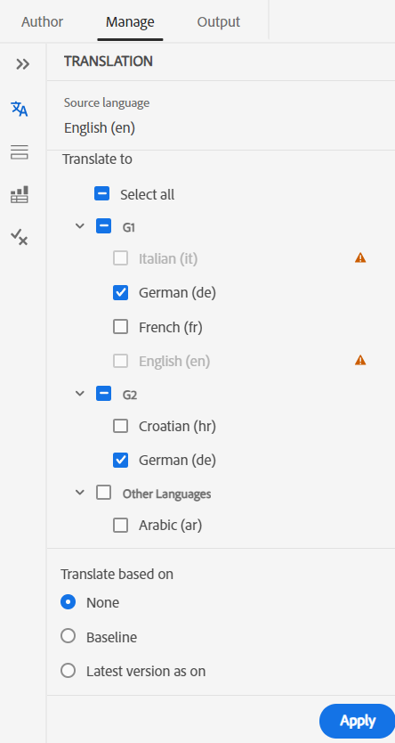
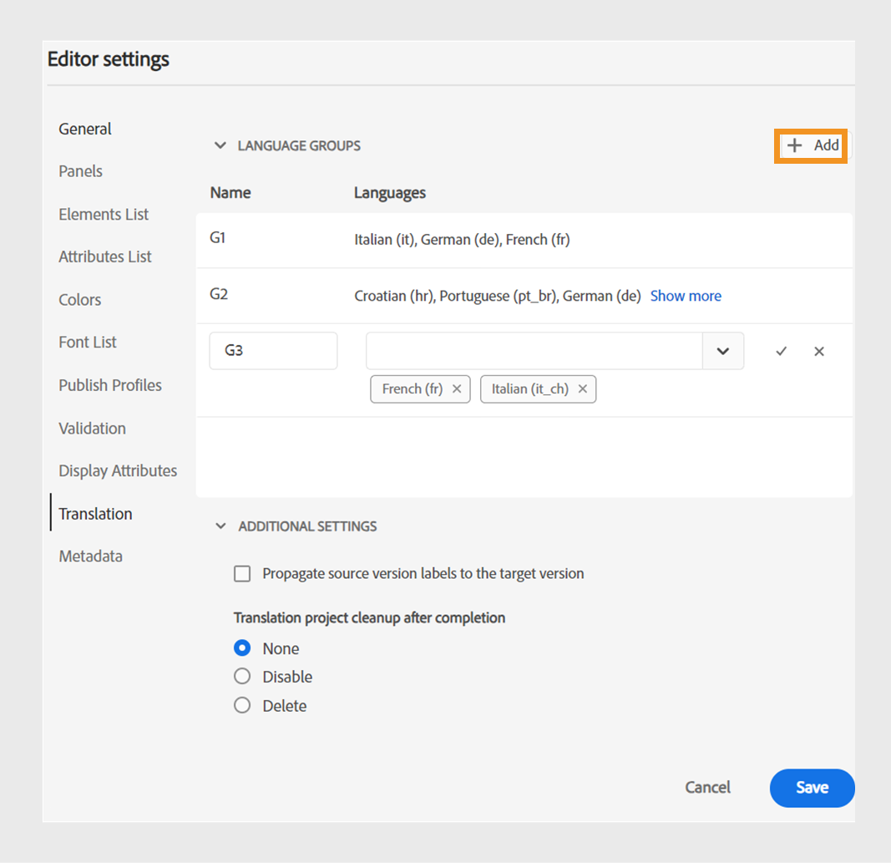
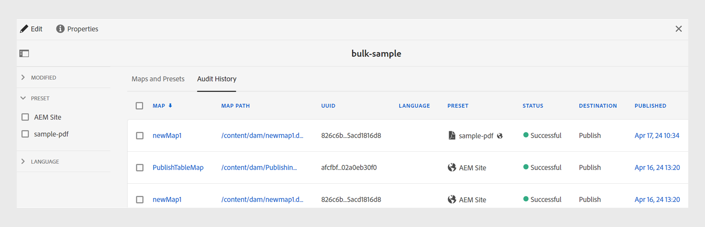
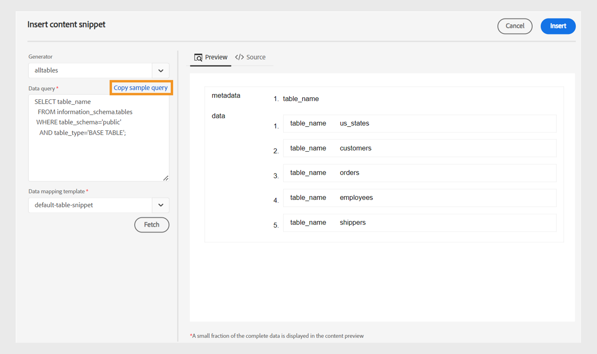
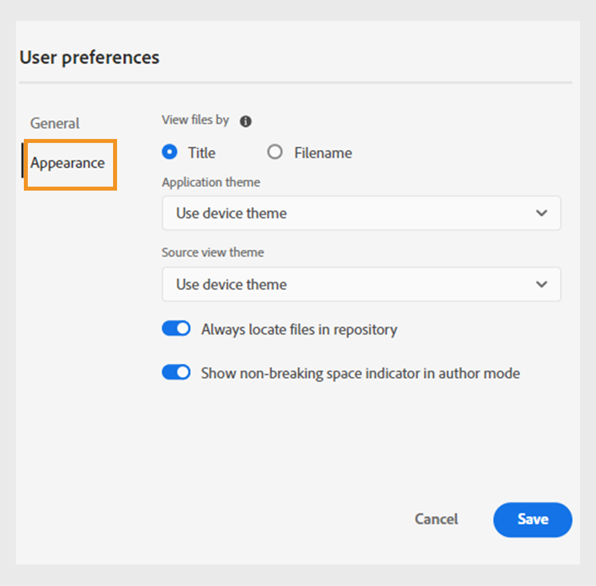
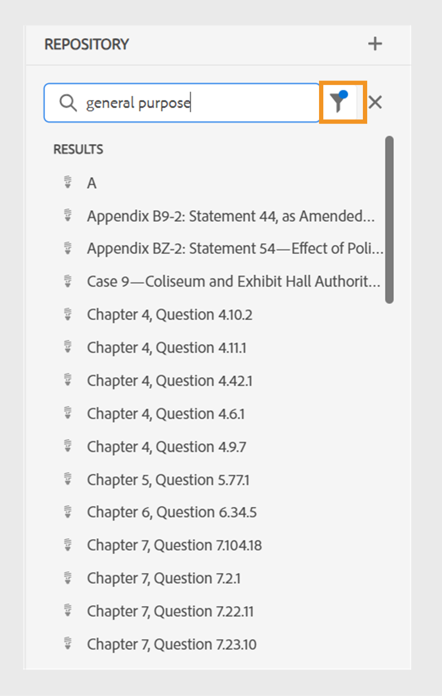
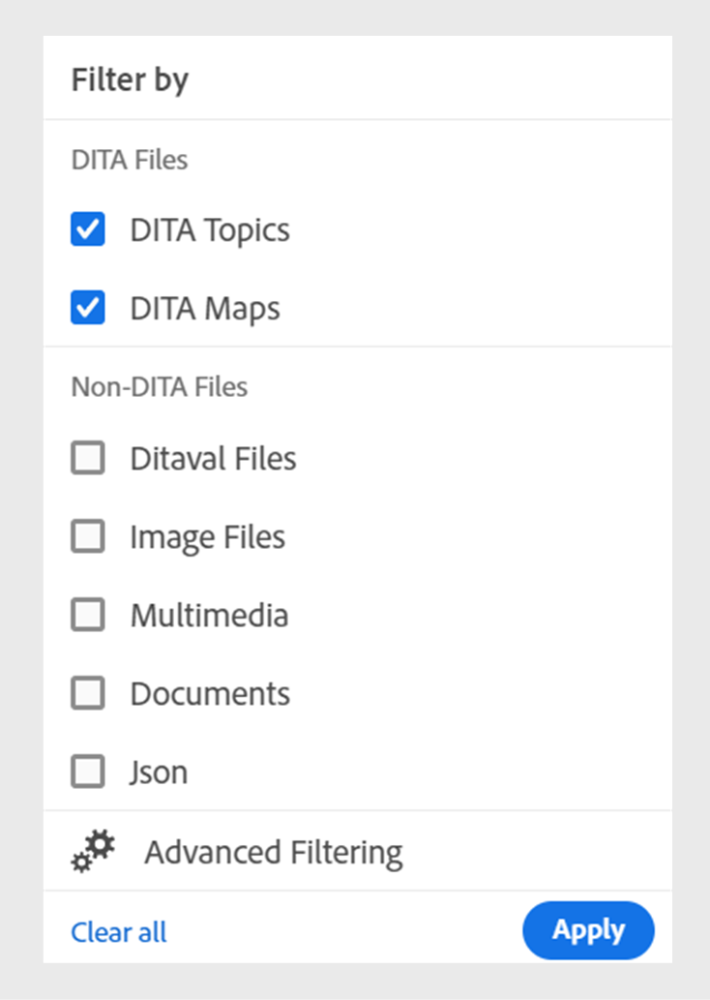
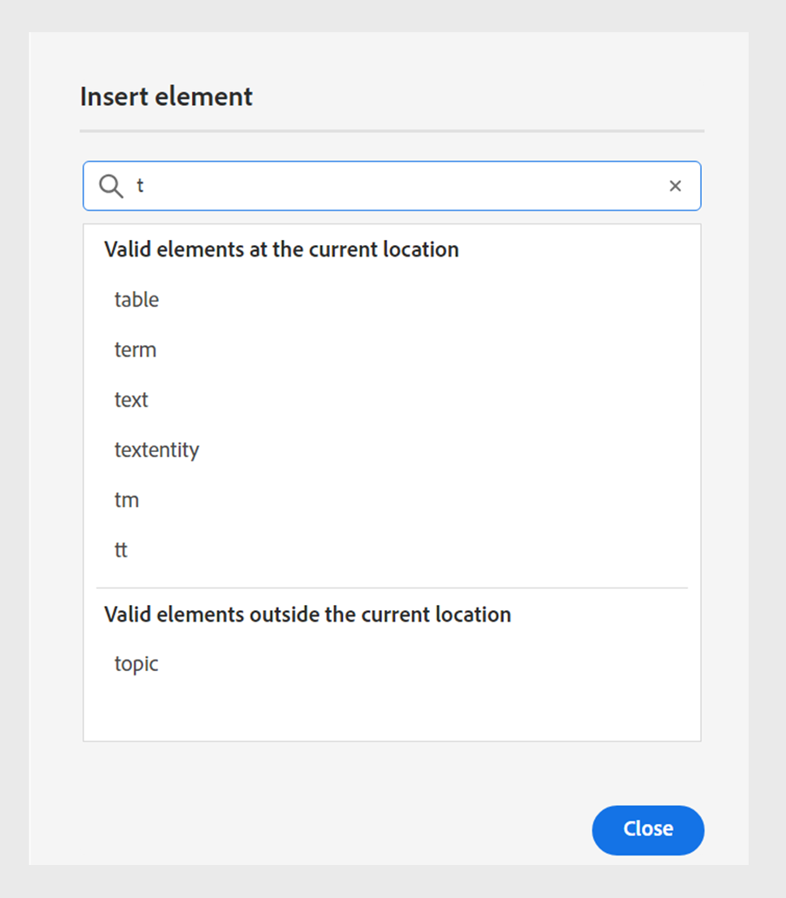
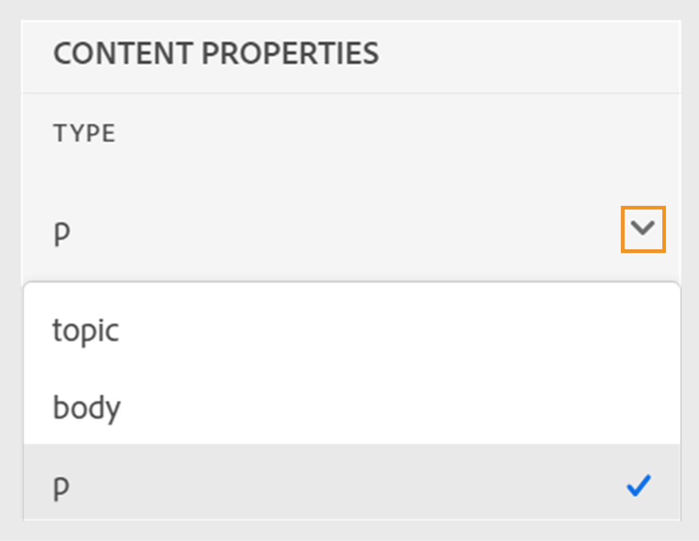
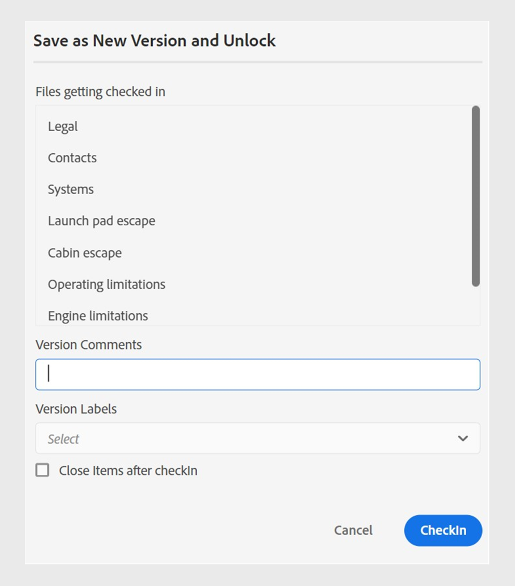

# 2024.4.0版本中的新增功能

本文介绍Adobe Experience Manager Guides 2024.4.0版的新增功能和增强功能。

有关此版本中修复的问题列表，请查看 [修复了2024.4.0版本中的问题](fixed-issues-2024-04-0.md).

了解 [2024.4.0版的升级说明](upgrade-instructions-2024-04-0.md).

## 能够使用预配置的语言组将内容翻译成多种语言

Experience Manager指南现在允许您创建语言组并轻松地将内容翻译成多种语言。 此功能可帮助您根据组织的需求组织和管理翻译。

例如，如果您需要为某些欧洲国家/地区翻译您的内容，则可以创建一个欧洲语言的语言组，如英语(EN)、法语(FR)、德语(DE)、西班牙语(ES)和意大利语(IT)。

{width="300" align="left"}

*选择要翻译文档的语言组或语言。*

>[!NOTE]
>
>如果缺少语言的目标文件夹，或者目标语言与源语言相同，则文件夹将呈灰色显示，并显示一个警告符号。

作为管理员，您可以创建语言组并将它们配置为多个文件夹配置文件。 作为作者，您可以查看在文件夹配置文件中配置的语言组。

总体而言，创建语言组可提高翻译项目的效率和生产率，最终改进跨多种语言的本地化流程。

了解如何 [从Web编辑器翻译文档](../user-guide/translate-documents-web-editor.md).

## 在翻译后自动删除或禁用翻译项目

现在，作为管理员，您可以将翻译项目配置为在完成翻译后自动禁用或删除。 此功能可帮助您在完成翻译后高效地使用资源和管理文件。

删除项目将永久删除该项目中存在的所有文件和文件夹。 删除翻译项目还可以释放已占用的磁盘空间。

如果要稍后使用翻译项目，可以禁用这些项目。

{width="550" align="left"}

*为翻译项目配置语言组和清理设置。*

详细了解如何 [自动删除或禁用翻译项目](../user-guide/translate-documents-web-editor.md#automatically-delete-or-disable-a-completed-translation-project).

## 在预览实例的批量激活集合中激活映射的输出

现在，除了在发布实例上激活批量激活集合的输出之外，Experience Manager指南作为Cloud Service提供了在 **预览** 实例。

此功能可帮助您将内容激活到预览实例，允许您在将其激活到之前查看内容的外观和工作方式 **Publish** 实例。

{width="800" align="left"}

*在中查看有关已激活映射输出的信息&#x200B;**审核历史记录**选项卡。*

了解有关  [批量激活](../user-guide/conf-bulk-activation-publish-map-collection.md).

## 数据源连接器中的增强功能

对2024.4.0版本的数据源连接器进行了以下增强：

### 连接到Salsify、Akeneo和Microsoft Azure DevOps Boards (ADO)数据源

除了现有的开箱即用连接器外，Experience Manager指南还为Salsify、Akeneo和Microsoft Azure DevOps Boards (ADO)数据源提供连接器。 作为管理员，您可以下载并安装这些连接器。 然后，配置已安装的连接器。

### 复制并粘贴示例查询以创建内容片段或主题

您可以在生成器中轻松复制并粘贴示例数据查询，以创建内容片段或主题。 使用此功能，您无需记住语法或手动创建查询。 您可以复制并粘贴示例查询，编辑该查询，然后按照您的要求使用它获取数据，而不是手动键入查询。

{width="800" align="left"}

*复制并编辑示例查询以创建内容片段。*

### 使用文件连接器连接到JSON数据文件

现在，作为管理员，您可以配置JSON文件连接器，以使用JSON数据文件作为数据源。 使用连接器从您的计算机或Adobe Experience Manager Assets导入JSON文件。 然后，作为作者，您可以使用生成器创建内容片段或主题。

此功能可帮助您使用JSON文件中存储的数据并在各种代码片段中重复使用。 每次更新JSON文件时，内容也会动态更新。

### 为连接器配置多个资源URL以创建内容片段或主题

作为管理员，您可以为某些连接器(如Generic REST Client、Salsify、Akeneo和Microsoft Azure DevOps Boards (ADO))配置多个资源URL。

然后，作为作者，与数据源连接以使用生成器创建内容片段或主题。 此功能非常方便，因为您不必为每个URL创建数据源。 它可帮助您从单个内容片段或主题中特定数据源的任何资源快速获取数据。

查看有关数据源连接器和操作方法的更多详细信息 [从用户界面配置数据源连接器](../cs-install-guide/conf-data-source-connector-tools.md).

了解如何 [使用来自数据源的数据](../user-guide/web-editor-content-snippet.md).

## 使用新的用户首选项UI自定义您的Web编辑器体验

此 **用户首选项** Web编辑器中的对话框现在包含一个新的 **外观** 选项卡。 此新选项卡允许您在Web编辑器界面中方便地配置最常见的外观首选项。

您可以配置以按标题或文件名查看文件，并更改应用程序和源视图的主题。 它还有助于您配置设置，以便在存储库视图中查找打开的文件并处理不间断空格。

{width="550" align="left"}

*根据您的喜好自定义外观。*

了解关于 **用户首选项** 中的功能描述 [左侧面板](../user-guide/web-editor-features.md#id2051EA0M0HS) 部分。

## 在Web编辑器的存储库视图中查找打开的文件

选择 **始终在存储库中查找文件** 中的选项 **用户首选项** 在存储库视图中快速导航和查找文件。 您不必手动搜索它。

在编辑时，此功能还可帮助您轻松查看文件在存储库层次结构中的位置。

有关详细信息，请查看 [在存储库视图中查找打开的文件](../user-guide/web-editor-edit-topics.md#locate-an-open-file-in-the-repository-view).

## 改进了Web编辑器中不间断空格的处理

Experience Manager指南允许您在Web编辑器中编辑文档时显示不间断空间指示器。 它还改进了不中断空间的处理。
它将多个连续的空格转换为单个空格，以在Web编辑器中保留文档的WYSIWYG视图。 此功能还有助于改进文档的整体外观和专业性。

有关更多详细信息，请查看 [Web编辑器的其他功能](../user-guide/web-editor-other-features.md).

## 在Adobe Experience Manager Assets上禁用选择性文件夹的后处理

作为管理员，您现在可以在Experience Manager Assets上为选择性文件夹禁用后处理和UUID生成。 此配置可能很有用，尤其是在处理许多资源或复杂的文件夹结构时。 它还有助于多个用户同时快速上传资产，而不会相互干扰。  

禁用文件夹的后处理也会影响其所有子文件夹。 但是，Experience Manager指南现在提供了为被忽略文件夹中的各个子文件夹选择性地启用后处理的功能。

了解如何 [禁用文件夹的后处理](../cs-install-guide/conf-folder-post-processing.md).

## 在存储库视图中搜索和筛选文件的改进体验

现在，您在筛选文件时有了增强的体验。 经过改进的文件过滤功能提供了一种改进的方法，让您能够轻松地搜索和浏览文件。

{width="300" align="left"}

*搜索包含文本的文件`general purpose.`*

享受以下好处：更快地访问相关文件以及更直观的用户界面，让您的搜索体验更顺畅、更有效。

 {width="300" align="left"}

*使用快速筛选器搜索DITA和非DITA文件。*

了解关于 **筛选搜索** 中的功能 [左侧面板](../user-guide/web-editor-features.md#id2051EA0M0HS) 部分。

## 用于根据元素的位置查看和插入有效元素的隔离列表

在Web编辑器中编辑文档时，您现在可以查看在当前位置以及在当前位置之外有效的元素的独立列表。 根据要求，您可以从以下选项中选择元素：

* **当前位置的有效元素** 可以在当前光标位置本身处插入。
* **当前位置之外的有效元素** 可以在元素层次结构中当前元素的任何父元素之后插入。

{width="300" align="left"}

*查看有效元素的分离列表以在当前位置插入元素。*

此有效元素拆分列表可帮助您维护内容结构并遵循DITA标准。

了解关于 **插入元素** 中的功能 [辅助工具栏](../user-guide/web-editor-features.md#2051ea0j0y4) 部分。

## 内容属性类型显示为下拉菜单

现在，查看内容属性 **类型** 显示为下拉菜单。 您可以查看并从下拉列表中为当前标记选择完整层次结构的标记。

此下拉菜单可帮助您快速访问层次结构中的相关标记。

{width="300" align="left"}

*从层次中为当前标记选择一个标记。*

了解关于 **内容属性** 中的功能 [右侧面板](../user-guide/web-editor-features.md#id2051eb003yk) 部分。

## 改进了从映射编辑器批量检查文件的性能

Experience Manager指南改进了映射编辑器中批量文件签入功能的性能和体验。 这项改进可帮助您更快地批量签入文件。
您还可以从查看文件签入操作的进度 **另存为新版本并解锁** 对话框。 最后，在操作完成且所有选定的检出文件都已检入后，将显示成功消息。

{width="300" align="left"}

*查看从映射编辑器批量签入的文件的列表和状态。*

了解如何 [使用高级映射编辑器](../user-guide/map-editor-advanced-map-editor.md)

## 通过DITA-OT生成输出时下载临时文件

您还可以下载通过DITA-OT发布AEM Site、HTML、自定义、JSON或PDF输出时生成的临时文件。 此功能可帮助您分析输出生成过程中可能发生的任何问题并有效地进行故障排除。  
如果您选择了任何已传递到使用DITA-OT生成的输出的元数据属性，则也可以下载metadata.xml文件。 

有关预设的更多详细信息，请查看 [了解输出预设](../user-guide/generate-output-understand-presets.md).

## 使用IMS OAuth凭据替换IMS JWT凭据以进行基于微服务的发布

服务帐户(JWT)凭据已弃用，更倾向于 **OAuth服务器到服务器** 凭据。 使用服务帐户(JWT)凭据的应用程序将在2025年1月1日之后停止工作。 您必须在2025年1月1日之前迁移到新凭据，以确保您的应用程序继续运行。

Experience Manager指南的云发布服务现在由基于Adobe IMS OAuth的身份验证来保护。 了解如何 [使用OAuth身份验证配置基于微服务的发布](../knowledge-base/publishing/configure-microservices-imt-config.md).
