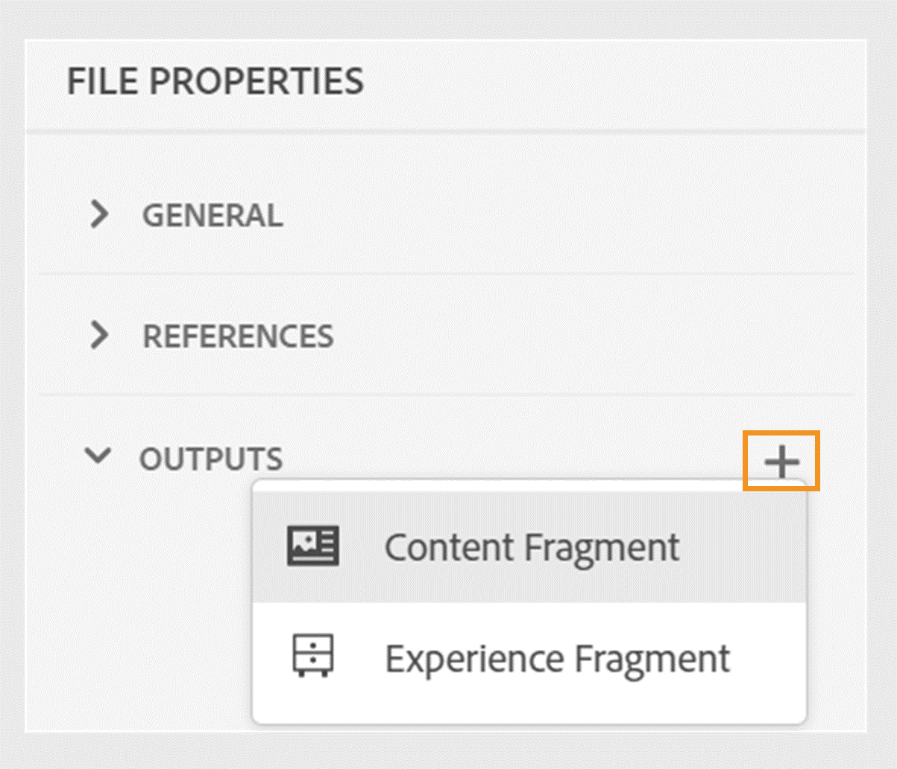
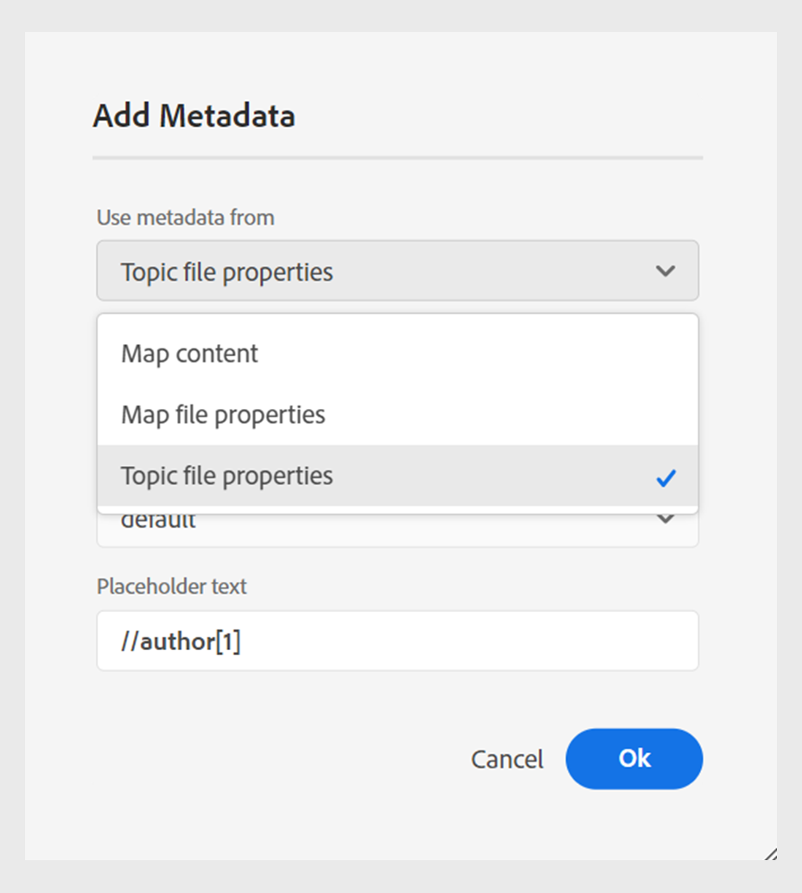
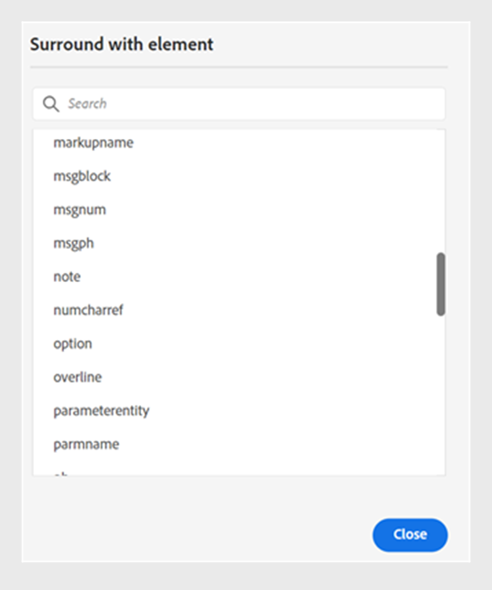

# 2024.06.0版本中的新增功能

本文介绍Adobe Experience Manager Guides 2024.06.0版的新增功能和增强功能。

有关此版本中修复的问题列表，请查看 [2024.06.0 版本中已修复的问题](fixed-issues-2024-06-0.md)。

了解 [2024.06.0版的升级说明](upgrade-instructions-2024-06-0.md).

## 将主题或其元素发布到体验片段

体验片段是Adobe Experience Manager中的一个模块化内容单元，它集成了内容和布局。 体验片段有助于创建一致且引人入胜的体验，这些体验可以跨多个渠道进一步重复使用。

Experience Manager指南现在允许您将主题或其元素发布到体验片段。 您可以在主题及其体验片段中的元素之间创建基于JSON的映射。 例如，您可以为页眉或页脚创建体验片段，其中具有品牌元素、促销横幅、客户口号和事件促销活动。

有关详细信息，请查看 [发布体验片段](../user-guide/publish-experience-fragment.md).

## 内容片段发布中的增强

《Experience Manager指南》在内容片段中还提供了一些有用的增强功能：

- 使用DITAVAL文件或条件属性，您可以在发布到内容片段时轻松筛选带条件的内容。

- 您还可以通过发布和查看主题的内容片段 **输出** 中的部分 **文件属性**.

{width="300" align="left"}

有关详细信息，请查看 [发布内容片段](../user-guide/publish-content-fragment.md).

## 能够将元数据从主题文件属性传递到本机PDF输出

现在，Experience Manager指南允许您在生成本机PDF输出时将元数据从主题的文件属性添加到页面布局。 使用此功能可向页面布局添加特定主题的元数据，例如标题、标记和描述。 您还可以根据主题的元数据自定义已发布的PDF，例如根据主题的文档状态向主题背景添加水印。

 {width="300" align="left"}

*将元数据添加到页面布局中的字段。*

了解如何 [添加字段和元数据](../native-pdf/design-page-layout.md#add-fields-metadata) 在页面布局中。

## 在操作的元素间选择部分内容

Experience Manager指南增强了您在Web编辑器中跨元素选择内容的体验。 您可以轻松地跨不同元素选择内容并执行操作，如使其变为粗体、斜体和加下划线。 此功能允许您为部分选定的内容无缝地应用或删除格式。 您还可以快速删除跨元素选择的内容。 删除内容后，如有必要，其余内容会自动合并到单个有效元素下。

您还可以跨元素选择部分内容，然后使用有效的DITA元素环绕该内容。
 {width="300" align="left"}

*使用有效元素环绕所选内容。*

总体而言，这些增强功能提供了更好的体验，并帮助您在编辑文档时提高效率。

有关详细信息，请查看 [跨元素的部分内容选择](../user-guide/web-editor-edit-topics.md#partial-selection-of-content-across-elements).

## 在本机PDF发布中支持Markdown文档

Experience Manager指南还支持本机PDF发布中的Markdown文档。 此功能非常方便，可帮助您为DITA映射中的Markdown文件生成PDF。 本机PDF发布中的Markdown支持可帮助您轻松创建、管理和共享文档。

有关详细信息，请查看 [支持Markdown文档](../web-editor/native-pdf-web-editor.md#support-for-markdown-documents).

## 提高了大型翻译项目的性能和可扩展性

翻译功能比以往更快、更可扩展。 它随附提供增强性能的新架构。 项目创建时间现在比以前快，在此过程中几乎不存在冲突。 这种改进的性能可帮助您更快地翻译，确保即使对于大型翻译项目也能顺利操作。

这种改进非常有益，因为它提高了生产率和整体体验。

详细了解如何 [从Web编辑器翻译文档](../user-guide/translate-documents-web-editor.md).
