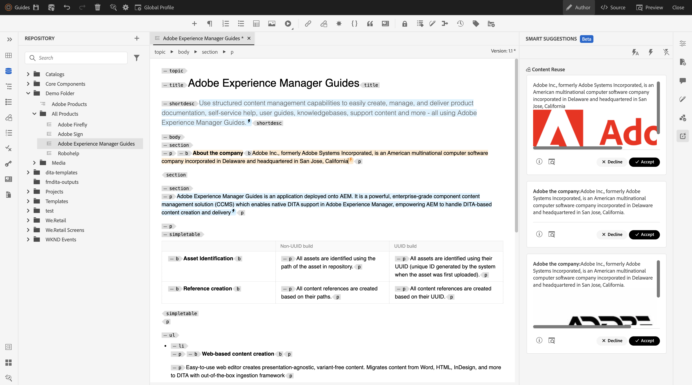
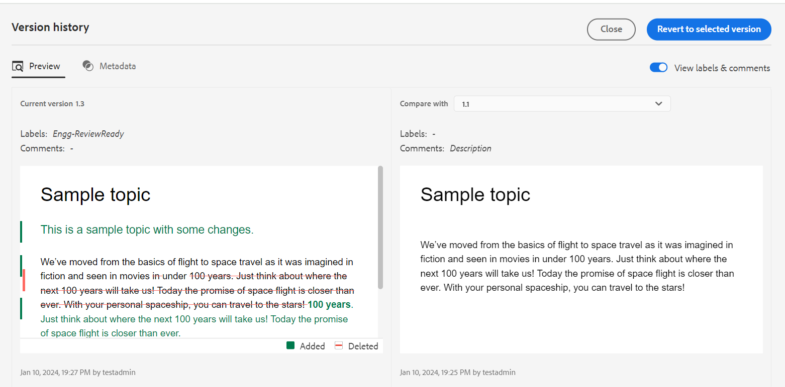
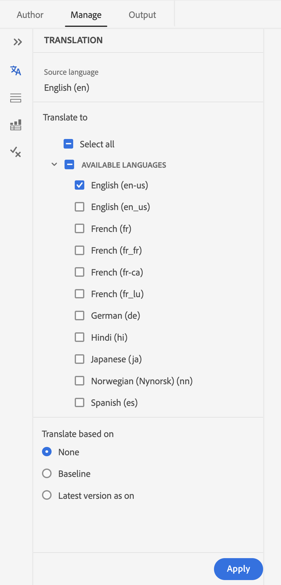
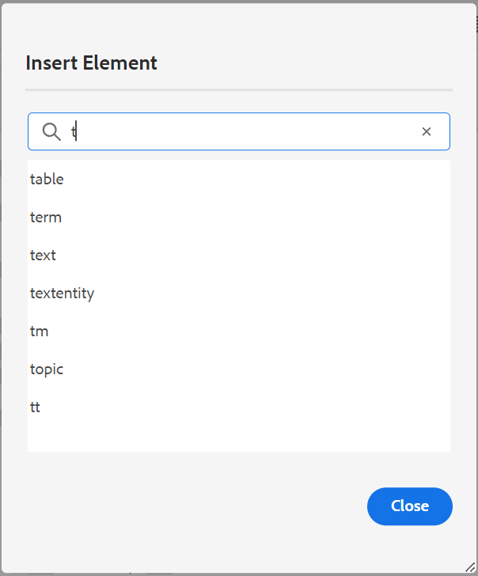
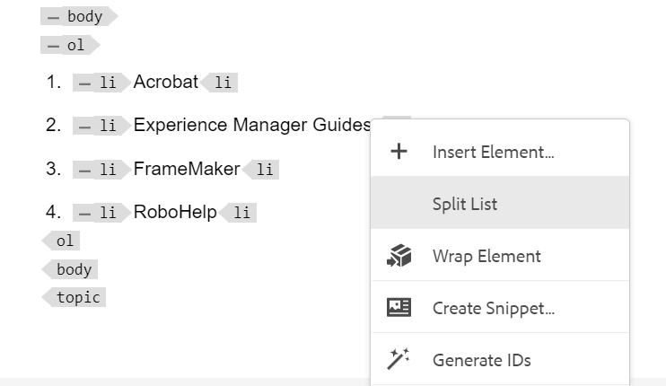
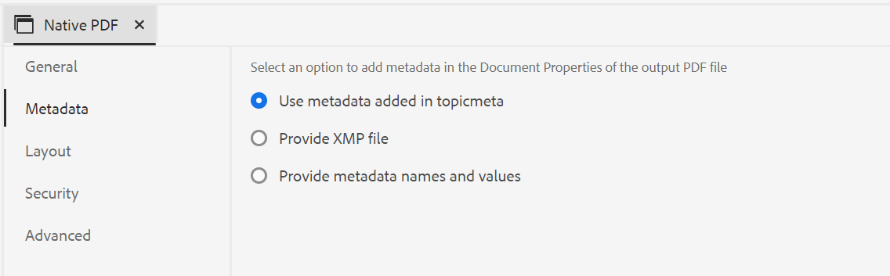

# 2024.2.0版本中的新增功能

本文介绍Adobe Experience Manager Guides 2024.2.0版的新增功能和增强功能。

有关此版本中修复的问题列表，请查看 [修复了2024.2.0版本中的问题](fixed-issues-2024-2-0.md).

了解 [2024.2.0版的升级说明](upgrade-instructions-2024-2-0.md).

## AI支持的智能建议，用于在创作内容时添加内容引用

现在，您可以使用Web编辑器中一项基于人工智能的新功能 — “智能建议”来增强您的创作历程。 在您创作内容时，此智能功能会为内容引用提供实时建议，从而改进您的工作流程、增加准确性并确保无与伦比的效率。

为了保持您的内容正确一致，搜索和建议受限于您组织拥有的内容，并与您搜索的关键字紧密匹配。

 {width="800" align="left"}

*查看智能建议，以从内容存储库查找并添加匹配的内容引用。*

您还可以将当前内容与其他主题中的类似内容进行比较。 然后，您可以轻松地从各种主题中选取内容片段，并将其作为内容引用添加到当前主题中。 添加内容引用使更新更易于管理，尤其是在较大的文档项目中。 例如，您正在创建一个有关产品最新功能的小册子。 在这种情况下，您可以快速添加更新的规范作为相关功能文档中的内容引用。

使用此智能功能可减少手动搜索相关内容的工作量，并帮助您专注于新内容的创建。  它还有助于保持一致性，并有助于更好地进行团队协作。

了解有关 [用于创作内容的AI支持的智能建议](../user-guide/authoring-ai-based-smart-suggestions.md).

## Web编辑器中改进的版本历史记录功能

现在，《Experience Manager指南》提供了增强的版本历史记录功能，允许您比较一段时间内对文档所做的更改。 在新的并排视图中，您可以轻松地将当前版本的内容和元数据与同一文档的任何先前版本进行比较。 您还可以查看比较版本的标签和注释。 作为管理员，您可以控制主题版本元数据及其值显示在 **版本历史记录** 对话框。

{width="800" align="left"}
*预览主题不同版本中的更改。*

了解关于 **版本历史记录** 中的功能描述 [左侧面板](../user-guide/web-editor-features.md#id2051EA0M0HS) 部分。

## 改进了翻译面板中的用户体验

此 **翻译** 面板已得到改进。  您可以查看 **可用语言** 列表并快速选择要翻译项目的区域设置。 通过单个选择，您还可以选择 **全选** 将您的项目翻译为所有可用的语言。

{width="300" align="left"}

*选择要翻译项目的区域设置。 选择要翻译的文件的默认、基线或最新版本。*

详细了解如何 [翻译内容](../user-guide/translation.md).

## 改进了“插入元素”对话框中的搜索逻辑

现在，可以在“插入元素”对话框中轻松查找元素。  您可以在搜索框中键入一个字符串，并获取以输入的字符串开头的所有有效元素的列表。

例如，在编辑要插入元素的段落时，您可以搜索字符“t”以获取以“t”开头的所有有效元素。

{width="300" align="left"}

*键入字符以搜索以该字符开头的所有有效元素。*

有关更多详细信息，请查看 **插入元素** 中的功能描述 [左侧面板](../user-guide/web-editor-features.md#id2051EA0M0HS) 部分。

## 能够拆分当前列表并在同一级别开始使用新列表项

现在，您可以在Web编辑器中轻松拆分列表。 选择 **拆分列表** 列表项的上下文菜单中的选项以拆分当前列表。 将从您为拆分选择的列表项开始，在同一级别创建新列表。

{width="300" align="left"}

*选择用于拆分当前列表的选项。*

有关更多详细信息，请查看 **插入列表** 中的功能描述 [左侧面板](../user-guide/web-editor-features.md#id2051EA0M0HS) 部分。

## 在创作源模式下访问文件属性

现在，您可以访问右侧面板的 **文件属性** 在所有四种模式或视图中都具有该功能：“布局”、“作者”、“源”和“预览”。  这有助于您在不同的模式之间切换时查看文件的属性。

有关更多详细信息，请查看 **文件属性** 中的功能描述 [右侧面板](../user-guide/web-editor-features.md#id2051EB003YK) 部分。

## 能够使用动态基线并行发布多个输出预设

“Experience Manager”提供的功能通过根据应用于主题的主题标签自动选择主题来创建基线。 现在，您还可以使用同一DITA映射的自动基线无缝发布多个输出预设。 您不必一次只发布一个预设，但可以轻松地同时发布多个输出预设。

## 本机PDF增强功能

2024.2.0版本中完成了以下本机PDF增强功能：

### 将资源元数据传递到PDF输出

Experience Manager现在提供将资源的元数据属性从DITA映射传递到PDF输出的功能。
从本机PDF输出预设中，您可以选择要传递到PDF发布过程的元数据。 您可以选择自定义属性和默认属性。  所选元数据属性将传递到使用本机PDF生成的PDF文件。

此功能非常方便，因为它有助于保持资源属性（如作者、创建日期或文档标题）的一致性。 这样可以更轻松地组织、搜索和分类您的文档。

有关更多详细信息，请查看 **高级** 中的设置 [发布PDF输出](../web-editor/native-pdf-web-editor.md).

### 使用添加到中的元数据 `topicmeta` PDF输出的元素

本机PDF发布中的元数据功能有助于内容管理，并有助于在Internet上搜索文件。

*选择一个选项以添加和自定义元数据选项。*

现在，Experience Manager指南提供了使用您在中添加的元数据的选项 `topicmeta` dita映射的元素，用于填充PDF输出的元数据字段。 默认情况下，该选项处于选中状态。

此功能有助于更好地管理文档，确保一致性，并使您的文档可搜索。

要了解更多信息，请查看 **元数据** 选项卡 [发布PDF输出](../web-editor/native-pdf-web-editor.md).
