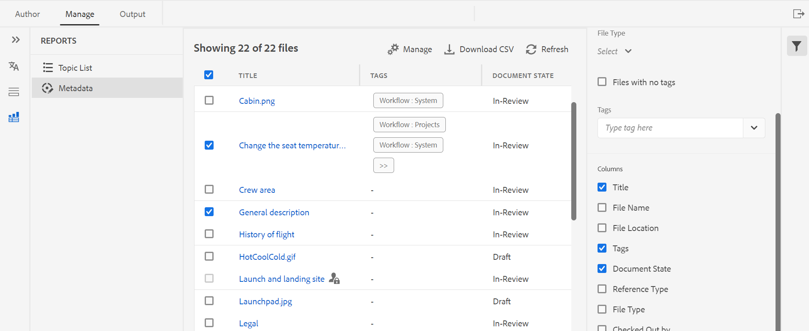
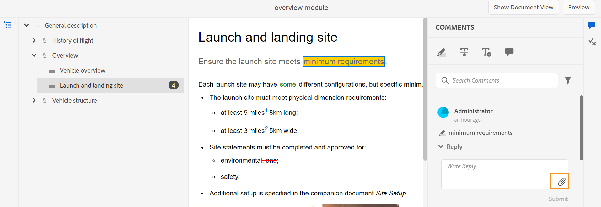
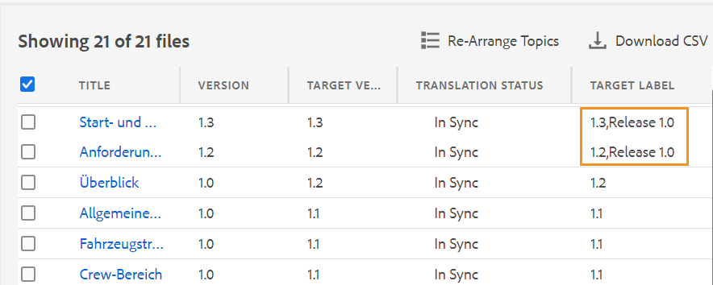
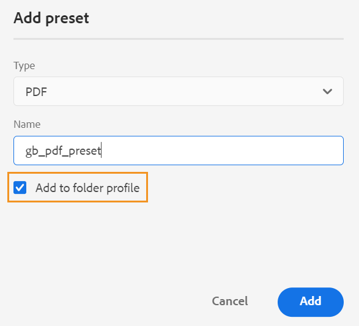
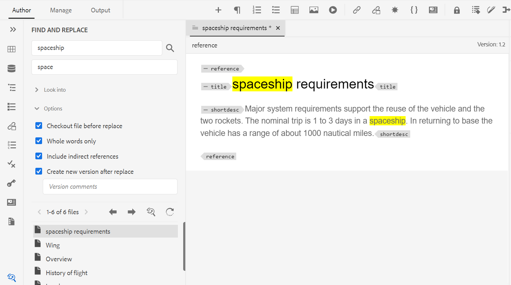
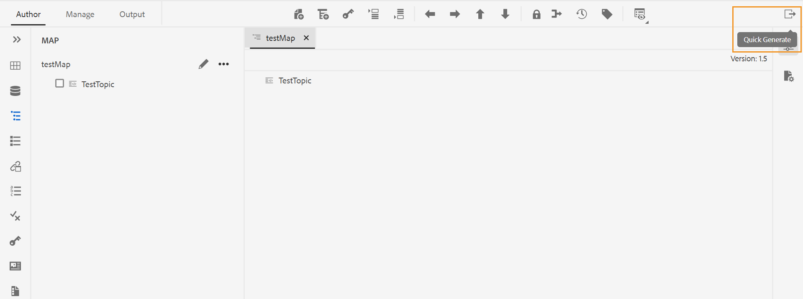
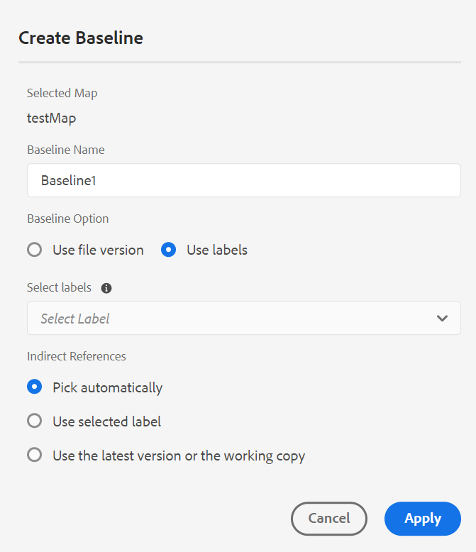
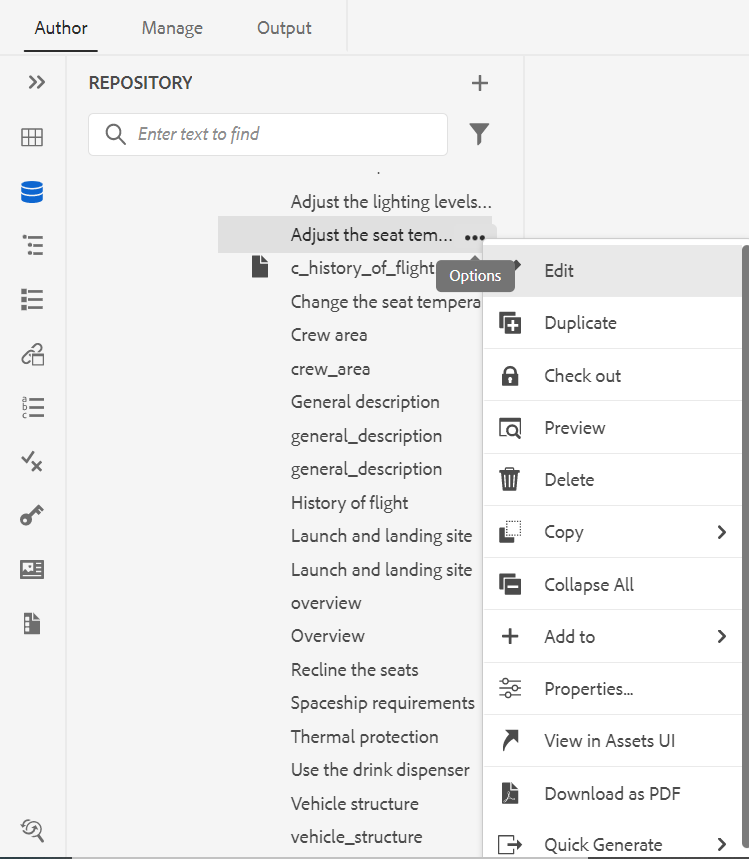
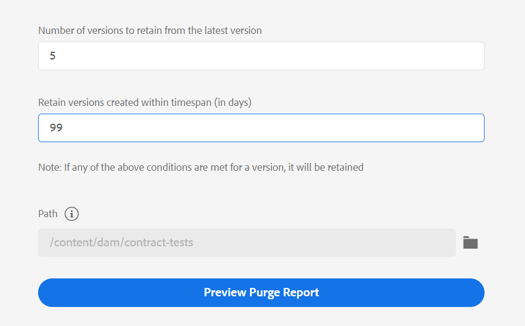
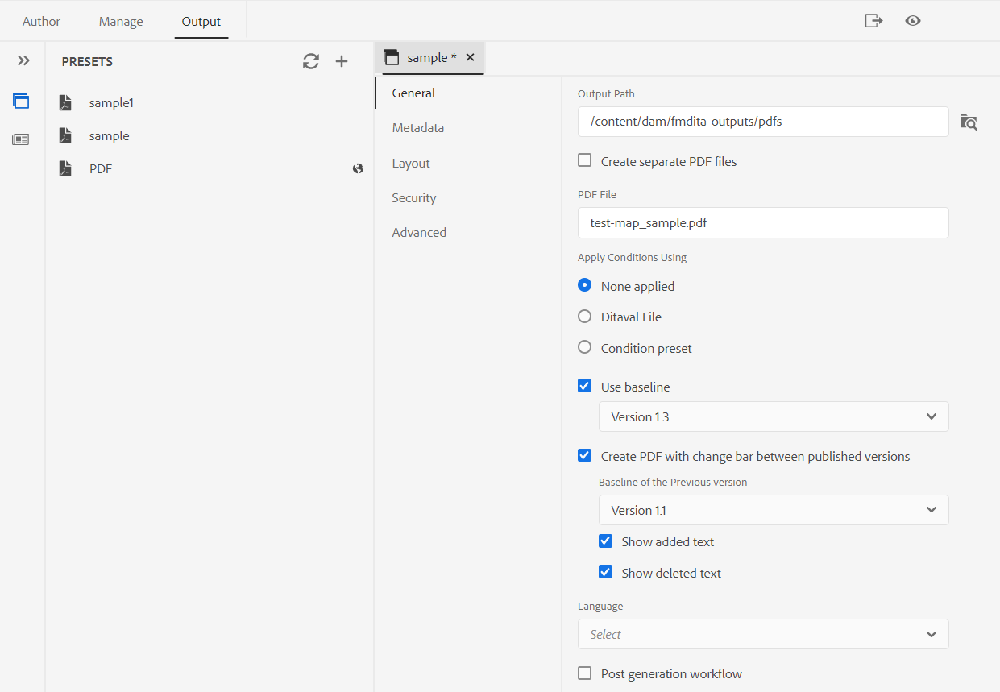

# Adobe Experience Manager Guides 4.2版的新增功能（2023年2月）

本文介绍Adobe Experience Manager Guides版本4.2中的新增功能和增强功能(后称为 *AEM指南*)。

有关升级说明、兼容性矩阵以及此版本中修复的问题的更多详细信息，请参阅 [发行说明](release-notes-4.2.md) 文章。

## 从Web编辑器生成报表

AEM Guides在Web编辑器中提供的功能使您能够检查技术文档的整体完整性并为其生成报告。
您可以从查看主题列表并管理当前映射的所有引用的元数据
**报表** 选项卡。

**生成主题列表视图**

可生成“主题列表”，其中提供有关主题的详细信息，如引用类型、文档状态和作者。 您还可以生成CSV来下载DITA映射中主题的当前快照。

**管理元数据和更改文档状态**

可以在单个主题中应用标记，也可以使用批量标记功能在多个主题、DITA映射或子映射中应用多个标记。 您也可以将所有选定主题的文档状态更改为下一个可能的公共文档状态。

## UX的审阅功能经过了改版

现在，AEM Guides提供了一个改进的UX，可帮助您查看共享以供查看的主题。 在最新体验中，审阅功能具有以下增强功能：

* 已刷新用户界面
* 条件面板，允许您根据主题中的可用条件突出显示内容。
* 评论面板中的每个评论都链接到当前主题中的相应文本。 它有助于您识别注释的文本。
* 注释按文档中注释文本的顺序显示。
* 审核任务的名称显示在审核工作流中。
* 选择审阅任务的根图，该根图用于解析审阅内容中使用的所有关键引用和术语表。
* 上下文工具栏可帮助您快速高亮显示或删除文本。
* “选项”菜单，用于编辑或删除您自己的评论。
* 对于过时的注释，您可以访问并排视图，这有助于将主题的先前版本与当前审阅版本进行比较
* 使用过滤器时，右侧面板上的注释将根据所选内容进行过滤，左侧面板中的注释数量将相应地更新。

欲知更多详情，请参见 *查看主题或映射* Adobe Experience Manager部分。

## 翻译增强功能

现在，翻译仪表板中提供了对用户更友好的增强功能，可帮助您从Web编辑器轻松翻译文档。

**已将“版本标签”列添加到翻译仪表板**

在翻译仪表板中，您还可以看到版本标签列。 这将显示源文件的选定版本的标签。 这可以帮助您选择具有特定标签的所有文件并一次性翻译它们。

**从翻译仪表板查看不同步文件的版本差异**

现在，您可以检查主题的所选版本与上次翻译的源版本之间的差异。 您也可以选择翻译 **不同步** 基于两个版本主题之间所做更改的文件。

**将版本标签传递到目标版本**

AEM Guides允许您将源文件的标签传递到目标文件。 这有助于您轻松识别已翻译文件的源版本。

例如，如果您有一些源文件应用了版本标签发行版本1.0，那么您还可以将源标签（发行版本1.0）传递到已翻译的文件。

**强制同步不同步的资产**

如果对某些资源进行了更改，AEM Guides会将它们标记为不同步。 您可以重新翻译修改的资产，也可以选择取消不同步状态。 例如，如果您进行了一些确实不需要翻译的细微更改，则可以将其状态标记为同步。

**查看正在进行中的主题或地图翻译项目**

您的翻译仪表板上的某些引用可能正在进行中。 现在，AEM Guides提供了一项功能，可帮助您查看包含所选引用的所有正在进行的翻译项目（以及目标语言）的列表。

欲知更多详情，请参见 *从Web编辑器翻译文档* Adobe Experience Manager部分。

## 从Web编辑器生成各种格式的输出

现在，您可以从Web编辑器轻松生成主题或DITA映射的输出。 您可以配置各种输出预设，如AEM Site、PDF、HTML5、JSON（一种Headless输出格式）和自定义输出。 使用这些字段生成相应的输出。 您可以在DITA主题中定义属性，然后使用条件预设在发布输出时应用条件。 也可以使用基线发布功能有选择地发布DITA映射或主题的特定版本。

**管理全局和文件夹配置文件输出预设**

AEM Guides为您提供了创建和管理“全局配置文件”和“文件夹配置文件”的输出预设的功能。 然后，您可以轻松地使用这些输出预设为与该全局或文件夹配置文件相关的所有映射生成输出。

这些全局预设显示在 **输出** 选项卡。 您可以使用它们为所有相关映射生成输出。 您可以选择预设作为默认PDF预设，以生成PDF输出。 您还可以 **编辑**， **重命名**， **复制**，或 **删除** 来自的现有输出预设 **选项** 菜单。

>[!NOTE]
>
>只有文件夹级别的管理用户可以创建全局和文件夹配置文件预设。

## 在映射级别查找和替换文本

现在，您可以在映射中搜索包含特定文本的文件。 搜索到的文本将在文件中突出显示。 您也可以使用文件中的其他单词或短语替换搜索的单词或短语。 选择 **替换单次发生次数** 图标以替换当前出现的 **替换文件中的所有内容** 图标以替换选定文件中的所有匹配项。 您可以选择 **全部替换** 图标以替换所有文件中搜索词的所有匹配项。

默认情况下，选项 **替换前签出文件** 和 **替换后创建新版本** 都会被选中，因此在替换文本之前会签出文件，并且在替换文本之后会创建一个新版本。 您还可以在DITA映射的间接引用中搜索字符串。 默认情况下，这是禁用的，因此仅对直接引用执行搜索。

## 映射编辑器中的布局视图

现在，您可以在映射编辑器中查看DITA映射的完整布局。 打开映射进行编辑时，将打开映射编辑器的“布局”视图。 在此视图中，您可以在树视图中查看映射层次结构。 您还可以在地图中编辑和组织或构建主题。

“布局”视图包含一个单独的工具栏，可帮助您对映射中的主题执行多项任务。
可以在映射中插入主题引用、主题组和键定义。 您可以通过上移、下移、左移或右移来重新组织地图中的主题。 您还可以拖放主题以在地图中移动它们。 映射编辑器还提供了用于锁定或解锁文件、检查版本历史记录和执行版本标签管理的图标。

“布局”视图还提供 **查看选项** 显示或隐藏行号、显示或隐藏复选框，或显示映射中主题的文件名或标题。
您还可以根据主题上应用的条件筛选器查看主题。

除了在映射文件中组织主题外，您还可以使用添加、移动、复制、粘贴或删除参照 **选项** 适用于“布局”视图中的元素的菜单。

右侧面板在地图编辑器的布局视图中显示内容属性和地图属性。 现在，您还可以设置主题或映射的元数据信息。 您可以为所选主题或映射定义“导航标题”、“链接文本”、“简短说明”和“关键字”。

有关更多详细信息，请参阅 *布局视图* Adobe Experience Manager部分。

## “快速生成”面板

现在，AEM Guides提供了“快速生成”面板，可帮助您快速生成和查看为DITA映射创建的预设的输出。

在 **快速生成** 面板中，您可以看到为DITA映射创建的所有输出预设的列表。 您还可以快速查看为预设生成的输出。 输出生成完成后将显示成功或失败消息。 您还可以查看错误日志，其中包含生成过程中所发生错误的详细信息。

## 基于标签创建动态基线

现在，AEM Guides提供了基于标签创建动态基线的功能。 如果您生成基线、下载基线或使用基线创建翻译项目，则系统会根据更新的标签动态选取文件。 此功能非常方便，因为在更新标签时您不必修改基线。

## 从存储库面板删除和复制文件

现在，您可以从以下位置轻松删除文件（一次删除一个文件）： **选项** 存储库面板中选定文件的菜单。 删除文件之前会显示确认提示。 如果文件未从任何其他文件引用，则会将其删除，并显示一条成功消息。

您还可以创建所选文件的副本或副本。 默认情况下，创建该文件时带有后缀（如filename_1.extension）。

## 其他Web编辑器增强功能

* 在AEM Guides中，您可以使用上下文菜单对图像和媒体文件执行一些常见操作。 现在，您还可以在存储库中找到选定的图像或媒体，或者在Assets UI中查看文件预览。

* 当前文件夹配置文件的名称在主工具栏中显示为“用户首选项”图标的标签。 这有助于您识别正在处理的文件夹配置文件。

* 在地图视图中打开地图时，当前地图的标题将显示在主工具栏的中央。 这有助于让用户知道哪个映射当前处于打开状态。

## 清除所选的文件版本

在创建和维护内容时，可能会为存储库中的DITA文件创建多个版本。 AEM Guides允许您从存储库中清除旧版本的DITA文件并释放磁盘空间。

AEM Guides不会删除文件的第一个版本或基线中包含的版本，也不会为其应用标签。 清除操作甚至不会删除翻译或审阅工作流中包含的文件。 您可以选择要保留的版本数量，也可以决定删除早于定义天数的文件。

在开始清除操作之前，您可以预览报表以查看要清除的版本。 然后，您可以决定是启动还是取消清除操作。

清除操作完成后，您可以检查清除报表以查看已清除的文件。

## 在氧气编辑器中查看标题以取代UUID

现在，AEM Guides允许您选择 **在编辑器和映射管理器中使用标题** 选项。 如果选择此选项，则在编辑器或DITA映射管理器中打开文件时，文件的标题将显示在文件的选项卡上。 如果不选择此选项，则文件的UUID将显示在文件的选项卡上。

## 元数据UI可用于PDF预设

可以从DITA映射的输出预设设置元数据。 您可以设置标题、作者、主题和关键字元数据。 此元数据映射到输出PDF的文件属性中的元数据。 此元数据将覆盖在帐簿级别定义的元数据。 您可以具体定义每个输出预设中的元数据，并将其传递到输出PDF。

## 本机PDF |带有更改条的PDF，显示文档版本之间的差异

现在，您可以使用更改栏创建一个PDF，以显示两个版本之间的内容差异。 您可以选择将当前版本与先前版本的基线进行比较，或者将两个选定的基线版本进行比较。

PDF中将显示一个更改栏，以指示已修改、已插入或删除的内容。 您还可以选择执行以下操作：
* 以绿色和带下划线的形式显示插入的内容
* 以红色显示删除的内容并标记删除线

## 本机PDF |对输出路径和PDF文件名的变量支持

现在，您还可以使用以下现成的变量来定义输出路径和PDF文件。 您可以使用单个变量或变量组合来定义以下选项：
* `${map_filename}`
* `${map_title}`
* `${preset_name}`
* `${language_code}`
* `${map_parentpath}` （仅适用于输出路径）
* `${path_after_langfolder}` （仅适用于输出路径）

## 本机PDF |为DITA映射生成目录并重新排序页面布局

现在还可以使用模板的高级PDF设置在DITA映射中生成目录。 您可以选择启用或禁用各种页面布局的显示，也可以重新排列它们的位置。

## 本机PDF |在PDF输出中添加自定义书签

现在，您可以在最终PDF输出中为特定内容添加自定义书签以便轻松导航。 这将添加到从DITA映射中的主题或节标题创建的目录。

## 本机PDF |对目录条目和主题内容应用自定义样式

AEM Guides提供了对目录条目或PDF输出中的特定主题应用自定义样式的功能。 例如，您可以更改目录中的文本颜色和主题标题。 您还可以在主题的整个内容中应用样式。
