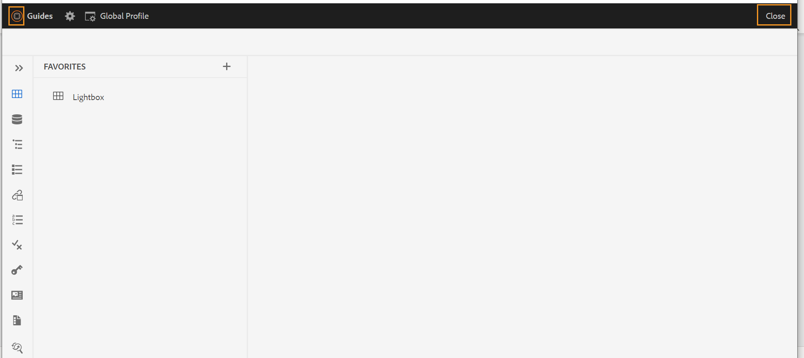
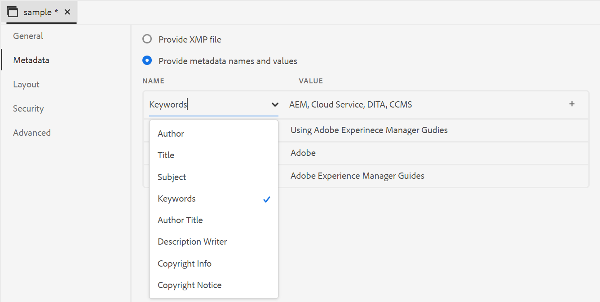
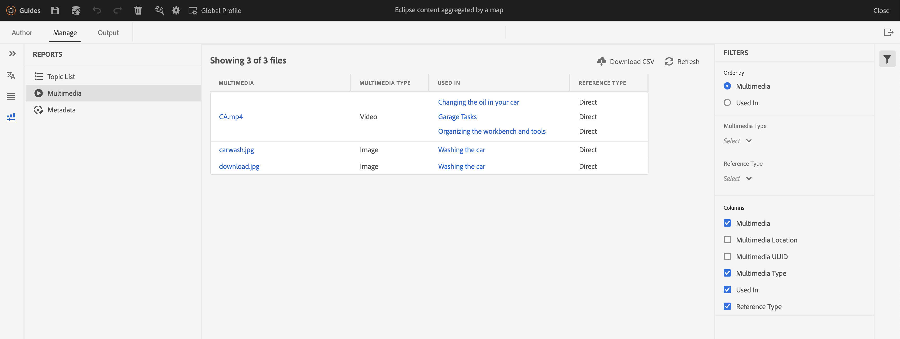
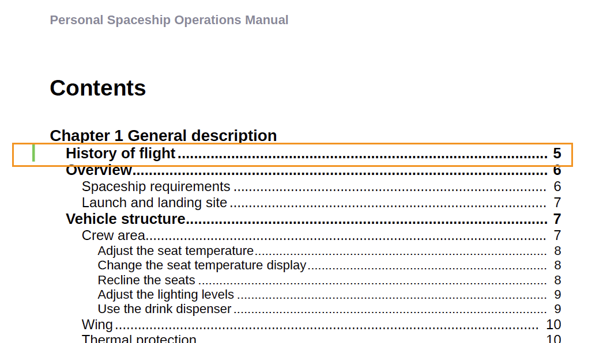
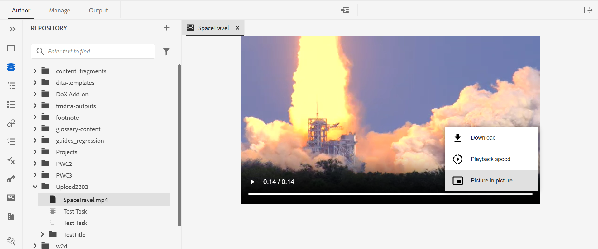

# Adobe Experience Manager Guides 4.2.1版的新增功能（2023年5月）

本文介绍Adobe Experience Manager Guides版本4.2.1中的新增功能和增强功能(后称为 *AEM指南*)。

有关升级说明、兼容性矩阵以及此版本中修复的问题的更多详细信息，请参阅 [发行说明](release-notes-4.2.1.md) 文章。

## 从Web编辑器导航到AEM主页

现在，您可以轻松地从Web编辑器导航到AEM导航页面。

{width="800" align="left"}

* 单击 **指南** 图标( )，以返回到“AEM导航”页面。

有关更多详细信息，请参阅 [AEM导航页面](../user-guide/web-editor-launch-editor.md#id2056BG00RZJ).

## PDF发布中的高级元数据支持

AEM Guides现在为映射到PDF输出中元数据的元数据提供高级支持。 元数据选项包括有关文档及其内容的信息，如作者姓名、文档标题、关键字、版权信息和其他数据字段。

您可以导入XMP文件，AEM Guides可以从文件中选取信息。 您还可以选择使用下拉菜单提供元数据名称和值。 您还可以通过直接在名称字段中键入来添加自定义元数据。

有关更多详细信息，请参阅 **元数据** 中的功能描述 [创建PDF输出预设](../web-editor/native-pdf-web-editor.md).

### 增强的大纲视图面板

AEM Guides提供了一个改进的“大纲视图”面板，您可以在其中获得文档中所用元素的分层视图。

“大纲视图”提供了以下增强功能：

* “视图选项”下拉列表显示在“大纲视图”面板的顶部。 如果元素具有ID、属性和文本，则可以从下拉列表中选择它们，以与元素一起显示它们。 可以在“大纲视图”面板中显示的属性由管理员在 **编辑器设置**.

* 使用搜索功能，您可以按元素的名称、ID、文本或属性值搜索元素。

有关更多详细信息，请参阅 [左侧面板](../user-guide/web-editor-features.md#id2051EA0M0HS) 部分。

## 从Web编辑器生成多媒体报告

AEM Guides提供了为技术文档生成报表的功能。  您可以使用此功能查看主题列表和管理文档的元数据。 现在，您还可以从以下位置查看当前地图的所有引用中使用的多媒体： **报表** 选项卡。

您可以生成多媒体报告，该报告包含有关当前映射中引用使用的多媒体的详细信息。 您可以灵活地筛选和排序报表中列出的多媒体文件。
您还可以生成CSV来下载DITA映射中使用的多媒体的当前快照。

有关更多详细信息，请参阅 [Web编辑器中的DITA映射报表](../user-guide/reports-web-editor.md) 部分。

## 本机PDF | 更改栏以指示目录中已更改的主题

AEM Guides现在允许您快速识别PDF输出目录中的已更改主题。  它会在目录中已更改的主题左侧显示更改栏。 您可以单击目录中的主题并查看详细更改。

有关更多详细信息，请参阅 [使用自定义更改条样式](../native-pdf/change-bar-style.md).

## 本机PDF | 设置脚注组件中页面标记的样式

现在，您可以在脚注中设置页面标记的样式。 例如，您可以添加括号或更改其颜色。 这些样式可帮助用户轻松识别文档中的页面标记。

有关更多详细信息，请参阅 [在脚注中使用自定义样式](../native-pdf/footnote-number-style.md).

## 在Web编辑器中打开并播放视频或音频文件

AEM Guides现在提供在Web编辑器中打开和播放音频或视频文件的功能。 您可以更改视频的音量或视图。 在快捷菜单中，您还可以选择 **下载**，更改 **回放速度**，或视图 **画中画**.

有关更多详细信息，请参阅 [左侧面板](../user-guide/web-editor-features.md#id2051EA0M0HS) 部分。
