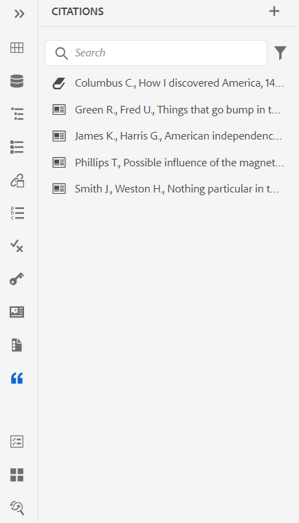
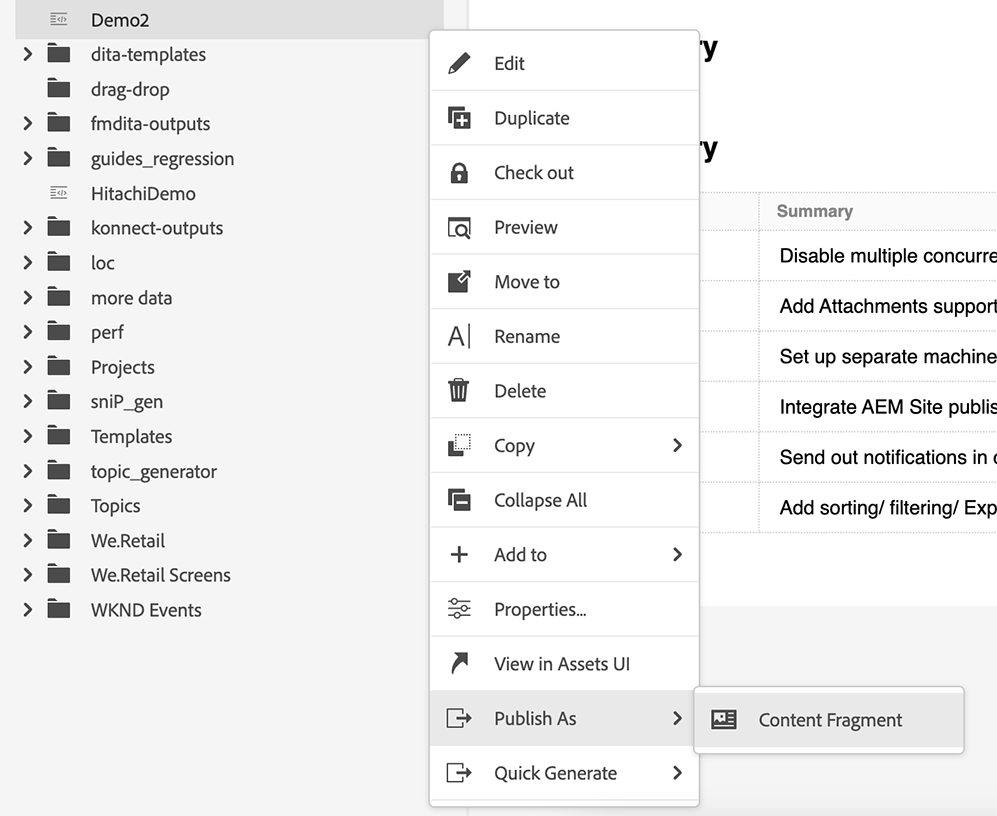

# Adobe Experience Manager Guides 4.3.0版的新增功能（2023年7月）

本文介绍4.3.0版本的Adobe Experience Manager Guides(以后称为 *AEM指南*)。

有关升级说明、兼容性矩阵以及此版本中修复的问题的更多详细信息，请参阅 [发行说明](./release-notes-4.3.md).

## 连接到数据源并将数据插入主题

现在，您可以使用AEM Guides中的现成连接器快速连接到数据源。 连接到数据源使您能够保持与源同步的信息，并且任何数据更新都会自动反映出来，从而使AEM Guides成为真正的内容中心。 此功能可帮助您节省手动添加或复制数据的时间和精力。

AEM Guides允许管理员为JIRA和SQL (MySQL、PostgreSQL、SQL Server、SQLite)数据库配置现成的连接器。 它们还可以通过扩展缺省接口来添加其它连接器。
添加后，您可以在Web编辑器的数据源面板下查看列出的已配置连接器。

创建内容片段，以从连接的数据源获取数据。 然后，您可以将数据插入主题并进行编辑。 创建内容片段生成器后，您可以重复使用它来将数据插入任何主题。

现在，您还可以从连接的数据源创建一个主题。 主题可以包含各种格式的数据，如表、列表和段落。 它还允许您为所有主题创建DITA映射。 从数据源提取时，您可以将元数据与主题相关联。

有关详细信息，请查看 [使用来自数据源的数据](../user-guide/web-editor-content-snippet.md).

## 将引用添加到您的内容

引用是指对添加到内容的信息源的引用。 引用内容有助于建立可信度，防止抄袭。 引文可帮助读者找到源文件并验证文本中提供的信息。

在AEM Guides中，您可以添加引文或导入引文，并将它们应用到您的内容。 您可以从任何书籍、网站和日记帐来源添加这些引文。

将引文插入主题后，您可以在Web编辑器中预览它们。 您还可以使用本机PDF发布包含引文的内容。

{width="300" align="left"}

有关详细信息，请查看 [在内容中添加和管理引文](../user-guide/web-editor-apply-citations.md).

## 发布到内容片段

内容片段是AEM中的离散内容片段。 它们是基于内容模型的结构化内容。 内容片段是纯内容，没有设计或布局信息。 它们可以独立于AEM支持的渠道进行创作和管理。 内容片段的模块化和重用性带来了更大的灵活性、一致性、效率和更简单的管理。

现在，AEM Guides提供了一种将主题或主题中的元素发布到内容片段的方法。 您可以在主题和内容片段模型之间创建基于JSON的映射。 使用此映射将主题中部分或所有元素中存在的内容发布到内容片段。

利用AEM Guides和内容片段的强大功能，并在任何AEM站点中使用内容片段。 您还可以通过内容片段支持的API提取详细信息。

{width="550" align="left"}

## 审核增强功能

AEM Guides现在提供了改进的审阅功能，具有以下功能：

### 用于显示审阅项目和活动审阅任务的审阅面板

现在，AEM Guides可让您的评论更加顺畅。 它在Web编辑器中提供“审阅”面板。 “审阅”面板显示您所属的审阅项目中的所有审阅项目和活动审阅任务。

作为作者，此功能可帮助您轻松地打开审阅任务、查看注释并在集中视图中快速处理注释。
{width="800" align="left"}
有关更多详细信息，请查看 **审核** 中的功能描述 [左侧面板](../user-guide/web-editor-features.md#id2051EA0M0HS) 部分。

### 搜索审核主题

审查是AEM Guides的关键功能。 它有助于查看者查看分配给他们的文档。
现在，通过在审阅面板的主题视图的搜索栏中输入标题或文件路径的文本的一部分来搜索主题。 您还可以选择查看所有主题或查看包含注释的主题。 默认情况下，可以查看审阅任务中存在的所有主题。

{width="800" align="left"}

有关详细信息，请查看 [查看主题](../user-guide/review-topics.md).

## Guides扩展框架

在AEM Guides上创建自定义包，以便使用AEM Guides Extension Framework实现可扩展性。 这些包对开发人员和顾问非常有用，并且可为编辑器中的组件提供可扩展性。 他们可以定位按钮、对话框和下拉列表，并添加可轻松与AEM Guides UI交互操作的自定义JavaScript。

## 本机PDF增强功能

在4.3.0版本中完成了以下本机PDF增强，使AEM Guides成为一个更强大的产品：

### 支持语言变量

AEM Guides提供对语言变量的支持。 您可以使用语言变量来定义开箱即用标签的本地化版本，例如PDF输出中的“注意”、“注意”和“警告”或静态文本。
您可以将语言变量或本地化的标签版本添加到PDF输出和输出模板中的相应部分。

#### PDF输出中的语言变量

您可以使用语言变量为“注意”、“警告”等元素定义本地化标签。 您可以用一种或多种语言更新这些变量的值，然后在PDF输出中自动选取本地化值。
例如，您可以通过以下方式在PDF输出中显示标签“注释”：

* 英文：注释
* 法语：雷马克
* 德语：欣威语

#### 输出模板中的语言变量

如果要创建各种语言的PDF输出，则必须创建包含每种语言的本地化文本的各种PDF模板。 现在，使用语言变量功能，您只需创建模板一次。 然后，对于需要本地化的任何静态文本，您可以创建相应的语言变量并在模板中使用它们。
您可以为较长的文本创建语言变量，例如整个句子甚至段落。 您还可以应用样式并使用HTML标记来设置这些语言变量的格式。

有关详细信息，请查看 [支持语言变量](../native-pdf/native-pdf-language-variables.md).

### 为草稿文档的PDF输出添加水印

现在，您可以向尚未批准的文档的PDF输出添加水印。 如果您为“已批准”文档生成的文档PDF，则不会显示此水印。 例如，您可以为PDF输出添加水印“草稿”。

有关详细信息，请查看 [为草稿文档的PDF输出添加水印](../native-pdf/use-javascript-content-style.md#watermark-draft-document).

### 能够在PDF布局中使用AEM元数据

元数据是内容的描述或定义。 此元数据存储在源DITA映射内容中。

现在，在AEM Guides中，您还可以选择资源的元数据属性，并将它们添加到页面布局中。 然后，AEM Guides会选取资源的这些元数据属性，并将它们发布在PDF输出中。

{width="300" align="left"}

>[!NOTE]
>
> AEM Guides还支持DITA映射的元数据属性。

有关详细信息，请查看 [添加字段和元数据](../native-pdf/design-page-layout.md#add-fields-metadata).

### 对PDF输出中的页进行排序

您可以在PDF中显示或隐藏以下部分，还可以排列它们在最终PDF输出中的显示顺序：

* 目录
* 章节和主题
* 数字列表
* 表列表
* 索引
* 术语表
* 引用
* 页面布局

如果不想在PDF输出中显示特定截面，可以通过关闭切换开关来隐藏该截面。

有关详细信息，请查看 [页面顺序](../native-pdf/components-pdf-template.md#page-order).

### 合并页面

默认情况下，在本机PDF输出中，所有部分都从新页面开始。 现在，您可以将部分合并到其上一页或下一页。 此操作将发布与PDF输出中选择的页面连续的部分，并且中间没有分页符。

有关更多详细信息，请参阅中的合并页面功能说明 [页面顺序](../native-pdf/components-pdf-template.md#page-order) 部分。

### 静态页面

您还可以创建自定义页面布局，并将其发布为PDF输出中的静态页面。 这有助于您添加任何静态内容，如注释或空白页面。

有关更多详细信息，请参阅中的静态页面功能说明 [页面顺序](../native-pdf/components-pdf-template.md#page-order) 部分。

### 交叉引用中的变量

您可以使用变量来定义交叉引用。 使用变量时，将从属性中提取其值。

现在您还可以使用 {figure} 和 {table}.
使用 {figure}添加对图编号的交叉引用。 它从您为数字定义的自动编号样式中选取数字编号。

使用 {table} 添加对表编号的交叉引用。 它会从您为题注定义的自动编号样式中选取表格编号。

有关详细信息，请查看 [交叉引用](../native-pdf/components-pdf-template.md##cross-references).

### 从当前页面开始任何章节

可以设置从奇数页或偶数页开始章节的基本配置设置、目录结构，并定义目录条目的引线格式。

现在，您还可以从当前页面开始一个章节。 如果选择这样做，则所有章节将继续发布，而不带任何分页符。 例如，如果章节在页面15的中间结束，则下一章节也会从第15页本身开始。

### 能够在生成本机HTML输出时访问临时PDF文件

现在，AEM Guides允许您下载在生成本机HTML输出时创建的临时PDF文件。 在输出预设设置中，选择用于下载临时文件的选项。  然后，AEM Guides允许您下载在使用该预设生成输出时创建的临时文件。

此功能通过访问临时样式和布局，使您能够更好地分析生成过程，并帮助您根据自己的要求更正或更改CSS样式。

{width="800" align="left"}

有关详细信息，请查看 [创建PDF输出预设](../web-editor/native-pdf-web-editor.md#create-output-preset).

### 重新设计CSS编辑器

现在，CSS编辑器经过重新设计，可提供更好的选择器和样式属性用户体验。

#### 增强“添加样式”对话框

您现在可以使用自定义选择器添加复杂样式。 新的Selector字段可帮助您添加除Class 、 Tag和Pseudo Class组合之外的自定义选择器。 例如，您可以创建 `table a.link` 表内所有超链接的样式。

{width="300" align="left"}

#### 自定义样式的属性

现在，AEM Guides将向您介绍样式预览部分下的新属性面板。 您可以在“属性”面板中更有效、更快速地编辑样式的属性。

## 重命名和移动存储库视图中的文件

现在，您还可以从存储库面板重命名或移动文件。 此功能非常方便，有助于从“存储库”面板轻松管理文件。 您可以选择文件，然后使用 **选项** 菜单。 当您移动或重命名文件时，AEM Guides会显示一条成功消息。

{width="550" align="left"}

有关文件的“选项”菜单的更多详细信息，请查看 **存储库视图** 中的功能描述 [左侧面板](../user-guide/web-editor-features.md#id2051EA0M0HS) 部分。

## Web编辑器中的“断开链接”报表

AEM Guides允许您检查技术文档的整体完整性，并从Web编辑器生成报告。 2023年6月版AEM Guides现在提供了查看和修复断开链接的功能。 这是一个有用的报表，可帮助您管理断开的链接。 您可以轻松地查看DITA映射中存在的断开链接并进行修复。
{width="800" align="left"}

修复链接后，该链接不会显示在断开链接列表下。

有关更多详细信息，请参阅 [查看和修复断开的链接](../user-guide/reports-web-editor.md#report-broken-links).

## 模式增强功能

### 使用报表语句检查Schematron中的规则

AEM Guides现在也支持带有架构的报表语句。 当测试语句的计算结果为true时，报表语句会生成消息。 例如，如果希望简要说明少于或等于150个字符，则可以定义报告语句以检查简要说明超过150个字符的主题。

有关详细信息，请查看 [使用声明和报表语句检查规则](../user-guide/support-schematron-file.md#schematron-assert-report).

### 使用正则表达式

您还可以使用Regex表达式定义包含matches()函数的规则，然后使用Schematron文件执行验证。

有关详细信息，请查看 [使用正则表达式](../user-guide/support-schematron-file.md#schematron-assert-report).

### 定义抽象模式

AEM Guides还支持Schematron中的抽象模式。 您可以定义通用抽象模式并重用这些抽象模式。 抽象模式可以简化您的Schematron模式，并帮助您管理和更新验证逻辑。

有关详细信息，请查看 [定义抽象模式](../user-guide/support-schematron-file.md#schematron-abstract-patterns).

## 在翻译中支持XLIFF格式

AEM Guides还支持翻译中的XML本地化交换文件格式(XLIFF)格式。 现在您还可以选择 **创建新的XLIFF翻译项目** 将XML内容转换为XLIFF格式。 AEM Guides支持XLIFF版本1.2。

使用此格式，您可以将内容导出为行业标准XLIFF格式，然后将其提供给翻译供应商。 有关详细信息，请查看 [创建翻译项目](../user-guide/translate-documents-web-editor.md#create-translation-project).

{width="350" align="left"}

## 映射收藏集增强

地图收藏集可帮助您组织多个地图并批量发布它们。 已对地图收藏集进行多项新的增强：

* 现在，您可以将本机PDF输出预设添加到映射集合中，并使用它们生成PDF输出。
* 您可以查看管理员创建的全局配置文件预设和文件夹配置文件预设，并使用它们生成PDF输出。
* 现在，您不仅可以选择单个预设，还可以一次性为DITA映射启用所有文件夹配置文件预设。
  {width="800" align="left"}

有关详细信息，请查看 [使用映射集合生成输出](../user-guide/generate-output-use-map-collection-output-generation.md).

## 批量发布功能板支持本机PDF

借助AEM Guides的批量激活功能，您可以快速轻松地激活内容从创作到发布实例。 在“批量激活”映射中，您可以包含本机PDF输出预设、AEM站点、PDF、HTML5、自定义和JSON输出。
有关详细信息，请查看 [批量激活已发布内容](../user-guide/conf-bulk-activation.md).

## 改进的批量移动工具

现在，作为管理员，您可以使用改进的批量移动工具将具有多个文件的文件夹从一个位置移动到另一个位置。
可以使用“浏览文件”对话框选择要移动的源文件夹。 您还可以浏览以选择要移动源文件夹的目标位置。 选择  {width="25" align="left"} 靠近某个字段可查看有关该字段的更多信息。

有关详细信息，请查看 [批量移动文件](../user-guide/authoring-file-management.md#move-files-bulk).

## “收藏夹”面板已改进

AEM Guides可帮助您创建文件和文件夹的收藏集或收藏夹列表，并轻松使用它们。 现在 **选项** 菜单也可在 **收藏夹** 面板。 您可以重命名选定的收藏集，也可以将其从 **选项** 菜单。 您可以选择 **刷新** 选项，用于从存储库中获取文件或文件夹的刷新列表。 您还可以在Assets UI中查看文件夹内容。

{width="650" align="left"}

>[!NOTE]
>
> 您也可以使用 **刷新** 图标。

欲知关于 **选项** 收藏夹的菜单，查看 **收藏夹** 中的功能描述 [左侧面板](../user-guide/web-editor-features.md#id2051EA0M0HS) 部分。

## 切换到系统主题

您现在还可以使用设备主题。 使用 **用户首选项**，您可以将AEM Guides配置为根据设备的主题在浅色和深色主题之间自动切换。

{width="550" align="left"}

有关更多详细信息，请查看 **用户首选项** 中的功能描述 [主工具栏](../user-guide/web-editor-features.md#id2051EA0G05Z) 部分。
