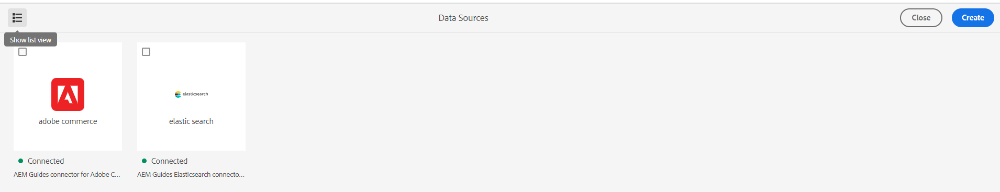

# Adobe Experience Manager Guides 4.3.1版的新增功能（2023年10月）

本文介绍4.3.1版本的Adobe Experience Manager Guides(以后称为 *Experience Manager指南*)。

有关升级说明、兼容性矩阵以及此版本中修复的问题的更多详细信息，请参阅 [发行说明](./release-notes-4.3.1.md).

## 连接到数据源并插入主题

《Experience Manager指南》提供现成的连接器，帮助您连接数据源，使《Experience Manager指南》成为真正的“内容中心”。 这为您提供了省时省力的优势，否则您将需要花在手动数据添加或复制上。

除了现有的现成连接器（如JIRA和SQL）(MySQL、PostgreSQL、SQL Server、SQLite)之外，管理员还可以为MariaDB、H2DB、AdobeCommerce和Elasticsearch数据库配置连接器。 它们还可以通过扩展缺省接口来添加其它连接器。

您可以在下面查看已配置的连接器 **数据源** 面板。

*查看连接的数据源。*

您现在还可以从连接的数据源创建主题。 主题可以包含各种格式的数据，如表、列表和段落。 它还允许您为所有主题创建DITA映射。 从数据源提取时，您可以将元数据与主题相关联。

有关详细信息，请查看 [使用来自数据源的数据](../user-guide/web-editor-content-snippet.md).

## 从用户界面配置数据源连接器

《Experience Manager指南》现在还提供了 **数据源** 此工具可帮助您为数据源配置现成的连接器。 您可以轻松为JIRA、SQL(MySQL、PostgreSQL、Microsoft SQL Server、SQLite、MariaDB、H2DB)、AdobeCommerce和Elasticsearch数据库创建连接器。

您还可以轻松地编辑、重新连接、复制或删除数据源连接器。 详细了解如何 [从用户界面轻松配置数据源连接器](../install-guide/conf-data-source-connector-tools.md).

{width="550" align="left"}

*从数据源面板创建和查看数据源连接器。*

## 查看主题生成器的日志

您现在还可以查看内容生成日志文件。 此日志文件可帮助您检查警告、错误和异常。  进一步了解 [主题生成器的选项](../user-guide/web-editor-content-snippet.md#options-for-a-topic-generator) 帮助您轻松生成和管理主题生成器。

## 数据源模板中支持Velocity工具

现在，您可以使用“Experience Manager参考线”模板中的Velocity工具。 这些工具可帮助您将各种功能应用于从数据源获取的数据。 在创建内容片段或主题时，可以使用模板。 此功能可帮助您节省将同一函数手动应用于每个数据集的时间和精力。  这样还可以确保获得准确的结果。
例如，可以使用$mathTool执行数学函数。
详细了解如何 [在数据源模板中使用Velocity工具](../user-guide/web-editor-content-snippet.md#use-velocity-tools).

## 本机PDF增强功能

2023年10月版本中完成了以下本机PDF增强功能：

### 重置布局第一页的页码

在本机PDF输出中，您可以重新启动页码并指定开始编号的编号。 现在，也可以仅对第一次出现的截面开始编号。
详细了解如何 [使用页面布局的页面属性](../native-pdf/design-page-layout.md#page-props-page-layout).

### 在目录中查看没有自动编号的章节

Experience Manager指南在目录(TOC)中显示章节编号和章节名称。 现在，您可以选择仅发布章节名称，而不发布章节编号。 查看有关如何配置 [模板的高级PDF设置](../native-pdf/components-pdf-template.md#advanced-pdf-settings).

## 从Web编辑器下载映射

现在，您不仅可以在Web编辑器的映射视图中编辑映射，还可以下载它。 您可以选择使用特定的基线下载映射。 您还可以选择将层次结构扁平化并将所有文件和文件夹保存在单个文件夹中。

欲知更多详情，请参见 **映射视图** 中的功能描述 [左侧面板](../user-guide/web-editor-features.md#id2051EA0M0HS) 部分。

{width="550" align="left"}

*在存储库视图中选择一个文件，然后选择选项以对该文件执行操作。*

## 在单个枚举定义中支持多个主题定义

现在，您可以在一个映射中定义一个或多个主题定义，在另一个映射中定义枚举定义，然后添加映射引用。 主题枚举引用在同一映射或引用的映射中进行解析。

您现在还可以定义条件并将其应用于主题中的某些特定元素。  条件仅对这些特定元素可见，对于所有其他元素则不可见。

有关处理主题定义和枚举的分层定义的更多详细信息，请参阅 [左侧面板](../user-guide/web-editor-features.md#id2051EA0M0HS) 部分。

## 上下文菜单中的增强预览体验

使用上下文菜单快速预览文件（.dita、.xml、audio、video或image），而无需将其打开。 您现在可以调整预览窗格的大小，如果内容包含任何引用链接，则可以选择它，以在新选项卡中打开它。

{width="800" align="left"}

*在窗格中预览文件。*

有关上下文菜单的更多详细信息，请参阅 **文件选项** 中的功能描述 [左侧面板](../user-guide/web-editor-features.md#id2051EA0M0HS) 部分。

## 在氧气连接器插件中编辑文件

Experience Manager指南现在允许您在Web编辑器中选择文件，然后选择在氧气连接器插件中编辑该文件。 此选项不是现成支持的一部分。

欲知更多详情，请参见 **文件选项** 中的功能描述 [左侧面板](../user-guide/web-editor-features.md#id2051EA0M0HS) 部分。

## 在目标路径、站点名称或文件名选项中为当前日期和时间使用变量

在AEM网站或PDF中生成输出时，您可以使用变量来设置 **目标路径**， **站点名称**，或 **文件名** 选项。 您现在还可以使用 `${system_date}`和 `${system_time}` 变量。 这些变量可帮助您将当前日期和时间附加到这些选项。

了解如何 [使用变量设置“目标路径”、“站点名称”或“文件名”选项](../user-guide/generate-output-use-variables.md).

## 在Web编辑器中移动光标的键盘快捷键

Experience Manager指南现在还允许您使用键盘快捷键在Web编辑器中移动光标。 您可以使用键盘快捷键快速左右移动一个单词。 您还可以在键盘快捷键的帮助下移动到行的开头或结尾。

了解关于 [Web编辑器中的键盘快捷键](../user-guide/web-editor-keyboard-shortcuts.md).
