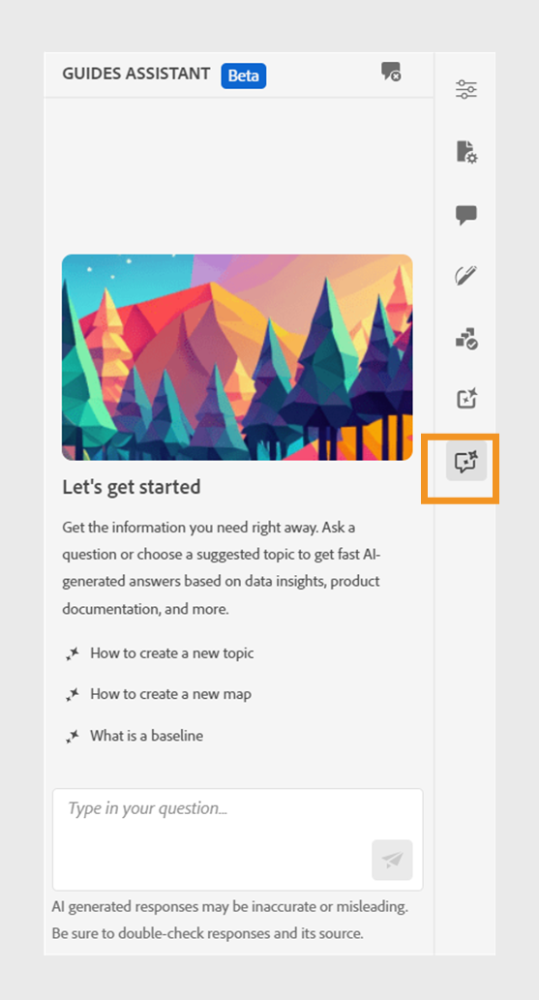
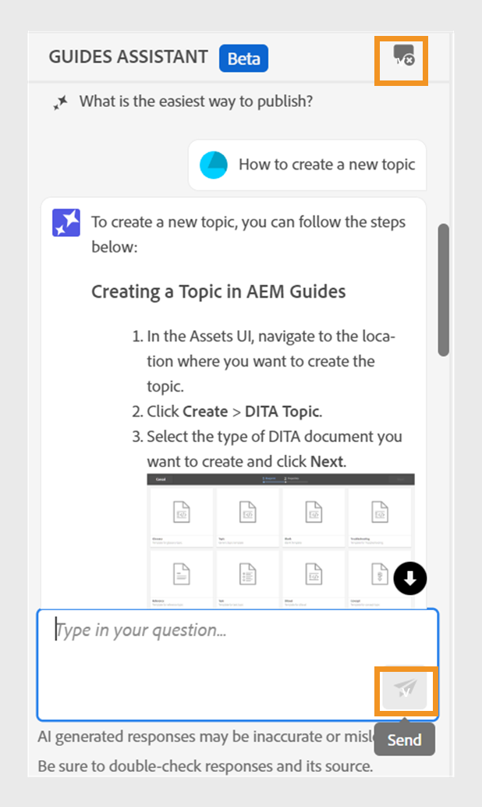

# 用于搜索内容的AI支持的指南助手

在Web编辑器中创作文档时，您可以使用基于GenAI的指南助手。 此对话式搜索功能可帮助您从 [Adobe Experience Manager Guides文档](https://experienceleague.adobe.com/en/docs/experience-manager-guides/using/overview).
您可以提出问题并以信息性的方式获得答案。 您的查询答案取决于产品文档中的内容。 此搜索完全是对话式的。 您可以先提出问题，然后根据响应情况，您还可以提出进一步的问题。 响应中还包括指向源文档的链接，您可以参阅这些链接以了解详细信息。

例如，您可能需要在Experience Manager指南中为文档创建一个主题。 你可以问， *如何创建主题？* 您将获得响应和相关文章的链接。 然后，如果您想了解如何为文档生成PDF输出，可以询问有关该文档的问题。 例如， *如何将主题发布到PDF？* 或 *如何为主题生成PDF输出？*

打开Web编辑器时， **指南助手** 面板将显示在右侧。

>[!NOTE]
>
> 您的管理员必须配置 **指南助手** 功能。 有关更多详细信息，请查看 [配置AI支持的指南助手以搜索内容](../cs-install-guide/conf-guides-assistant.md) Cloud Service的《安装和配置指南》中的部分。

{width="300" align="left"}

*查看&#x200B;**指南助手**面板。*

执行以下步骤以使用对话式搜索来查找相应的内容并解决您的查询：

1. 选择 **指南助手**  以打开面板。

   >[!NOTE]
   >
   > 在 [全局或文件夹级别配置文件](../cs-install-guide/conf-folder-level.md#conf-ai-guides-assistant)时，您的管理员需要定义面板中显示的默认问题。

1. 在“Experience Manager指南”文档中键入问题以查找相关内容。 您可以在面板中选择默认问题，或在文本框中键入您的问题。

1. 选择 **发送**    或按 **输入**  查看对您问题的答复。

   根据您的问题，您可以查看内容、适用的图像以及指向文章的链接。

   {width="300" align="left"}

   *选择示例问题并查看对应的内容和图像。*

1. 选择结尾的文章链接，并查看有关您问题的详细信息。

1. 选择 **清除对话**  以从面板中删除对话历史记录。 然后，您可以开始新的对话并查找相关内容。

此智能功能可帮助您快速查找解决方案，让您能够专注于文档并高效完成任务。