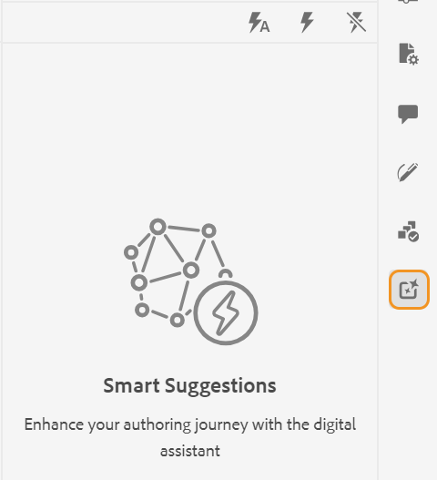
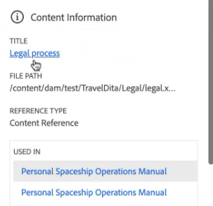
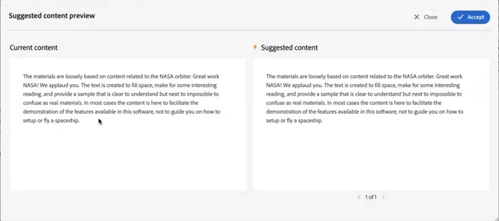

# 用于创作内容的AI支持的智能建议

《Experience Manager指南》提供了 **智能建议** 帮助您创建一致且准确的内容的功能。

在创作内容时， **智能建议** 功能可以使用AI进行搜索并显示语义上与您的内容类似的现有内容。 然后，您可以选择要在当前主题中包含的最佳匹配内容作为引用。

这可帮助您重用文档存储库中的现有内容并创建一致的内容。 例如，您正在创建一个文档，其中包含有关以下项的信息 **Adobe Firefly**，包括有关 **Adobe**. 在这种情况下，您可以快速查看和添加来自其他主题的内容引用，例如 **Adobe Photoshop**，其中包括相同的段落。

在Web编辑器中打开主题时， **智能建议** 面板将显示在右侧。

>[!NOTE]
>
> 您的管理员必须配置 **智能建议** 功能。 有关更多详细信息，请查看 [为创作配置AI支持的智能建议](../cs-install-guide/conf-smart-suggestions.md) Cloud Service的《安装和配置指南》中的部分。

{width="300" align="left"}

*查看&#x200B;**智能建议**面板。*

执行以下步骤，查看有关向主题添加相应内容引用的智能建议：

1. 选择 **智能建议**  以打开面板。

   >[!NOTE]
   >
   > 在 [全局或文件夹级别配置文件](../cs-install-guide/conf-folder-level.md#conf-ai-smart-suggestions)，管理员需要定义要索引以获取智能建议的文件或文件夹，需要输入的最小字符数才能查看建议，以及可在列表中查看的最大建议数。

1. 在主题中键入内容以查看相关建议。 确保内容的字符长度超过管理员在文件夹配置文件中为显示内容建议而设置的长度。

1. 选择 **当前标记的建议**  查看将鼠标指针放置到的当前标记的创作建议。  根据当前标记中的内容，显示从索引文件中查看和添加内容引用的建议。

   键盘快捷键： **Windows** (*Ctrl* + *K*)，  **macOS** (*命令* + *K*)
1. 选择 **有关完整文档的建议**   查看基于完整文档中提供的内容的建议。  智能建议 图标会显示在找到合适匹配项的内容旁边。

   键盘快捷键： **Windows** ( *Ctrl* + *Shift* +  *K* )，  **macOS** (*命令* + *Shift* + *K* )

   >[!NOTE]
   >
   > 您只能查看有关当前视区（屏幕上显示的内容）的建议。 要查看文档中任何其他内容的建议，请向上或向下滚动以在视区中显示该内容，然后选择  图标。

1. 选择 **智能建议**  图标以查看智能建议。
1. 您可以在以下位置查看智能建议 **内容重用** 建议框。  《Experience Manager指南》为完全匹配具有相同含义的内容和内容提供了建议。 例如，您可以搜索包含确切版本号的主题，如“发行版本2023.03.12”。 您还可以搜索“Adobe的总部在加利福尼亚州的圣何塞”，并找到类似“圣何塞拥有像Adobe这样的许多软件公司的季度”的内容。
1. 选择 **内容信息**  以查看详细信息。
   {width="300" align="left"}

   *查看有关内容引用的详细信息。*

   1. 包含内容引用的主题的标题显示为超链接。
   1. 包含内容引用的文件的路径。
   1. 引用了内容的引用类型。
   1. 引用主题的DITA文件的名称显示为超链接。
1. 选择 **建议的内容预览**  将当前内容与建议内容进行比较。 这有助于您比较差异，并确定您是要为建议的内容添加内容引用并使它保持一致，还是要保留当前内容。

   {width="800" align="left"}

   *预览当前内容与建议内容之间的比较。*

1. 单击 **Accept** 在中添加建议的内容引用 **建议的内容预览** 对话框。
1. 您还可以选择 **Accept** 或 **拒绝** 在 **内容重用** “建议”框中的相应建议。

此智能功能非常方便，最大程度地减少了手动内容搜索的工作量，让您能够将更多精力集中在生成新内容上。 它还有助于更好地进行团队协作，并帮助保持由不同作者创建的内容的一致性。

>[!NOTE]
>
>智能建议不会保留当前会话之外的数据。 对于响应，智能建议仅依赖于基于内部数据库中驻留的内容创建的索引。 不使用外部AI工具，确保您的数据保留在系统中。
