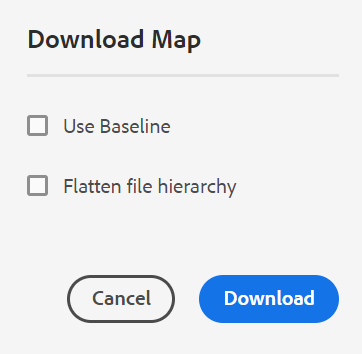
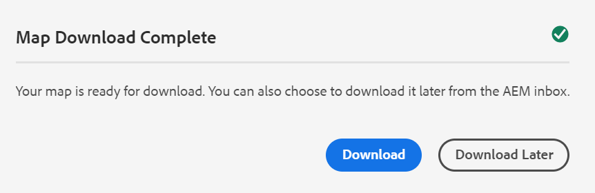
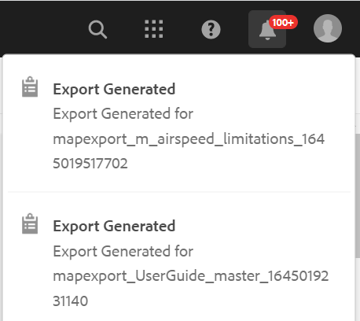

# 下载文件 {#id216MC0H0BE8}

您可以下载包括DITA和非DITA文件的资源。 您可以通过多种方式下载资源，有些方法是AEM的固有方法，而其他方法受AEM Guides的支持。 有关本机AEM Assets下载信息，请参阅 [从Adobe Experience Manager下载资源](https://experienceleague.adobe.com/docs/experience-manager-cloud-service/assets/manage/download-assets-from-aem.html) 请参阅AEM文档。 以下部分将介绍AEM Guides中通过DITA映射控制台下载文件的机制。

## 导出DITA映射文件

在AEM存储库中拥有DITA映射文件后，即可下载映射文件及其依赖项。 这使您能够灵活地共享完整的映射文件，以便进行离线编辑、验证、审阅或只是创建备份。

执行以下步骤下载DITA映射文件及其依赖文件：

1. 在资产UI中，导航到要下载的DITA映射。

1. 单击DITA映射以在DITA映射控制台中将其打开。

1. 选择 **主题** 选项卡以查看DITA映射中可用的主题列表。

1. 在主工具栏中，单击 **下载地图**.

   出现“Download Map（下载映射）”对话框。

   {width="300" align="left"}

1. 单击 **下载**. 在“下载映射”对话框中，您可以选择以下选项：

   - **使用基线**：选择此选项可获取为DITA映射创建的基线列表。 如果要根据特定基线下载映射文件及其内容，请从下拉列表中选择基线。 有关使用基线的更多详细信息，请参见 [使用基线](generate-output-use-baseline-for-publishing.md#).
   - **拼合文件层次结构**：选择此选项可将所有引用的主题和媒体文件保存在单个文件夹中。
   >[!NOTE]
   >
   > 您也可以在不选择任何选项的情况下下载映射文件。 在这种情况下，将下载引用的主题和媒体文件的最新保留版本。

1. 在您单击 **下载** 按钮时，映射下载请求已排队。 一旦地图可供下载，您将收到以下通知。

   {width="550" align="left"}

   - 单击 **下载** 以.zip格式下载映射文件。

   - 单击 **稍后下载** 以稍后下载映射文件。 可以从AEM通知收件箱访问下载链接。 单击收件箱中生成的映射通知，以.zip格式下载映射。

   >[!NOTE]
   >
   > 默认情况下，下载的地图会在AEM通知收件箱中保留五天。

{width="300" align="left"}

下载地图后，您可以选择该地图并使用顶部的打开图标打开选定的报表。

**父主题：**[&#x200B;管理内容](authoring.md)
