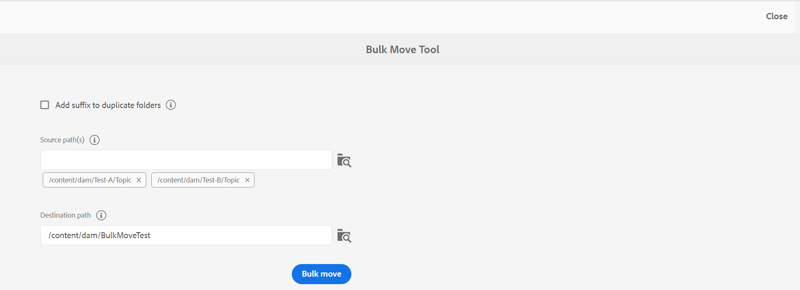
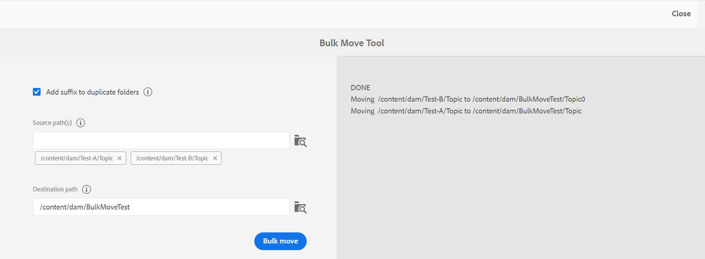
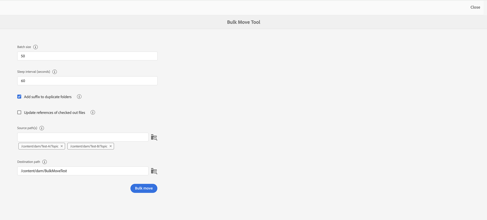
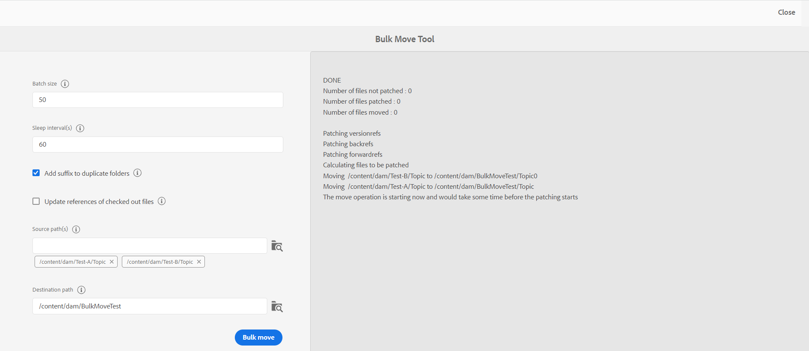
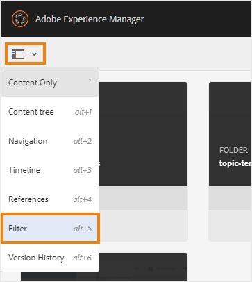
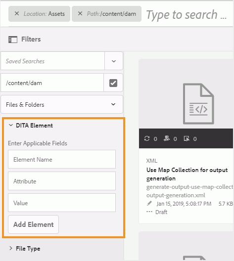
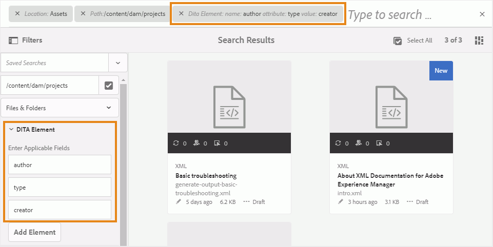
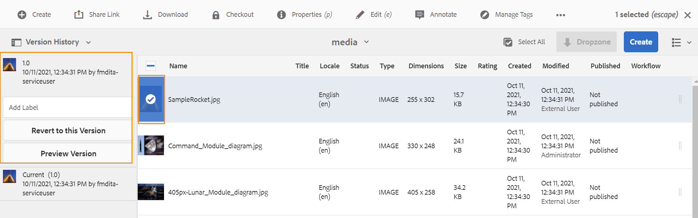
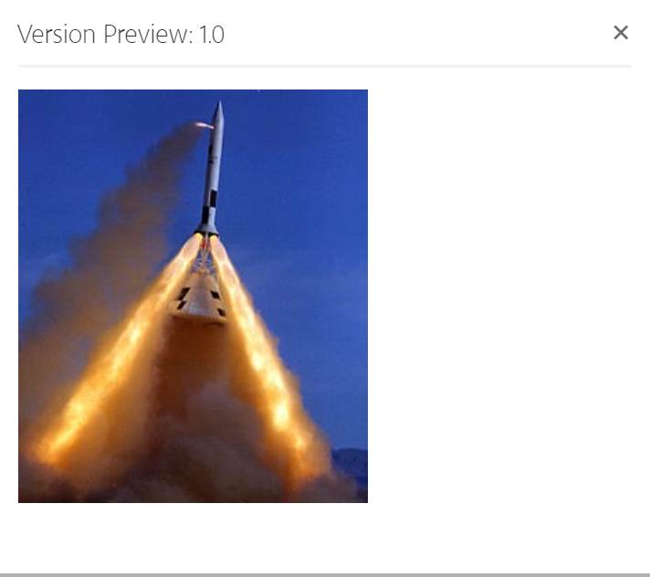

# 管理文件和文件夹 {#id2116G0L08XA}

本节介绍AEM Guides如何处理基本文件操作，如复制、粘贴、拖放和删除文件。 可能会出现以下情况：

## 复制并粘贴文件

**如果文件具有人类可读的文件名**

- *如果目标文件夹中不存在同名文件*：创建文件的新副本并为其分配UUID。 此处，文件名与原始文件名相同。
- *如果目标文件夹中已存在同名文件*：使用后缀\（如filename0.extension\）创建新文件副本。 UUID也会分配给新创建的文件。

**如果文件名基于UUID模式**

- *如果目标文件夹中不存在同名文件*：创建新文件副本，并在新位置为其分配新的UUID。 此处，文件名与UUID相同。
- *如果目标文件夹中已存在同名文件*：创建文件的新副本并为其分配新的UUID。 文件名与UUID相同。

## 复制并粘贴文件夹

**将文件夹复制并粘贴到同一位置**

- *文件夹中的文件具有易于用户识别的文件名*：使用后缀\(like foldername0\)创建文件夹的新副本。 新的UUID也会分配给文件夹中的文件。 但是，文件名没有变化。

- *文件夹中的文件具有基于UUID模式的文件名*：使用后缀\(like foldername0\)创建文件夹的新副本。 新的UUID也会分配给新文件夹中的所有文件。 文件名也会更改；文件名与新的UUID相同。

**将文件夹复制并粘贴到其他位置**

- *文件夹中的文件具有易于用户识别的文件名*：创建一个文件夹的新副本，并将一个新的UUID分配给该文件夹中位于新位置的所有文件。 此处，文件夹或文件名没有变化。

- *文件夹中的文件具有基于UUID模式的文件名*：将创建与原始文件夹同名的新文件夹副本。 新的UUID也会分配给新文件夹中的所有文件。 文件名也会更改；文件名与新的UUID相同。

## 拖放文件

**使用人类可读的文件名进行拖放**

- *在同一位置拖放*：您可以选择 **覆盖现有文件**， **保留两个文件**&#x200B;以及创建现有工作副本的版本的选项。

  {width="650" align="center"}

  如果您选择 **覆盖现有文件** 选项，则要上传的文件会替换原始位置现有文件的当前工作版本。 不会创建或更改UUID。

  如果您选择 **保留两个文件** 选项，则会创建文件的新副本，其后缀为\（如filename0.extension\）。 新的UUID也会分配给新复制的文件。

  使用“覆盖现有文件”选项，如果选择从现有工作副本创建版本的选项，则也会从文档的工作副本创建新版本。

  >[!NOTE]
  >
  > **为上载的文件创建新版本** 功能必须由管理员启用。 如果启用了此功能，则会为上传的文件创建一个新版本。 如果取消选择该选项，则不会创建已上传文件的版本。 有关更多详细信息，请参阅 *为上载的文件创建新版本* 安装和配置Adobe Experience Manager Guidesas a Cloud Service中的部分。

  如果某个文件已由其他用户签出以进行编辑，并且您尝试上载和覆盖现有文件，则该文件将失败并显示错误。

  >[!NOTE]
  >
  >此 **上载时覆盖签出的文件** 您的管理员必须禁用该功能。 如果启用了此功能，则可以覆盖签出的文件。 如果未启用该功能，则阻止覆盖已签出的文件。 有关更多详细信息，请参阅 *上载时覆盖签出的文件* 安装和配置Adobe Experience Manager Guidesas a Cloud Service中的部分。

- *在不同位置拖放文件*：创建新文件副本，并在新位置为其分配新的UUID。 此处，文件名与原始文件名相同。

**根据UUID模式拖放文件名称**

*在同一位置拖放文件*：您可以选择 **覆盖现有文件** 以及创建现有工作副本的版本的选项。

{width="650" align="center"}

当文件被覆盖时，文件名或其UUID不会发生更改。

如果您选择 **为现有工作副本创建版本** 选项，则从文档的工作副本中创建一个新版本；上传新文件，同时创建文件的新版本，并将其作为文档的工作副本。

**为上载的文件创建新版本** 功能必须由管理员启用。 如果启用了此功能，则会为上传的文件创建一个新版本。 如果取消选择该选项，则不会创建已上传文件的版本。 有关更多详细信息，请参阅 *为上载的文件创建新版本* 安装和配置Adobe Experience Manager Guidesas a Cloud Service中的部分。

*在不同位置拖放文件*：您可以选择 **覆盖现有文件**， **将文件移动到新位置**&#x200B;以及创建现有工作副本的版本的选项。

{width="650" align="center"}

如果您选择 **覆盖现有文件** 选项，则要上传的文件将替换原始位置上的现有文件。 不会创建或更改UUID。

如果您选择 **将文件移动到新位置** 选项，则现有文件会被移动到当前位置，然后由正在上传的文件覆盖。 将文件移动到新位置不会中断来自或指向文件的任何现有引用。

替换或移动文件时，如果选择从现有副本创建版本的选项，则文档的工作副本中会创建一个新版本；新文件将在现有位置被替换或移动到新位置。

## 批量移动文件 {#move-files-bulk}

AEM Guides附带批量移动工具，可帮助管理员将具有大量文件的文件夹从一个位置移动到另一个位置。 此工具可以轻松地将一个或多个文件夹中的文件移到AEM存储库中的其他文件夹中。 此工具的主要功能之一是，它不仅可以移动大量文件，还可以维护对要移动文件的引用和来自要移动文件的引用。 您可以调整可以批量移动的文件数量，而不会妨碍创作和发布任务。

>[!NOTE]
>
> “批量移动工具”仅在文件夹级别起作用。 如果要移动单个主题或映射文件，请使用AEM Assets UI中的常规移动工具。

以下是批量移动工具提供的一些功能：

- 您可以调整每个批次中要处理的文件数。 在获得系统可轻松处理的最佳号码之前，可能需要运行一些测试。
- 创作和发布服务运行平稳，不会中断移动操作。
- 在后续\（运行\）批处理之间的时间间隔内有完全控制权。 此时间间隔可确保后处理操作在启动下一批文件之前完成。

- 自动处理同名文件夹。 此功能可确保即使移动了具有相同名称的文件夹，也不会覆盖这些文件夹。

- 自动处理对要移动文件的引用和从中进行的引用。

在运行批处理之前，必须考虑以下几点：

- 如果计划移动当前审阅的主题，则必须先关闭所有此类主题的审阅过程，然后再移动它们。 不关闭审阅任务将中断审阅进程。
- 在任何时候，您都只能在系统上运行单个批量移动操作。 这可确保正确处理对正在移动的主题的引用以及从主题进行的引用。

要批量移动文件，请执行以下步骤：

1. 单击顶部的Adobe Experience Manager链接，然后选择 **工具**.
1. 选择 **指南** 工具列表中。
1. 单击 **批量移动工具** 磁贴。
1. 此时会根据您的设置显示“批量移动工具”页面。 提供以下关于以下内容的详细信息： **批量移动工具** 页面：

   

   
 Cloud Service和基于UUID的内部部署文件系统 

   {width="650" align="center"}

   >[!TIP]
   >
   > 选择    查看任何字段的更多详细信息。

   - **向重复文件夹添加后缀**：如果移动的是具有相同名称的文件夹，则必须选择此选项。 例如，在上一个屏幕截图中， **源路径** 包含要移动的文件夹的名称。 名为topic的文件夹存在于两个不同的位置 — test-A和test-B。选择此选项后，文件夹将成功移动。 第一个移动的文件夹将命名为topic ，第二个文件夹将命名为topic0。 移动操作将序列中的后缀\（0、1、2等）添加到具有相同名称的文件夹中。

     如果您正在移动同名文件夹而没有选择此选项，则该操作将中止，并出现一则消息。

   - **源路径**：指定要移动的文件夹的位置。

      - 选择  **浏览文件夹**      打开“浏览文件”对话框。 选择要移动的文件夹，然后单击 **选择** 以完成该过程。

      - 您还可以键入或复制并粘贴源位置。 按Enter将文件夹添加到列表。

        选定的文件夹将与其路径一起列出。 将鼠标悬停在文件夹标记上可查看完整路径。
      - 您也可以通过单击 **移除**  文件夹附近。

   - **目标路径**：指定要移动源文件夹的位置。

      - 选择  **浏览文件夹**  打开“浏览文件”对话框。 选择要移动源文件夹的位置。 ，然后单击选择以完成该过程。
      - 您还可以键入或复制并粘贴目标路径。

     所选文件夹与其路径一起显示在文本框中。

   - 单击 **批量移动**.

     系统开始将文件从源位置移动到目标位置。 移动过程完成后，页面右侧会显示移动过程的摘要。

     {width="650" align="center"}

   

   

   
 不基于UUID的内部部署文件系统 

   {width="650" align="center"}

   >[!TIP]
   >
   > 选择    查看任何字段的更多详细信息。

   - **批次大小**：指定在单个批次中要移动的文件数。 默认值为50个文件。
   - **睡眠间隔（秒）**：指定进程在启动下一个批次之前等待的时间（以秒为单位）。 在此休眠时间间隔内，系统会修复对移动文件的引用和来自移动文件的引用。 默认睡眠间隔为60秒。

   - **向重复文件夹添加后缀**：如果移动的是具有相同名称的文件夹，则必须选择此选项。 例如，在上一个屏幕截图中， **源路径** 包含要移动的文件夹的名称。 名为topic的文件夹存在于两个不同的位置 — test-A和test-B。选择此选项后，文件夹将成功移动。 第一个移动的文件夹将命名为topic ，第二个文件夹将命名为topic0。 移动操作将序列中的后缀\（0、1、2等）添加到具有相同名称的文件夹中。

     如果您正在移动同名文件夹而没有选择此选项，则该操作将中止，并出现一则消息。

   - **更新已签出文件的引用**：如果要移动包含已签出文件的文件夹，建议您选择此选项。 如果选择此选项，则所有已检出的文件都将保存并以新修订版本检入。 然后，此新修订版本会被移动到目标位置。

     如果未选择此选项，则签出文件将以相同的签出状态移动到目标文件夹。 但是，在此移动过程中可能会丢失一些数据。

   - **源路径**：指定要移动的文件夹的位置。

      - 选择  **浏览文件夹**      打开“浏览文件”对话框。 选择要移动的文件夹，然后单击 **选择** 以完成该过程。

      - 您还可以键入或复制并粘贴源位置。 按Enter将文件夹添加到列表。

        选定的文件夹将与其路径一起列出。 将鼠标悬停在文件夹标记上可查看完整路径。
      - 您也可以通过单击 **移除**  文件夹附近。

   - **目标路径**：指定要移动源文件夹的位置。

      - 选择  **浏览文件夹**  打开“浏览文件”对话框。 选择要移动源文件夹的位置。 ，然后单击选择以完成该过程。
      - 您还可以键入或复制并粘贴目标路径。

        所选文件夹与其路径一起显示在文本框中。

   - 单击 **批量移动**.

     系统开始将文件从源位置移动到目标位置。 移动过程完成后，页面右侧会显示移动过程的摘要。
     {width="650" align="center"}

## 搜索DITA内容

默认情况下，AEM不识别DITA内容，因此，它不提供任何机制来搜索其存储库中的DITA内容。 AEM Guides在AEM之上添加了一个层，使AEM能够理解和处理DITA内容。 AEM Guides中的搜索DITA内容功能允许您在AEM存储库中搜索DITA内容。

>[!NOTE]
>
>您的系统管理员可以配置 **DITA元素** 搜索组件，然后您可以从AEM Assets UI使用该功能。 有关详细信息，请参阅， *在资产UI中添加DITA元素搜索组件* 安装和配置Adobe Experience Manager Guidesas a Cloud Service部分中的。

使用搜索功能，您可以：

- 基于元素值搜索DITA内容；例如， `author`= xml
- 基于属性值搜索DITA内容；例如， `@platform`= windows
- 使用DITA元素和属性值的组合；例如， `author`= xml `AND` `@platform`= windows

执行以下步骤以搜索AEM存储库中的DITA内容：

1. 打开资产UI。

1. 在左边栏中，选择 **过滤器**.

   {width="450" align="center"}

   内容筛选选项显示在左边栏中。 您还会找到用于筛选DITA内容的筛选选项 — DITA元素。

   {width="450" align="center"}

1. *\（可选\）* 在 **选择搜索目录** 字段，浏览要搜索的位置。

1. 在 **DITA元素** 过滤器，提供 **元素名称**， **属性**，以及要搜索的值。 例如，要搜索具有以下特征的文档 `author` 属于的元素 `@type` 创建者需要提供如下屏幕快照中所示的信息：

   {width="650" align="center"}

   在中输入的搜索条件 **DITA元素** 过滤器显示在搜索栏的顶部。 与搜索条件匹配的文件显示在 **搜索结果** 区域。

   指定搜索条件时，请考虑以下几点：

   - 要搜索精确短语，请在带引号的值字段中输入该短语 `"`短语搜索`"`.
   - 最多可添加3个DITA元素搜索条件。
   - 如果指定多个搜索条件，则将使用AND逻辑组合所有这些搜索条件。
   - 不能在搜索条件中使用通配符。 例如，要搜索值为Windows的平台\(attribute\)，不能指定\*form或Windo？

**搜索中的签出状态筛选器**

除了DITA元素过滤器之外，AEM Guides还允许您根据内容的签出状态搜索内容。 当您想要快速过滤掉当前由您签出的文件并想要将它们签回时，这非常有用。

执行以下步骤以根据文件的签出状态搜索文件：

1. 打开资产UI。

1. 单击 **筛选** 在左边栏中。
1. 在搜索栏中输入搜索关键词。
1. 从左边栏应用所需的过滤器。

   例如，您可以应用 **签出状态** 筛选条件以显示已签出或已签入主题。 通过从“检出者”列表中选择用户或组，可以进一步细化此列表。

   将显示搜索结果。

## 删除文件

从AEM存储库中删除文件是一项受限制的功能，由系统管理员控制。 根据配置，如果文件满足以下条件，则可能会限制删除文件：

- 已签出
- 具有传入或传出引用

只有属于特定用户组，并且拥有删除文件的权限时，才能删除文件。

>[!NOTE]
>
> 有关文件管理配置的更多详细信息，请参阅 *阻止删除已签出的文件* 和 *防止删除引用的文件* 安装和配置Adobe Experience Manager Guidesas a Cloud Service中的部分。

如果管理员已授予所有用户文件删除权限，则在删除包含引用的文件时，将显示以下消息：

{width="650" align="center"}

在此方案中，您可以强制删除文件，而不从文件中删除传入或传出引用。

如果为特定用户组提供了删除权限，则也会为属于该组的用户显示上述消息。 但是，对于其他用户，会显示以下消息：

{width="650" align="center"}

在此方案中，在删除所有传入和传出引用之前，不允许用户删除文件。

## 使用媒体文件

图像和视频等媒体文件是内容的组成部分。 在上传和管理内容时，您还可以处理媒体文件。

如果介质文件发生任何更改，您可以在 **版本历史记录**.要了解不同版本的媒体文件中的更改，请执行以下操作：

1. 在中访问文件 **资产UI**.
1. 选择要查看其版本历史记录的文件。
1. 在左边栏中，单击 **版本历史记录** 并选择版本。
1. 您还可以在“版本历史记录”下查看不同版本的缩略图。

   {width="800" align="center"}

1. 从列出的版本中，选择要用作基本版本的版本，然后单击 **预览版本**. 所选版本的预览将显示在“版本预览”窗口中。

   {width="650" align="center"}

**父主题：**[&#x200B;管理内容](authoring.md)
