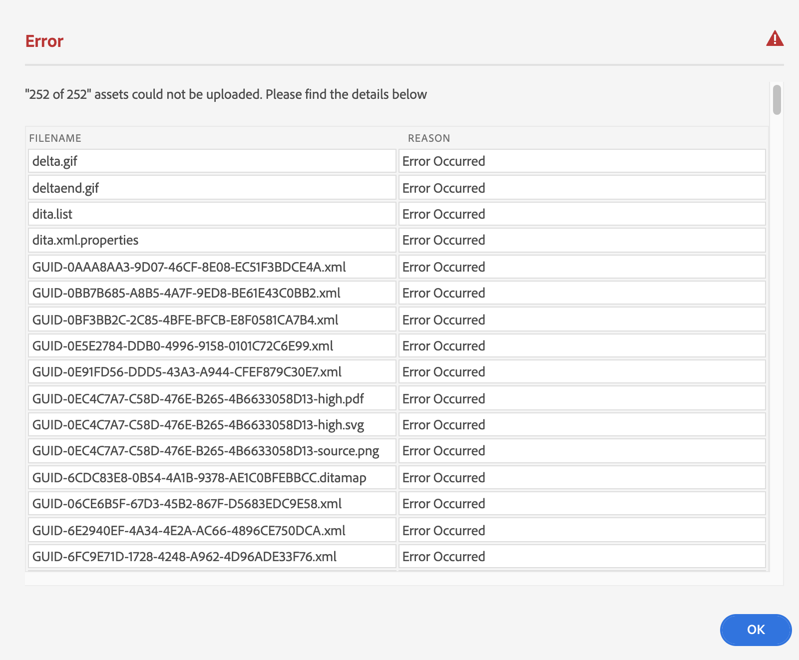

# 上载文件 {#id176FF000JUI}

最有可能的情况是，您拥有要与AEM Guides一起使用的现有DITA内容的存储库。 对于此类现有内容，您可以使用以下任意方法将内容批量上传到AEM存储库：

>[!IMPORTANT]
>
> 请参阅 [将数字资源添加到Adobe Experience Manager as a Cloud Service资源](https://experienceleague.adobe.com/docs/experience-manager-cloud-service/assets/manage/add-assets.html) 有关AEM中支持的内容上传方法的详细信息。

## Assets控制台用户界面

您可以选择桌面上的内容，然后在AEM用户界面\（Web浏览器\）上拖动到目标文件夹。 有关更多详细信息，请参阅 [上传资源](https://experienceleague.adobe.com/docs/experience-manager-cloud-service/assets/manage/add-assets.html#upload-assets) 请参阅AEM文档。

## AEM 桌面应用程序

如果您是创意专业人士并想要在本地桌面上管理资源，请使用AEM桌面应用程序。 您可以使用桌面应用程序打开和编辑这些资源。 您还可以维护版本并与其他用户共享您的文件。 有关更多详细信息，请参阅 [AEM桌面应用程序](https://experienceleague.adobe.com/docs/experience-manager-desktop-app/using/using.html).

## 资源批量提取器

如果您进行了大规模迁移并偶尔进行了批量摄取，请使用资产批量摄取器上传您的内容。 使用此工具，您可以从受支持的数据存储（如Azure或S3）上载批量内容。 有关更多详细信息，请参阅 [资源批量提取器](https://experienceleague.adobe.com/docs/experience-manager-cloud-service/assets/manage/add-assets.html?lang=en#asset-bulk-ingestor).

## 使用FrameMaker进行批量上传

Adobe FrameMaker附带强大的AEM连接器，可让您轻松上传现有DITA和其他FrameMaker文档\(`.book` 和 `.fm`\)到AEM中。 您可以使用各种文件上传功能，例如上传单个文件、上传具有或不具有依赖关系的完整文件夹\（如内容引用、交叉引用和图形\）。

有关在FrameMaker中使用批量上传功能的更多详细信息，请参阅部分 *创建CRX文件夹并上传文件* 《FrameMaker用户指南》中的。

## 上传内容时出错 {#id201MI0I04Y4}

如果上传一个或多个文件失败，将在上传过程结束时显示一条提示，其中包含上传失败的文件列表：

{width="650" align="center"}

有关各种文件上传方案的详细信息，请参阅 [上传DITA内容](authoring-file-management.md#).

如果您使用AEM桌面应用程序或资产批量摄取器等工具，则对重复文件执行的操作将由AEM服务器上的设置控制。 请与系统管理员联系以了解此配置。

**父主题：**[&#x200B;管理内容](authoring.md)
