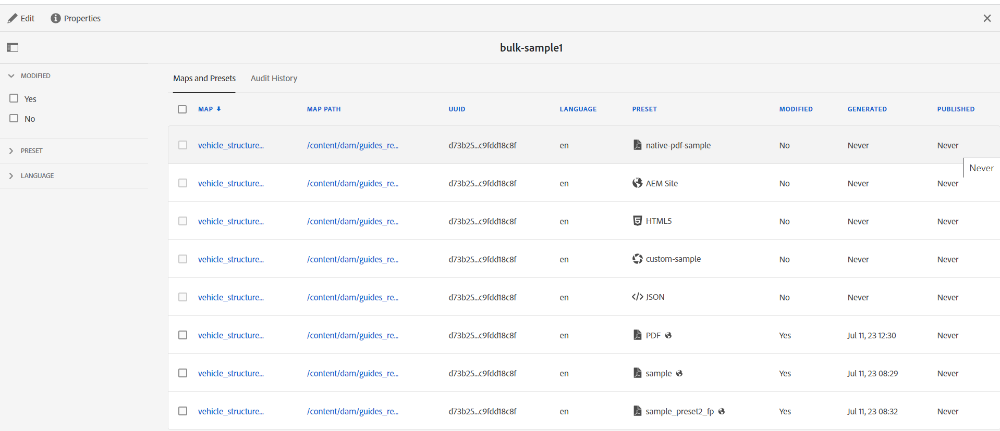
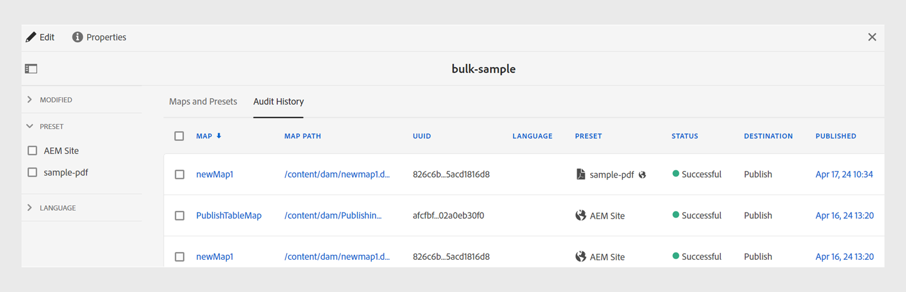

# 创建批量激活映射集合 {#id214GG0E90EV}

要创建批量激活映射集合，请执行以下步骤：

1. 选择 **指南** 工具列表中。

1. 选择顶部的Adobe Experience Manager链接，然后选择 **工具**.

1. 选择 **批量发布功能板** 磁贴。

   首次显示空白收藏集页面。 如果您之前已创建批量激活收藏集，则它们将显示在此页面上。

1. 单击&#x200B;**创建**。

1. 输入批量激活图集合的标题，然后单击 **创建**.

   创建批量激活图集合时会显示一条成功消息。

1. 单击 **打开** 在成功消息上。

1. 选择 **编辑** 然后选择 **添加映射**.

1. 查找并添加要添加到批量激活映射集合的DITA映射。

   默认情况下，会自动添加与映射关联的所有预设和区域设置。

1. 通过打开或关闭滑动按钮选择所需的输出。

   您可以跨可用区域设置选择多个输出预设。

1. 单击&#x200B;**完成**。

DITA映射文件将添加到批量激活映射集合中。

{width="800" align="left"}

## “映射和预设”选项卡

此 **映射和预设** 选项卡在以下列中显示信息：

- **地图**：显示DITA映射文件的标题。
- **映射路径**：显示DITA映射文件的完整路径。

- **UUID**：显示与文件关联的唯一标识符。

- **语言**：显示DITA映射的语言代码。
- **预设**：显示在映射文件上配置的输出预设的标题。 它还会根据输出预设的类型显示图标。

  >[!NOTE]
  >
  > 小  图标表示文件夹配置文件级别预设。

- **修改时间**：指示DITA映射是否在上次发布后更新。 根据此信息，您可以决定是否要激活此DITA映射的输出。
- **已生成**：显示上次生成输出的日期和时间。
- **已发布**：显示上次发布（或激活）输出的日期和时间。 如果您选择链接，则 **激活结果** 此时将显示页面，其中包含日志，其中包含有关激活内容的根路径的信息。

## “Audit History”（审核历史记录）选项卡

此 **审核历史记录** 选项卡在以下列中显示有关已激活映射输出的信息：
- **地图**：显示DITA映射文件的标题。
- **映射路径**：显示DITA映射文件的完整路径。
- **UUID** ：显示与文件关联的唯一标识符。
- **语言**：显示DITA映射的语言代码。
- **预设**：显示在映射文件上配置的输出预设的标题。 它还会根据输出预设的类型显示图标。
- **状态**：将激活状态显示为成功或不成功。
- **目标**：如果您as a Cloud Service在Experience Manager指南上生成输出，则可以以“发布”或“预览”形式查看输出的目标。

  >[!NOTE]
  >
  > 小  图标表示文件夹配置文件级别预设。

- **修改时间**：指示DITA映射是否在上次发布后更新。 根据此信息，可以决定是否激活此DITA映射的输出。
- **已发布**：显示上次发布（或激活）输出的日期和时间。 如果选择该链接，则会显示“激活结果”页面，其中包含日志，其中包含有关激活内容的根路径的信息。
  {width="800" align="left"}

  *在中查看有关已激活映射输出的信息&#x200B;**审核历史记录**选项卡。*

  >[!NOTE]
  >
  > 中的输出 **审核历史记录** 选项卡的排序基于 **已发布** 列。

## 左侧面板

左侧面板上提供了以下筛选选项：

- **修改时间**：您可以选择“是”或“否”。 如果选择“是”，则仅显示修改的DITA映射。 修改后的映射是自上次发布以来生成的映射。
- **预设**：选择要过滤掉映射文件的预设。 此列显示在映射文件上配置的输出预设的标题。 例如，如果您选择 *AEM站点* 则仅显示具有 *AEM站点* 已在其上配置输出预设。
- **语言**：您可以选择任何可用的语言代码，并在映射和预设选项卡中仅显示选定的语言。

当您从以下位置切换时，将更新过滤器 **映射和预设** 按tab键转到 **审核历史记录** 选项卡，反之亦然。

**父主题： **[批量激活已发布的内容](conf-bulk-activation.md)
