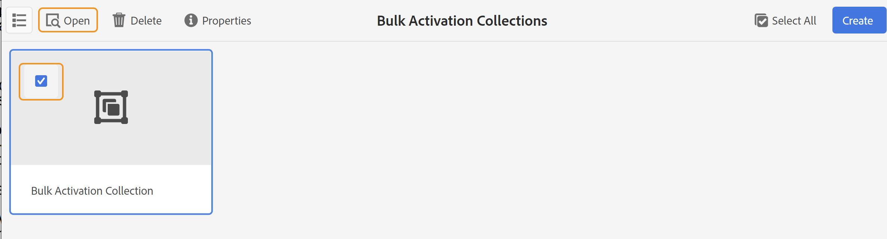
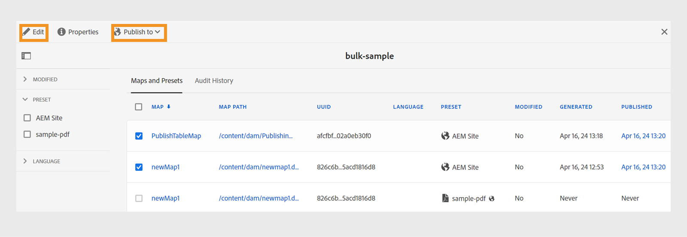
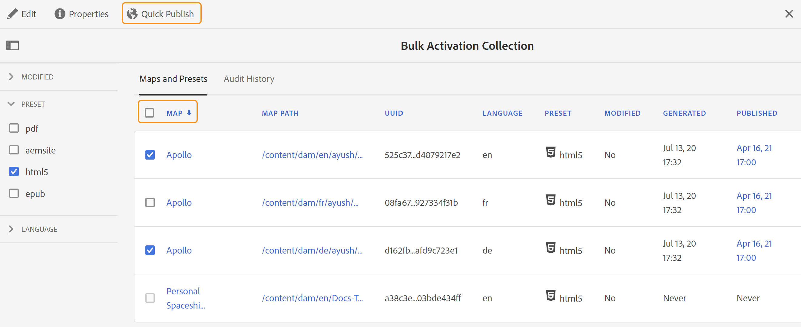

# 激活输出 {#id214GGF00V5U}

创建用于批量激活的映射收藏集后，下一步是在发布实例上激活您的内容。 要激活内容，请执行以下步骤：

1. 选择 **指南** 工具列表中。

1. 单击顶部的Adobe Experience Manager链接，然后选择 **工具**.

1. 单击 **批量发布功能板** 磁贴。

   此时将显示批量激活映射集合列表。

1. 选择要发布的收藏集，然后单击 **打开**.

   {width="800" align="left"}

1. \(*可选*\)从左边栏中应用所需的过滤器，以根据它们修改的\(status\)、输出预设或语言对映射进行过滤。

   >[!NOTE]
   >
   >在地图集合中激活输出预设之前，使用输出预设生成地图的输出。

查看根据您的设置激活收藏集的不同方式。

 Cloud Service 

{width="650" align="left"}

您可以将输出激活到 **预览** 或 **Publish** 实例。

**预览**

* 要激活选定映射的输出，请选择预生成的映射输出，然后选择 **发布到** > **预览**.
* 要激活所有DITA映射及其配置的预设的输出，请选中 **地图** 列，然后选择 **发布到** > **Publish**.

**Publish**

* 要激活选定映射的输出，请选择预生成的映射输出，然后选择 **发布到** > **Publish**.

* 要激活所有DITA映射及其配置的预设的输出，请选中“映射”（列）旁边的复选框，然后选择 **发布到** > **Publish**.

>[!NOTE]
> 
> 仅当已生成映射的输出时，才会启用映射输出的复选框。

当映射输出排队等待发布时，会显示一条成功消息。

为所选映射文件激活输出后，将更新审核历史记录选项卡，并且最新激活的输出将显示在顶部。 此 **已发布** 列将更新为发布日期和时间。

    

  内部部署软件 

执行下列操作之一：

* 要激活选定映射的输出，请选择预生成的映射输出，然后选择 **快速发布**.
* 要激活所有DITA映射及其配置的预设的输出，请选中“映射”（列）旁边的复选框，然后选择 **快速发布。**
  {width="650" align="left"}

  >[!NOTE]
  > 
  >仅当已生成映射的输出时，才会启用映射输出的复选框。

当映射输出排队等待发布时，会显示一条成功消息。

为所选映射文件激活输出后，将更新审核历史记录选项卡，并且最新激活的输出将显示在顶部。 此 **已发布** 列将更新为发布日期和时间。

**父主题： **[批量激活已发布的内容](conf-bulk-activation.md)
