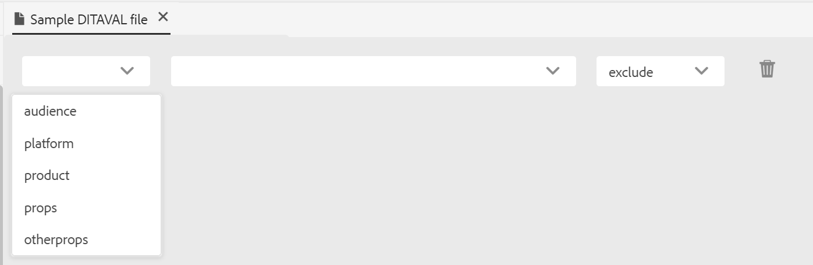
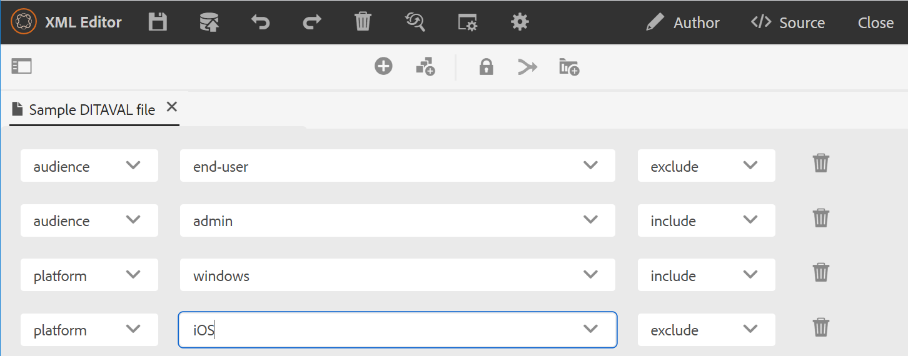
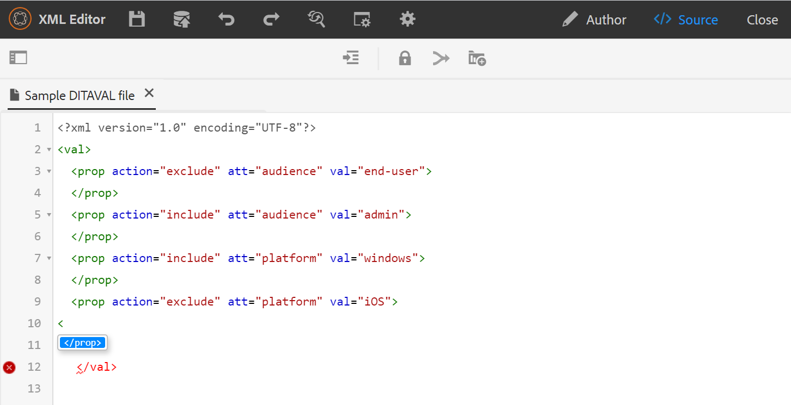

# DITAVAL编辑器 {#ditaval-editor}

DITAVAL文件用于生成条件输出。 在单个主题中，您可以使用元素属性添加条件以条件化内容。 然后，创建一个DITAVAL文件，在该文件中指定应选取以生成内容的条件，以及应从最终输出中排除哪些条件。

AEM Guides允许您使用DITAVAL编辑器轻松创建和编辑DITAVAL文件。 DITAVAL编辑器将检索系统中定义的属性\（或标记\），您可以使用它们来创建或编辑DITAVAL文件。 有关在AEM中创建和管理标记的更多详细信息，请参阅 [管理标记](https://experienceleague.adobe.com/docs/experience-manager-cloud-service/sites/authoring/features/tags.html?lang=en) 部分(在AEM文档中)。

## 创建DITAVAL文件

执行以下步骤以创建DITAVAL文件：

1. 在Assets UI中，导航到要创建DITAVAL文件的位置。

1. 单击 **创建** \> **DITA主题**.

1. 在Blueprint页面上，选择DITAVAL文件模板并单击 **下一个**.

1. 在“属性”页面上，指定 **标题** 和 **名称** DITAVAL文件。

   >[!NOTE]
   >
   > 根据文件的标题自动建议名称。 如果要手动指定文件名，请确保“名称”不包含任何空格、撇号或大括号，且以.ditaval结尾。

1. 单击&#x200B;**创建**。此时将显示“创建的主题”消息。

   您可以选择打开DITAVAL文件以便在DITAVAL编辑器中编辑，或者将主题文件保存到AEM存储库中。

## 编辑DITAVAL文件

执行以下步骤以编辑DITAVAL文件：

1. 在资产UI中，导航到要编辑的DITAVAL文件。

1. 要获取对文件的独占锁定，请选择该文件并单击 **签出**.

1. 选择文件并单击 **编辑** 以在AEM Guides DITAVAL编辑器中打开文件。

   DITAVAL编辑器允许您执行以下任务：

   A：切换左侧面板切换左侧面板视图。 如果您已通过DITA映射打开DITAVAL文件，则映射和存储库将显示在此面板中。 有关通过DITA映射打开文件的详细信息，请参见 [通过DITA映射编辑主题](map-editor-advanced-map-editor.md#id17ACJ0F0FHS).

   B：保存保存您在文件中进行的更改。 所有更改都保存在文件的当前版本中。

   C：添加属性在DITAVAL文件中添加单个属性。

   

   第一个下拉列表列出了可以在DITAVAL文件中使用的允许DITA属性。 有五个属性受支持 —  `audience`， `platform`， `product`， `props`、和 `otherprops`.

   第二个下拉列表显示为所选属性配置的值。 然后，下一个下拉列表显示了您可以对选定属性配置的操作。 “操作”下拉列表中允许的值是 —  `include`， `exclude`， `passthrough`、和 `flag`. 有关这些值的更多信息，请参见 [prop](http://docs.oasis-open.org/dita/dita/v1.3/errata01/os/complete/part3-all-inclusive/langRef/ditaval/ditaval-prop.html#ditaval-prop) OASIS DITA文档中的元素

   D：添加所有属性如果要通过单击来添加系统中定义的所有条件属性或属性，请使用“添加所有属性”功能。

   >[!NOTE]
   >
   > 如果DITAVAL文件中已存在所有已定义的条件属性，则无法添加更多属性。 在这种情况下，您会收到一条错误消息。

   

1. 编辑完DITAVAL文件后，单击 **保存**.

   >[!NOTE]
   >
   > 如果关闭文件而不保存，更改将丢失。 如果不希望将更改提交到AEM存储库，请单击 **关闭**，然后单击 **关闭但不保存** 在 **未保存的更改** 对话框。

## DITAVAL编辑器视图

AEM Guides的DITAVAL编辑器支持以两种不同的模式或视图查看DITAVAL文件：

**作者**：这是典型的“您所看到的内容”是DITAVAL编辑器的\(WYSISYG\)视图。 您可以使用简单的用户界面添加或删除属性，该界面在下拉列表中显示属性、属性值和操作。 在“创作”视图中，您可以选择通过一次单击插入单个属性和所有属性。

通过将指针悬停在文件名上，还可以找到当前正在处理的DITAVAL文件的版本。

**来源**：源视图显示构成DITAVAL文件的基础XML。 除了在此视图中编辑常规文本外，作者还可以使用智能目录添加或编辑属性。

要调用智能目录，请将光标放在任何属性定义的末尾并输入“&lt;”。 该编辑器将显示可以在该位置插入的所有有效XML元素的列表。

