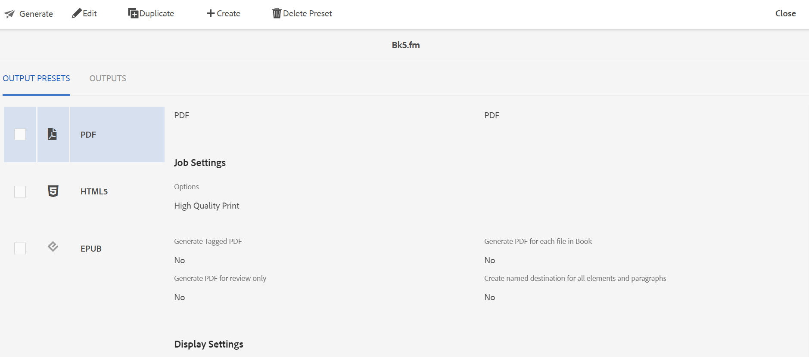

# 生成.book或.fm文件的输出 {#generating_output_fm_docs}

执行以下步骤以生成FrameMaker单据的输出：

1. 在Assets UI中，导航到并单击 `.book` 或 `.fm` 要发布的文件。

   此时将显示DITA映射控制台，其中显示了可用于生成输出的输出预设列表。

   {width="800" align="left"}

1. 选择一个或多个要用于生成输出的输出预设。

1. 单击“生成”图标以启动输出生成过程。

>[!NOTE]
>
> 通过单击输出，可以查看输出生成请求的当前状态。 有关更多信息，请参阅 [查看输出生成任务的状态](fm-output-view-status.md).

**父主题：**[&#x200B;生成FrameMaker单据的输出](fm-output-generatation.md)
