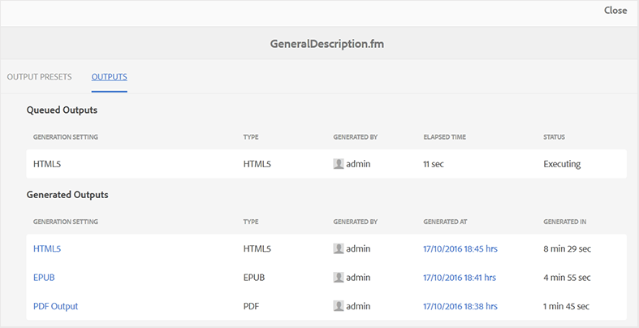

# 查看输出生成任务的状态 {#viewing_output_history}

启动FrameMaker文档的输出生成任务后，AEM Guides会将此任务发送到输出生成队列。 此队列将实时更新，显示队列中每个输出生成任务的状态。

执行以下步骤以查看输出生成队列：

1. 在Assets UI中，导航到要检查其输出生成状态的FrameMaker文档并单击该文档。

1. 单击输出。

   {width="800" align="left"}

1. “输出”页面分为两个部分：

   - **已排队输出：**

     列出正在等待生成或正在生成过程中的输出。 您还可以找到用于已排队任务的输出生成设置或预设、类型、启动任务的用户、自任务排队以来的时间以及当前状态。

   - **生成的输出**

     列出已完成的输出任务。 同样，这里显示的信息与已排队输出部分类似，只是输出生成时间不同。

     在此列表中，您可能有已成功执行的任务或失败的任务。 对于已成功完成的任务，发布过程会创建一个日志文件\(logs.txt\)，可通过单击“生成位置”列中的链接访问该文件。

**父主题：**[&#x200B;生成FrameMaker单据的输出](fm-output-generatation.md)
