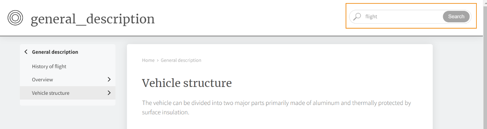

# AEM站点 {#id205BE3008SW}

以下选项可用于AEM Site输出：

您可以通过两种方式创建AEM站点预设：

**在Web编辑器中：** 在“存储库”面板中，在映射视图中打开DITA映射文件，然后在“输出”选项卡中，选择+图标以创建输出预设，然后从“添加预设”对话框的类型下拉列表中选择AEM站点。在Web编辑器中，配置已整理在“常规”和“高级”选项卡下：

**常规**

此 **常规** 选项卡包含以下配置：

- 网站名称
- 输出路径
- 现有输出页面
- 删除孤立站点页面
- 使用\（如果为映射定义了条件\）应用条件
- 使用基线\（如果为映射创建了基线\）
- 后期生成工作流

**高级**

“高级”选项卡包含以下配置：

- 清理DITA-OT临时文件
- 为每个主题生成单独的PDF
- 使用映射属性作为默认值

有关详细信息，请参阅 [AEM站点配置](#id231KIM004X1).

**从地图仪表板**

要打开AEM站点的输出预设，请单击Assets UI中的DITA映射文件，单击输出预设，然后单击AEM站点输出选项。在映射仪表板中，单击 **编辑** 以更新各种配置，然后单击 **保存**.

>[!TIP]
>
> 请参阅 *AEM站点发布* 部分，了解有关创建AEM站点输出的最佳实践。

## AEM站点配置 {#id_aem_site_config}

以下选项可用于AEM Site输出：

| AEM站点选项 | 描述 |
| --- | --- |
| 输出类型 | 要生成的输出类型。 要生成响应式AEM站点输出，请选择AEM站点选项。 |
| 设置名称 | 为您正在创建的AEM站点设置提供一个描述性名称。 例如，您可以指定 *内部客户输出* 或 *最终用户输出*. |
| 网站名称 | 将输出存储在AEM存储库中的网站名称。  将使用此处指定的名称创建AEM存储库中的节点。 如果未指定站点名称，则使用DITA映射文件名创建站点节点。  此处指定的站点名称还用作浏览器选项卡中的标题。  您还可以在设置站点名称时使用变量。 有关使用变量的更多详细信息，请参阅 [使用变量设置目标路径、站点名称或文件名选项](generate-output-use-variables.md#id18BUG70K05Z). |
| 设计 | 选择要用于生成输出的设计模板。  有关如何使用自定义设计模板生成输出的详细信息，请与发布管理员联系。 |
| 目标路径 | AEM存储库中存储输出的路径。 在生成最终输出时，站点名称和目标路径是组合在一起的。 例如，如果将“站点名称”指定为 `user-guide` 目标路径为 `/content/output/aem-guides`，则最终输出将生成于 `/content/output/aem-guides/user-guide` 节点。  您还可以在设置目标路径时使用变量。 有关使用变量的更多详细信息，请参阅 [使用变量设置目标路径、站点名称或文件名选项](generate-output-use-variables.md#id18BUG70K05Z). |
| 使用以下方式应用条件 | 选择以下选项之一：  **未应用**：如果您不想对已发布的输出应用任何条件，请选择此选项。 **DITAVal文件**：选择DITAVal文件以生成条件化内容。 可使用浏览对话框或键入文件路径来选择多个DITAVal文件。 使用文件名旁边的交叉图标可将其删除。 DITAVal文件将按指定的顺序进行计算，因此第一个文件中指定的条件优先于后续文件中指定的匹配条件。 您可以通过添加或删除文件来维护文件顺序。 如果将DITAVal文件移动到其他位置或将其删除，则不会从映射操控板中自动将其删除。 如果移动或删除了文件，则需要更新位置。 您可以将鼠标悬停在文件名上以查看存储该文件的AEM存储库中的路径。 您只能选择DITAVal文件，如果选择了任何其他文件类型，则会显示错误。 **条件预设**：从下拉列表中选择条件预设，以在发布输出时应用条件。 如果为DITA映射文件添加了条件，则此选项可见。 条件设置在DITA映射控制台的条件预设选项卡中可用。 要了解有关条件预设的更多信息，请参阅 [使用条件预设](generate-output-use-condition-presets.md#id1825FL004PN). |
| 现有输出页面 | 选择 **覆盖内容** 覆盖现有页面中内容的选项。 此选项仅覆盖页面内容和标题节点下存在的内容。 此选项允许混合发布内容。 选择此选项将提供一个选项，用于从已发布的输出中选择删除孤立页面。 这也是 *默认* 用于创建AEM站点输出的选项。  选择 **删除并创建** 选项，用于在发布期间强制删除任何现有页面。 此选项会删除页面节点及其内容和其下的所有子页面。 如果您已更改输出预设的设计模板，或者希望删除目标中已存在的任何额外页面，请使用此选项。 |
| 删除孤立站点页面 | 选择 **覆盖内容** 在 **现有输出页面** 设置会显示此选项。 如果选择此选项，则会从已发布的AEM站点中删除所有孤立页面。 要使此功能成功运行，必须发布整个DITA映射，而不使用增量发布。  假设您已发布一个DITA映射，其中包含主题a.dita、b.dita和c.dita。 再次发布映射之前，您已从映射中删除了b.dita主题。 现在，如果您选择了此选项，则与b.dita相关的所有内容都将从AEM站点输出中删除，并且仅发布a.dita和c.dita。  此功能不会删除任何已发布的子映射。 例如，如果父映射包含子映射，并且您删除了整个子映射，则子映射内容不会从已发布的输出中删除。 但是，如果您从子映射中删除任何主题并重新发布，则已删除主题的内容将从站点输出中删除。  此外，如果存在任何引用的内容，且在重新发布之前已移除该内容，则不会移除引用内容的数据。  **注意**：有关已删除的孤立页面的信息也会在输出生成日志中捕获。 有关访问日志文件的详细信息，请参见 [查看并检查日志文件](generate-output-basic-troubleshooting.md#id1821I0Y0G0A__id1822G0P0CHS). |
| 清理DITA-OT临时文件 | 选择此选项可清除DITA-OT生成的临时文件。 可以在输出生成日志中找到DITA-OT存储临时文件的位置。  如果在通过DITA-OT生成输出时遇到错误，可以取消选择此选项以保留临时文件。 然后，您可以使用这些文件排除输出生成错误。 |
| 为每个主题生成单独的PDF | 如果选中，还将为DITA映射中的每个主题创建一个PDF。 选择此选项时，将显示新的“拆分PDF路径”选项。  在拆分PDF路径字段中，指定用于存储为每个主题生成的PDF的路径。  **注意**： AEM Guides使用名为pdfx的DITA-OT插件为每个主题生成PDF。 此插件与现成提供的DITA-OT软件包捆绑在一起。 您可以自定义此插件以根据自己的要求生成PDF。 如果使用自定义DITA-OT插件，请确保集成pdfx插件以具有主题级PDF生成功能。 |
| 运行后期生成工作流 | 选择此选项时，将显示一个新的后期生成工作流下拉列表，其中包含在AEM中配置的所有工作流。 必须选择要在输出生成工作流完成后执行的工作流。 |
| 使用基线 | 如果已为所选DITA映射创建了基线，请选择此选项以指定要发布的版本。  **重要**：在为AEM站点生成增量输出时，将使用文件的当前版本而不是附加的基线创建输出。  请参阅 [使用基线](generate-output-use-baseline-for-publishing.md#id1825FI0J0PF) 了解更多详细信息。 |
| 属性 | 选择要作为元数据处理的属性。 这些属性是从DITA映射或书签文件的属性页面设置的。 从下拉列表中选择的属性列在“属性”字段的下方，并从下拉列表中删除。  **注意**：元数据属性区分大小写。  *如果已选择基线，则属性的值将基于所选基线的版本。 * 如果未选择“基线”，则属性的值将基于最新版本。  您还可以使用DITA-OT发布将元数据传递到输出。 有关详细信息，请参阅， [使用DITA-OT将元数据传递到输出](pass-metadata-dita-ot.md#id21BJ00QD0XA).  **注意**：如果您尚未定义 `cq:tags` 在属性选项中，找到的 `cq:tags` 将从当前工作副本中选取，即使您已经选择了要发布的基线。 |
| 如果主题中缺少映射属性，则使用映射属性 | 如果选中，为映射文件定义的属性也会复制到未定义此类属性的主题中。 使用此选项时，请考虑以下几点：  *只能将“字符串”、“日期”或“长”（单值和多值）属性传递到AEM站点页面。 * 字符串类型属性的元数据值不支持任何特殊字符(例如 `@, #, " "`)。 *此选项应与 `Properties` 选项。 |

## AEM网站上的其他说明

### 从Web编辑器生成基于文章的输出

您可以从Web编辑器为一个或多个主题或整个DITA映射生成AEM站点输出。 您需要为DITA映射创建输出预设，然后可以轻松为映射生成AEM站点输出。 如果您更新了地图中的几个主题，则还可以仅从Web编辑器为这些主题生成AEM站点输出。 有关更多详细信息，请参阅 [从Web编辑器中基于文章的发布](web-editor-article-publishing.md#id218CK0U019I).

### 从其他映射生成输出链接主题

一种非常常见的情形是，将大量文档分布在多个文件夹和DITA映射中。 发布从不同位置链接的内容变得极其复杂。 默认情况下，所有链接 `<xref>` 创建时使用 `local` `@scope`. 发布此类主题并不涉及任何挑战，因为它使用直接链接到该主题。 如果主题位于当前DITA映射之外，则该链接不会显示链接的内容。

链接内容的另一种方法是使用 `peer` `@scope`. 对于此类内容，通过从DITA映射的发布上下文中选取为链接主题配置的上下文，可在运行时解析链接。 以下屏幕截图显示了具有的链接的“属性”面板 `peer` `@scope`：

{width="800" align="left"}

为简化复杂映射和链接到其他映射中其他主题的主题的发布工作，AEM Guides允许您为每个输出预设设置发布上下文。

发布上下文允许您指定必须使用哪个主题来发布特定输出。 让我们通过一个示例来了解这一点 — 假设您有四个文件夹：示例a、示例b、示例c和示例d。每个文件夹都包含一个DITA映射 — DITA映射A、DITA映射B、DITA映射C和DITA映射D。当DITA映射A中的主题链接到DITA映射B、C或D中的主题时，将发生交叉映射链接。在以下屏幕截图中，示例概念主题包含指向属于其他DITA映射一部分的文件的链接\（或引用\）。

{width="350" align="left"}

现在，在为包含此主题的映射文件配置AEM站点发布设置时，您可以选择在发布时所使用的链接内容的发布上下文。 发布上下文是DITA映射及其输出预设的组合。 输出预设又包含特定版本的内容和条件预设。 DITA映射、输出预设、\(files\)版本和条件的整个组合定义了链接映射的发布上下文。

执行以下步骤可指定交叉链接文件的发布上下文：

1. 打开 **输出预设** 要发布的DITA映射的选项卡。

1. 选择 **AEM站点** 输出预设。

   您会获得“AEM预设设置”和“发布上下文”选项卡。

   {width="800" align="left"}

1. 打开 **发布上下文** 选项卡。

   您会看到一个依赖主题的列表。 这些是从当前映射中的某个主题链接的主题，但它们在其他一些DITA映射中可用。

   >[!NOTE]
   >
   > 发布上下文选项卡显示使用链接的主题 `peer` `@scope` 仅限。 用于链接 `local` `@scope`，无需指定发布上下文。

   默认情况下，已选择所有链接的主题的最新输出预设和映射。

   {width="800" align="left"}

1. 要更改DITA映射和预设的默认选择，请单击 **编辑** \（在主工具栏中\）。

1. 如果要使用映射中每个依赖文件最近发布的输出，请选择 **对所有相关主题使用最近生成的发布上下文**.

1. 在 **父映射** 下拉列表，选择要为其输出链接当前映射输出的映射文件。

   选择映射文件时，映射的UUID会显示在父映射UUID列中。 与所选映射关联的输出预设将在父映射的预设列表中列出。

1. 在 **父映射的预设** 下拉列表，选择要与当前地图的输出链接的输出预设。

1. 为所有相关主题选择所需的映射及其输出预设，然后单击 **完成**.

   现已设置相关主题的上下文。 可以为当前映射生成输出。 有关生成输出的更多信息，请参见 [从映射控制台生成DITA映射的输出](generate-output-for-a-dita-map.md#).

### 混合发布

AEM Guides支持在现有AEM站点中发布DITA内容。 例如，如果您有一个现有站点，则可以使用AEM站点输出仅发布该站点上的DITA内容。 在此流程中，发布流程不会修改现有的非DITA内容。 有关将站点设置为仅发布DITA内容的详细信息，请与发布管理员联系。

### 发布 `conref`

如果您使用 `conref` 然后，在您的内容中，它作为普通或嵌入内容与源\（或反向链接\）主题中的内容一起发布。 此 `conref` 内容将随主内容一起呈现，不会为同一内容创建单独的站点页面。 当您搜索中引用的内容时 `conref`，则仅包含主主题或页面 `conref` 内容显示在搜索结果中。

>[!NOTE]
>
>如果您已经为 `conref` 内容使用AEM Guides版本3.5或更低版本，则建议使用清理/删除这些页面 [删除孤立站点页面](#delete-orphan-page-aem-site) 选项。

### 搜索内容中的字符串

您可以在AEM Site输出中搜索字符串。 默认情况下，您只能在标题中搜索字符串。 要在AEM站点输出的内容或正文中搜索字符串，请与系统管理员联系以启用flattening.enabled属性。

{width="650" align="left"}

有关更多详细信息，请参阅 *配置AEM站点节点结构的扁平化* 安装和配置Adobe Experience Manager Guides指南中的部分。

**父主题：**[&#x200B;了解输出预设](generate-output-understand-presets.md)
