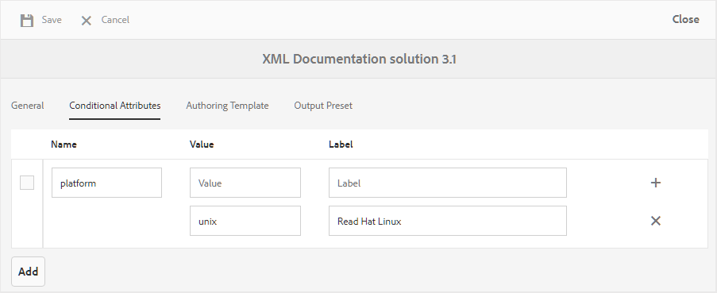
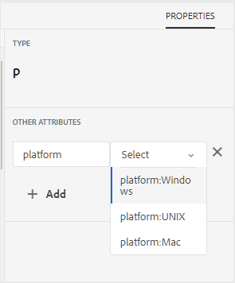

# 条件属性分析 {#id1843I0HN0Y4}

在企业级别，确保您拥有标准的标记系统极为重要。 标记或条件属性可以与存储库中的数字资产相关联，这有助于根据所选条件发布输出。 例如，您可以为Windows和Mac内容创建条件属性。 然后，将这些属性添加到主题中的相关内容。 发布内容时，您可以选择是仅发布Windows内容，还是仅发布Mac内容。

AEM Guides允许您使用相关的DITA属性轻松创建和关联条件属性。 您可以在全局级别或文件夹级别定义条件属性。 全局定义的条件在所有项目中均可见，特定于文件夹的条件仅在指定文件夹内创建的项目中可见。 内容作者可以使用这些条件属性来条件化其DITA主题中的内容或他们创建或使用的映射。 然后，发布者可以使用这些条件来创建条件预设。 使用条件预设，发布者可以决定从已发布输出中包含和排除哪个条件。

>[!NOTE]
>
> 您可以在您有权访问的文件夹配置文件中创建或编辑条件属性。 如果系统管理员未授予您访问文件夹配置文件的权限，则无法在文件夹配置文件中创建或编辑条件属性。

要定义条件属性，请执行以下步骤：

1. 单击顶部的Adobe Experience Manager链接，然后选择 **工具**.

1. 选择 **指南** 工具列表中。

1. 单击 **文件夹配置文件** 并选择一个文件夹配置文件。

   >[!NOTE]
   >
   > 您无法编辑全局配置文件。

1. 单击 **条件属性** 选项卡，然后单击 **编辑**.

   此时将显示“条件属性”表。

1. 单击 **添加**.

1. 输入 **名称**， **值**，和 **标签** 属性的。

   您可以保存仅具有属性名称的配置文件。 但是，仅当属性具有指定的值时，才能使用属性。 如果为属性指定 — 值和标签，则Web编辑器仍只显示属性的值。 在创建条件预设时，标签会向发布管理员显示。

   以下屏幕截图显示了的定义 `platform` 具有值的属性 `unix` 和标签 `Red Hat Linux`.

   {width="800" align="left"}

1. 如果要为同一属性添加更多值，请单击 **+** 图标，然后输入其他值和标签。

1. 如果要添加更多属性，请单击 **添加**.

1. 单击 **保存** 以保存更改。

此 `platform` 属性存储在系统中。 每当作者决定使用 `platform` 属性，它们将在Web编辑器的属性选项卡中看到值。

{width="350" align="left"}

**父主题：**[&#x200B;输出生成](generate-output.md)
