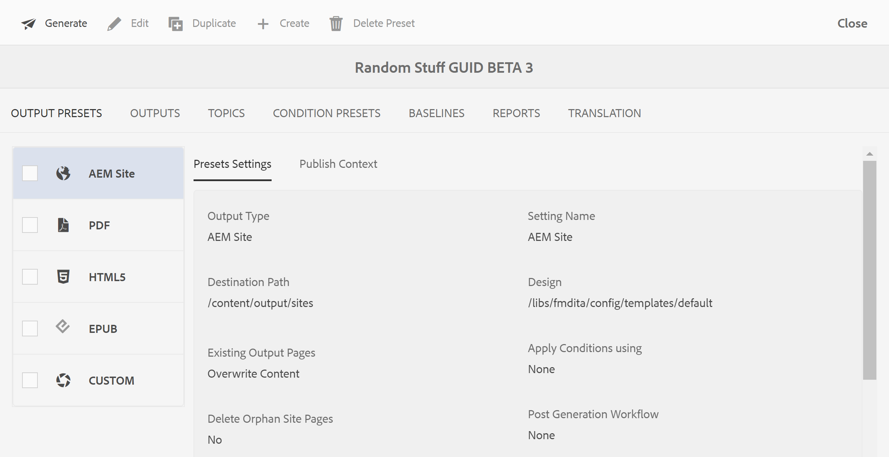
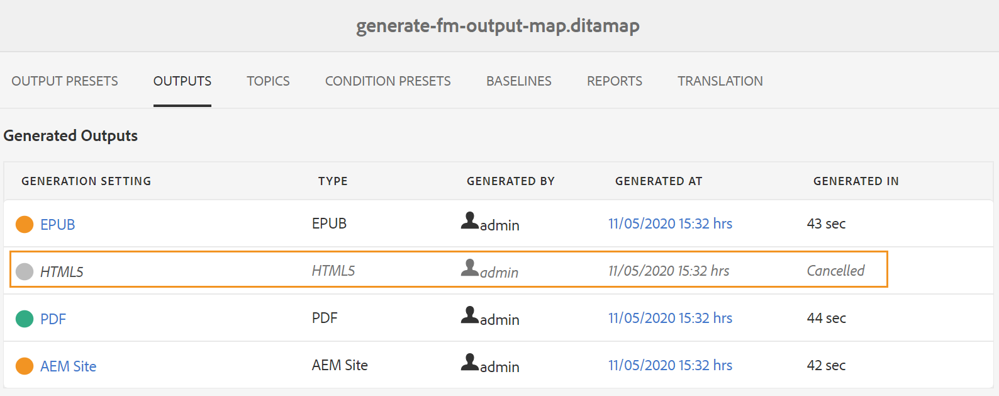

# 从映射控制台生成DITA映射的输出 {#id1825FG00UHT}

执行以下步骤来生成DITA映射的输出：

1. 在资产UI中，导航到要发布的DITA映射文件并单击该文件。

   此时将显示DITA映射控制台，其中包含可用于生成输出的输出预设列表。

1. 选择一个或多个要用于生成输出的输出预设。

   {width="800" align="left"}

   >[!NOTE]
   >
   > 如果您正在生成AEM Site输出，则发布流程将使用中定义的结构。 `.ditamap` 创建AEM站点结构的文件。

1. 单击“生成”图标以启动输出生成过程。

通过单击输出，可以查看输出生成请求的当前状态。 有关更多信息，请参阅 [查看输出生成任务的状态](#viewing_output_history)

>[!IMPORTANT]
>
> 如果预设的输出生成过程处于队列中或正在进行中，则无法为同一预设启动另一个输出生成任务。

您可以为从Web编辑器为DITA映射创建的一个或多个输出预设生成PDF输出。 有关更多详细信息，请参阅 [使用“快速生成”面板生成和查看预设的输出](web-editor-quick-generate-panel.md#).

您还可以从Web编辑器为一个或多个主题或整个DITA映射生成AEM站点输出。 有关更多详细信息，请参阅 [从Web编辑器中基于文章的发布](web-editor-article-publishing.md#id218CK0U019I).

## 增量输出生成 {#generating_standalone_topic}

>[!NOTE]
>
> 增量输出生成仅适用于AEM站点输出。 此外，您只能从DITA映射或子映射重新生成DITA \(.dita/.xml\)主题。 如果选择DITA映射、子映射、主题组或主题 `@processing-role="resource-only"`，则重新生成选项将不可用。

在许多情况下，您只会更新DITA映射中的几个主题，并只实时推送这些更新的主题。 为了处理此类情况，AEM Guides允许您创建增量输出。 如果更新了几个主题，则无需重新生成整个DITA映射。 您只能选择已更新的主题并再生它们。

如果您的映射是分块的，并且您更新了该映射中的单个主题，则需要为更新的主题或内容重新生成整个映射以便反映在输出中。 在主题级别不会获得输出重新生成选项，该选项仅在\(chunked\)映射级别可用。 这适用于父映射和所有子映射。

执行以下步骤以重新生成特定主题或一组主题的输出：

>[!IMPORTANT]
>
> 重新生成AEM Site输出时，将使用文件的当前版本而不是附加的基线来创建输出。

1. 在资产UI中，导航到并单击DITA映射文件。

   此时将显示DITA映射控制台，其中包含可用于生成输出的输出预设列表。

1. 选择 **主题** 选项卡。

   将显示DITA映射中可用的主题列表。

1. 选择要重新生成的主题。

   >[!NOTE]
   >
   > 如果您向DITA映射中添加了新主题，您将无法从此处生成这些新主题。 必须首先使用DITA映射发布函数发布新添加的主题。

   {width="800" align="left"}

1. 单击 **重新生成**.

   此时将显示“重新生成所选主题”页。

1. 选择要用于再生所选主题的输出预设。

1. 单击 **重新生成** 以启动输出生成过程。

>[!IMPORTANT]
>
> 如果重命名主题标题并重新生成主题，则更新的主题标题不会反映在DITA映射目录中。 要更新目录中的主题标题，必须生成整个DITA映射。

通过单击输出，可以查看输出生成请求的当前状态。 有关更多信息，请参阅 [查看输出生成任务的状态](#viewing_output_history).

## 查看输出生成任务的状态 {#viewing_output_history}

启动映射的输出生成任务或重新生成所选主题后，AEM Guides会将此任务发送到输出生成队列。 此队列将实时更新，显示队列中每个输出生成任务的状态。

执行以下步骤以查看输出生成队列：

1. 在资产UI中，导航到要检查输出生成状态的映射文件并单击该文件。

1. 单击 **输出**.

   {width="800" align="left"}

   “输出”页面分为两个部分：

   - **已排队输出：**

     列出正在等待生成或正在生成过程中的输出。 已排队或正在进行的任务在预设名称之前会显示一个蓝色图标。 您还可以找到用于已排队任务的输出生成设置或预设、类型、启动任务的用户、自任务排队以来的时间以及当前状态。

     单击链接以访问 **发布功能板** 和查看当前运行状态。 发布功能板中提供了所有活动发布任务的列表。 此 **已排队输出** 和 **发布功能板**&#x200B;仅当存在等待生成或正在生成过程中的输出时，才会显示链接。 输出任务完成后，它们不会显示。有关“发布仪表板”的更多详细信息，请参阅 [使用发布仪表板管理发布任务](generate-output-publish-dashboard.md#).

   - **生成的输出**

     列出已完成的输出任务。 同样，此处显示的信息与“已排队输出”部分类似，但有一些差异。 您有输出结果图标和输出生成时间形式的新信息集。

     在此列表中，您可能有已成功执行的任务、已使用消息执行的任务或失败的任务。 成功的任务以绿色图标显示，带有消息的任务以橙色图标显示，失败的任务以红色图标显示。

     对于所有任务，发布过程都会创建一个日志文件\(logs.txt\)，可以通过单击“生成位置”列中的链接来访问该文件。 对于失败或有消息的任务，您可以检查日志文件，如一节中所述 [查看并检查日志文件](generate-output-basic-troubleshooting.md#id1822G0P0CHS).

     >[!NOTE]
     >
     > 单击生成的PDF输出的链接时，系统会要求您下载PDF。 这是AEM 6.5和6.4中的默认行为。

## 取消输出生成任务 {#id2061H100T5Z}

AEM Guides为发布者提供了一种简单而轻松的方式来取消任何正在进行的发布任务。 作为发布者，您可以从DITA映射控制台或 [发布功能板](generate-output-publish-dashboard.md#).

执行以下步骤以从DITA映射控制台取消输出生成任务：

1. 在资产UI中，导航到要取消正在进行的输出生成任务的映射文件并单击该文件。

1. 单击 **输出**.

1. 在“排队的输出”列表中，将指针悬停在要取消的任务上。

1. 单击 *取消此作业* 图标。

   {width="800" align="left"}

1. 单击 **是** 在Confirm Cancellation消息提示下。

   {width="800" align="left"}

   如果任务尚未启动，则对任务执行cancel命令。 对于正在取消的任务，“状态”将设置为“正在取消”。

   成功取消任务后，该任务将移至 **生成的输出** 列表包含 **已取消** 状态。 当您将鼠标悬停在已取消的任务上时，它会显示已取消任务的用户的名称。 在下面的屏幕截图中， *HTML5* 任务已取消。

   {width="800" align="left"}

## 从DITA映射控制台中删除输出任务

当您为DITA映射生成多个输出时，在一段时间内，此类映射的已生成输出列表会变得非常长。 作为发布者，您可以通过从删除过时的任务来清除任何映射文件的输出历史记录 *生成的输出* 列表。 请注意，系统不会移除输出，只会移除生成的输出条目 *生成的输出* 列表。

执行以下步骤以从“已生成的输出”列表中删除输出任务：

1. 在资产UI中，导航到要删除任务的映射文件并单击该文件。

1. 单击 **输出**.

1. 在“生成的输出”列表中，将指针悬停在要删除的任务上。

1. 单击删除图标。

   {width="800" align="left"}

1. 单击 **是** 出现“Confirm Delete（确认删除）”消息提示。

   该任务将从“生成的输出”列表中删除。

**父主题：**[&#x200B;输出生成](generate-output.md)
