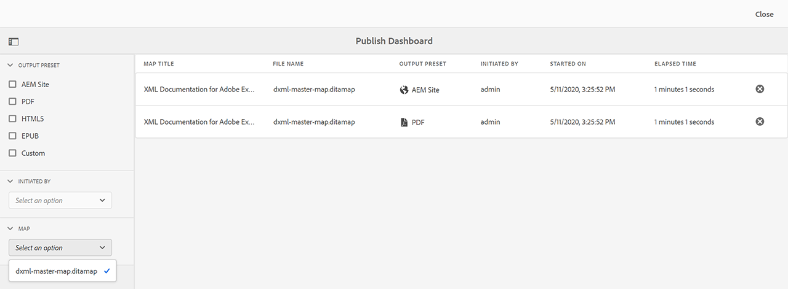
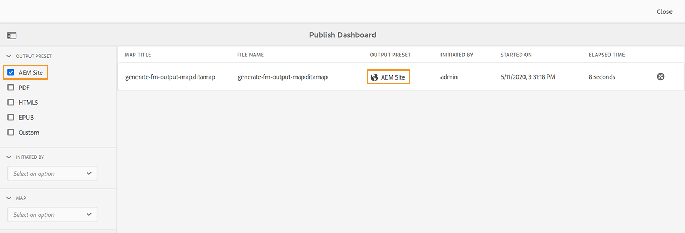
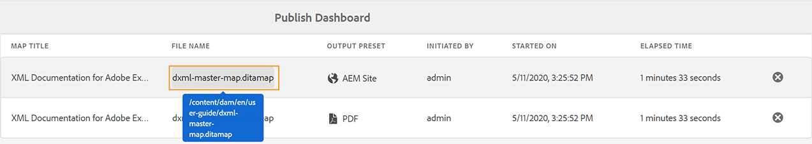
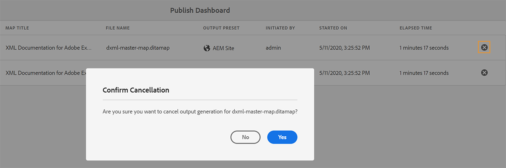
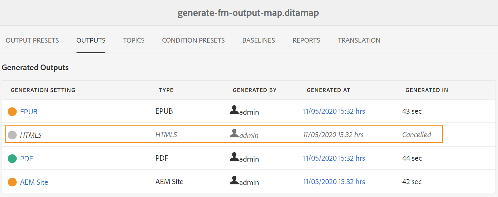

# 使用发布仪表板管理发布任务 {#id205CC08305Z}

当系统中运行大量发布任务时，几乎不可能单独检查每个DITA映射以监视其发布任务。 AEM Guides为管理员和发布者提供系统中运行的所有发布任务的统一视图。 发布功能板中提供了所有活动发布任务的列表。

发布仪表板提供当前在系统中运行的所有发布任务的完整概述。

{width="800" align="left"}

发布功能板包含以下详细信息：

- **地图标题**  — 当前正在发布或位于发布队列中的映射文件的标题。

- **文件名** - DITA映射的文件名。

- **输出预设**  — 用于生成输出的输出预设的名称。

- **发起者**  — 启动发布任务的用户的用户名。

- **开始日期**  — 发布任务开始的日期和时间。

- **经过的时间**  — 自发布任务在系统中运行以来的时间。

- **“删除”图标**  — 取消或终止发布任务。

发布功能板中的左侧面板提供了以下筛选选项：

- **输出预设**  — 选择一个或多个要查看其当前活动发布任务的输出预设。 在以下屏幕截图中，对发布任务进行了筛选，以仅显示使用AEM站点输出预设的任务：

  {width="800" align="left"}

- **发起者**  — 从列表中选择用户名以显示所选用户启动的发布任务。

- **地图**  — 从列表中选择一个映射文件，以显示针对所选映射运行的发布任务。

## 访问发布功能板 {#id205CC100DY4}

执行以下步骤以访问发布功能板：

>[!NOTE]
>
> 只有管理员或发布者才能访问发布功能板。

1. 单击顶部的Adobe Experience Manager链接，然后选择 **工具**.

1. 选择&#x200B;**指南** 工具列表中。

1. 单击 **发布功能板** 磁贴。

   此时会打开发布功能板，其中包含系统中所有活动发布任务的列表。

   如果单击文件名链接，将显示选定映射的DITA映射控制台。

   {width="800" align="left"}

>[!NOTE]
>
> 在从映射仪表板生成输出时，您还可以从“输出”选项卡访问“发布仪表板” 。 有关更多详细信息，请参阅 [查看输出生成任务的状态](generate-output-for-a-dita-map.md#viewing_output_history).

## 取消发布任务

执行以下步骤，取消发布功能板中的输出生成任务：

1. [访问发布功能板](#id205CC100DY4).

1. 从活动发布任务列表中，单击要取消的任务的删除图标。

   {width="800" align="left"}

1. 单击 **是** 在Confirm Cancellation消息提示下。

   只要任务保持活动状态，就会接受取消命令并尝试取消。 任务成功终止后，将从当前活动任务列表中删除该任务。 任务状态也会在DITA映射控制台中更新为“已取消”。 在下面的屏幕截图中， *HTML5* 任务已从发布仪表板取消，其状态也会在DITA映射控制台中更改。

   {width="800" align="left"}

**父主题：**[&#x200B;输出生成](generate-output.md)
