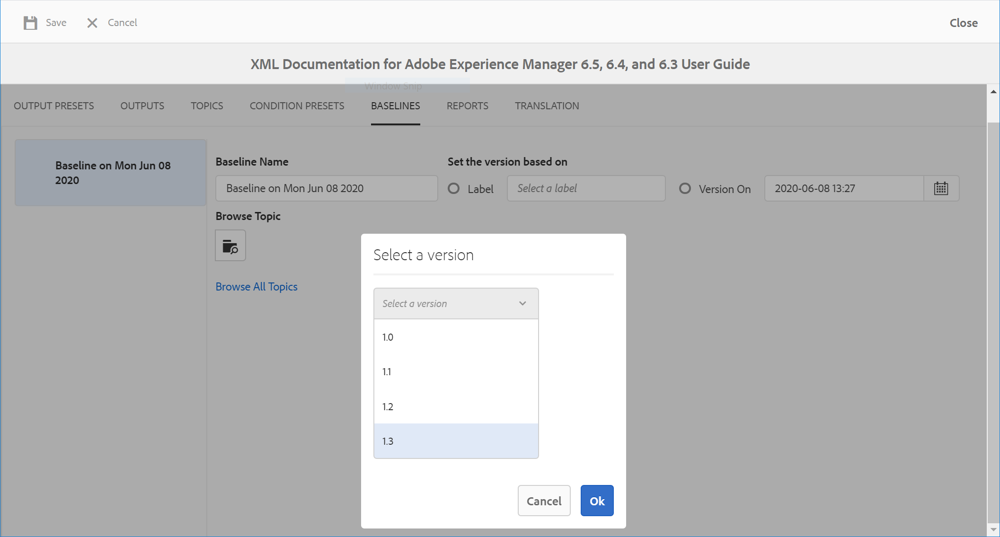

# 使用基线 {#id1825FI0J0PF}

基线功能允许您创建随后可用于发布或翻译的主题和资产的版本。 例如，如果DITA映射具有 `topicA` 和 `imageA`，您可以创建一个基线以使用 `topicA`，但第4个版本的 `ImageA`. 一旦基线就位，您只需单击一下即可发布或翻译不同版本的主题。

对于输出预设，选择基线是可选的，并且DITA映射可以有多个基线。 但是，DITA映射中的每个输出预设只能与单个基线相关联。 如果在发布时未指定基线，则使用最新版本的内容发布输出。

同样，选择要翻译内容的基线也是可选的。 但是，如果选择使用基线翻译内容，则基线的内容也将与翻译的副本一起保存。 然后，您可以使用翻译后的基线执行进一步的操作，如与外部发布者共享或存档它。 有关导出转换后的基线的详细信息，请参见 [导出已翻译基线](#id196SE600GHS).

>[!TIP]
>
> 请参阅 *基线* 部分，了解有关使用基线的最佳实践。

您的管理员可以在映射仪表板上配置基线选项卡。 有关更多详细信息，请参阅 *在DITA映射仪表板中配置基线选项卡* 安装和配置指南中的部分。

可以通过执行以下步骤来访问“基线”功能：

1. 在资产UI中，导航到并单击DITA映射文件。
1. 转到 **基线** 选项卡。

在“基线”选项卡中，可以执行以下操作：

- [创建基线](#id195FI0I0MUQ)
- [查看基线的内容](#id195FI0I0TLN)
- [编辑、复制或删除基线](#id195FI0I0YJL)
- [向基线添加标签](#id184KD0T305Z)

## 创建基线 {#id195FI0I0MUQ}

您可以创建基线，该基线包含特定版本的主题和在特定日期和时间可用的引用内容，或者包含为某个版本的主题定义的标签。 可以单独指定基线中选定主题的版本，以便每次在发布或翻译工作流中应用基线时，所选主题及其相应版本都会包含在输出生成或翻译中。

执行以下步骤以创建基线：

1. 在“基线”页上，单击 **创建**.
1. 输入中基线的名称 **基线名称**.
   {width="800" align="left"}
1. 在 **设置版本依据**，选择以下选项之一：

   - **标签**：选择此选项可根据应用于主题的标签选择主题。 输入标签以根据输入的字符串筛选列表。 从过滤出的列表中，您可以选择标签以选择具有指定标签的主题和其他资源。

   当您选择时 **标签**，则还可以选择使用未应用指定标签的最新版本主题。 如果不选择此选项，并且有任何主题或媒体文件没有指定的标签，则基线创建过程将失败。 有关添加标签的详细信息，请参阅 [使用标签](web-editor-use-label.md#).

   - **版本于** &lt;*时间戳*\>：选取在指定日期和时间的主题版本。 请注意，您在此处指定的时间与AEM服务器的时区相对应。 如果您的服务器在不同时区，则会按照服务器的时区而不是本地时区提取主题。

   选择标签或版本作为日期后，将相应地选择映射中所有引用的主题和媒体文件。 所选的主题不会显示在用户界面上，但会保存在后端。

   >[!NOTE]
   >
   >建议不要使用 **浏览所有主题** 创建基线时的链接。

1. 单击&#x200B;**保存**。

## 查看基线的内容 {#id195FI0I0TLN}

通过单击“基线”选项卡并从列表中选择所需的基线版本，可以查看现有基线的内容。 “基线”页面分为三个部分 — DITA映射文件、映射的内容或主题以及引用的内容。 如果您的映射包含子映射，则从子映射引用的主题也会显示在内容部分中。 “基线”页上的各列说明如下：

- **名称**：列出DITA映射或主题的标题或资源的名称，如图像的文件名。

- **种类**：列出映射中的资源类型或类型，如DITA映射、DITA主题或图像格式。

- **版本**：列出基线中可用的资源版本。

- **版本日期和时间**：列出选定版本资产的创建日期和时间。

- **最新**：列出是否在基线中使用资源的最新版本。

- **父映射**：如果您的映射文件包含子映射，则此列包含在其中引用了主题的映射的名称。

- **标签**：列出应用于主题版本的标签。

- **引用者**：此列仅适用于引用的内容。 它指示被引用资源的父级主题。 如果资产由多个主题引用，则这些主题用逗号分隔。

## 编辑、复制或删除基线 {#id195FI0I0YJL}

**编辑基线**

执行以下步骤来编辑现有基线：

1. 选择基线并单击 **编辑**.
1. 在基线中进行所需的更改。 您可以更改主题或引用内容的名称和版本。
1. 如果要对一个或多个主题使用不同的版本，可以通过手动选择这些主题来实现此目的。 单击 **浏览主题**，选择要使用其他版本的主题。 从所选主题的“选择版本”下拉列表中，选择要用在基线中的主题版本，然后单击 **确定**.

   {width="800" align="left"}

   有关主题及其选定版本的信息存储在后端。 您可以重复此步骤以更改多个主题的所选版本。

1. 要加载从DITA映射引用的所有主题和介质文件，请单击 **浏览所有主题** 链接。 主题和媒体文件的UUID也显示在主题标题或\(media\)文件名的下方。

   >[!NOTE]
   >
   > 如果DITA映射中存在非常大的文件集（包含嵌套映射和主题），则单击浏览所有主题可能需要一些时间才能加载所有文件。

   映射的内容分为三个部分：映射文件、内容\（主题引用\）和引用的内容\（嵌套主题、映射和其他资源\）。 一旦所有引用的内容都可用，您就可以单独选择要用于基线的主题版本。

   此 **版本** 下拉列表显示了主题或引用的内容的可用版本。 对于引用的内容，您可以选择自动选择版本。

   如果您选择 **自动挑选** 对于引用的内容，系统会自动选取与引用该内容的内容版本对应的引用内容版本。 例如，假设主题A具有对图像B的引用。创建主题A的版本1.5时，存储库中的图像B的版本为1.2。 现在，在主题A版本1.5中创建基线时，图像B设置为 **自动挑选**，系统会自动选取版本1.2的图像B。

   如果使用标签创建基线， **自动挑选** 应用于所有引用内容的版本。

   如果引用的内容或资产\（主题、子映射、图像或视频\）未进行版本控制\（例如，新上传的内容\），则创建基线将会创建此类文件的版本。 但是，如果您的文件进行了版本控制，则不会为这些文件创建增量版本。 此行为由默认启用的自动创建版本设置控制。 在翻译过程中需要所有文件都有一个版本的内容时，也需要用到此项。

   >[!NOTE]
   >
   > 如果要为任何特定资源指定不同的版本，可以通过从中选择所需的版本来执行此操作。 **版本** 下拉列表。
1. 单击&#x200B;**保存**。

**复制基线**

选择基线并单击 **复制** 创建现有基线的副本。 为基线指定其他名称，选择主题和引用内容的版本号，然后单击 **保存**.

**删除基线**

选择基线版本并单击 **移除** 删除基线。

## 向基线添加标签 {#id184KD0T305Z}

为每个主题添加标签可能很耗时。 AEM Guides提供了一种单击机制，可将标签添加到DITA映射的多个主题和引用的内容中。

执行以下步骤以将标签添加到DITA映射中的多个主题和引用的内容：

1. 在“基线”页上，选择包含主题和引用内容的基线，以添加标签。

   >[!NOTE]
   >
   > 确保您的基线不包含任何主题或资源的最新版本。 标签只能添加到版本化主题或资源中。

1. 单击 **添加标签**.

   {width="800" align="left"}

1. 在 **添加标签** 对话框，请指定要与此基线关联的唯一标签。

   如果管理员配置了预定义标签，则会在下拉列表中显示这些标签。 您需要从列表中选择一个标签。

1. 如果要将标签应用于从子映射引用的主题，请选择 **将标签应用于子映射和依赖项** 选项。

   - 单击 **添加**.
指定的标签将添加到DITA映射以及引用的主题和内容。

     {width="650" align="left"}

## 导出已翻译基线 {#id196SE600GHS}

可以使用基线来翻译内容。 例如，您可以为1.1版本创建一个准备翻译为法文的基线。 在“翻译”选项卡中，您需要使用“基线”来过滤内容，然后选择内容的1.1版本基线。 使用基线翻译内容使您能够更轻松地管理内容。

在翻译内容后，您可以导出翻译后的基线以进行存档，或与组织中的不同团队共享它。 在导出转换后的基线之前，必须考虑以下几点：

- 只有在基线中的内容被翻译之后，才能导出基线。 如果尝试导出未开始翻译或未完成的基线，您将收到错误。
- 您只能为已翻译的版本传输基线。 例如，如果已为内容版本1.1创建了基线并翻译了该基线，则可以导出此基线。 但是，如果您已经为1.2版创建了未翻译的基线，则无法导出此基线。
- 如果已导出基线，则可以通过选择 *覆盖现有基线* 选项。

执行以下步骤以导出转换后的基线：

1. 打开包含转换后的基线的DITA映射。

1. 在 **翻译** 选项卡，展开 **基线** 选项在左边栏中可用。

   {width="800" align="left"}

1. 选择 **使用基线** 选项，然后选择要导出的基线。

1. 单击 **导出基线**.

   此时将显示“导出状态”。 如果过程成功，则会显示一条消息，指出基线导出所用的语言。 如果发生故障，将显示故障原因。

   如果尝试导出已导出的基线，则还会显示基线创建失败消息。

1. \（可选\）要导出已导出的基线，请选择 **覆盖现有基线** 然后单击 **导出基线**.

**父主题：**[&#x200B;输出生成](generate-output.md)
