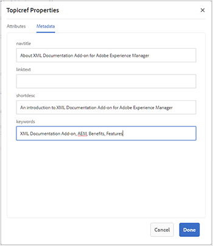

# 使用基本映射编辑器 {#id1942CM005Y4}

基本映射编辑器提供了简单的拖放功能，可从AEM存储库添加主题以创建DITA映射或书图。 您可以添加嵌套主题、关系表\(reltable\)、属性和元数据信息，还可以验证映射是否正确。

>[!NOTE]
>
> 如果您的管理员启用了高级映射编辑器选项，则您将无法访问基本映射编辑器。 默认情况下，所有映射文件都将在高级映射编辑器中打开。

以下部分介绍了基本映射编辑器中可用的各种功能。

## 将主题添加到映射文件 {#id193CBL0505Z}

创建映射文件后，您需要向映射文件添加主题。 使用基本映射编辑器，可以添加主题、关系表或其他映射文件。

执行以下步骤来构建映射文件：

1. 在资产UI中，导航到要编辑的映射文件。

1. 要获取映射文件的独占锁定，请选择映射文件并单击 **签出**.

   >[!NOTE]
   >
   > 一旦您对映射文件进行了独占锁定，其他用户将无法编辑该映射。 但是，他们能够处理映射文件中的主题。

1. 选择映射文件后，单击 **编辑**.

   将在映射编辑器中打开映射文件进行编辑。 使用映射编辑器，您可以使用引用边栏中显示的当前可用主题来构建映射。

   {width="800" align="left"}

1. 使用 **引用** 边栏中，导航到包含要添加的主题或子映射的文件夹。

   >[!NOTE]
   >
   > 您可以从“引用”边栏中的任意文件夹添加主题或子映射。

1. 要将第一个主题添加到映射，请将该主题拖放到基本映射编辑器上。

   >[!NOTE]
   >
   > 添加第一个链接后，当您将鼠标悬停在地图中的现有主题上时，可以使用“添加新引用”链接。

1. 要添加后续主题或子映射，请将主题或子映射拖放到映射中的所需位置。

   如果将子映射添加到DITA映射，则该子映射在DITA映射中显示为链接。 要查看子映射的所有主题，请单击子映射链接。 子映射的内容将显示在新选项卡中。

   >[!NOTE]
   >
   > 如果在映射中放置了一个关于现有主题的新主题，则会收到一条关于替换该主题的消息。 如果要替换主题，请单击“是”；如果不想替换主题，请单击“否”。 可以使用CTRL+Z和CTRL+Y撤消或重做映射中的任何更改。

1. 单击&#x200B;**保存**。

## 基本映射编辑器工具栏中可用的功能

基本映射编辑器中的主工具栏允许您执行以下任务：

{width="800" align="left"}

**A：搜索**

您可以搜索并包含DAM中的所需主题。 单击此图标将显示“搜索”对话框：

{width="800" align="left"}

输入要搜索的关键字，这些关键字在主题的文件名、内容甚至属性值中匹配。 搜索结果可用后，选择所需的主题\(s\)，然后单击“检查”按钮以在映射结构末尾添加选定的文件。 您可以通过指定修改日期参数来筛选搜索结果。

**B：组**

单击主题左侧的复选框，然后单击工具栏中的分组以对所选主题进行分组。 有关分组主题的更多信息，请参见 [主题组](https://docs.oasis-open.org/dita/v1.0/langspec/topicgroup.html) OASIS DITA语言规范文档。

**C：删除**

单击主题左侧的复选框，然后单击工具栏中的删除以从映射中删除所选主题。

**D：显示数字/隐藏数字**

在地图中显示主题的\（或隐藏\）编号。

**E：验证**

检查映射是否有效或有错误。

**F：默认模式/XML模式**

在 **默认模式**，单击主题链接会在新选项卡中显示主题预览。 单击 **默认模式** 图标会将其模式更改为 **XML模式**. 在 **XML模式**，单击主题行中的任意位置会显示主题中主题引用的基础XML。 在源XML视图中， **自动缩进** 选项，用于以可呈现且易于阅读的格式重新组织XML代码。 如果您手动编辑映射，则源视图还会执行验证检查。 如果XML包含错误，则会在 **XML模式** 并且不允许保存DITA映射文件。 如果要查看整个映射的XML，请单击主题边界之外的任意位置。

**注意：** 在默认模式下，您可以使用键盘快捷键撤消\(`Ctrl+z`\)或重做\(`Ctrl+y`\)最后一个操作。

{width="650" align="left"}

**G：映射属性**

显示“映射属性”对话框，在其中可以设置映射的属性和元数据信息。 要添加属性，请单击 **添加** 对话框左下角的按钮以获取 **属性** 下拉列表。 从列表中选择要添加的属性。 如果所选属性具有在DTD中指定的预定义值，则这些值将显示在新下拉列表中。 您可以从下拉列表中选择所需的值。 如果没有预定义值，则会显示一个文本框，用于输入选定属性的值。

{width="300" align="left"}

## 基本映射编辑器的主题级别可用的功能

将鼠标指针悬停在“基本映射编辑器”中的主题或子映射文件上时，可以执行以下任务：

{width="650" align="left"}

**A：左移或右移**

单击向左或向右箭头图标&#39;，将主题向左或向右移动。 以这种方式移动主题会使其成为与其上主题相关的子级\（嵌套\）或同级主题\（删除嵌套\）。

**B：属性**

单击“属性”图标以打开“Topicref属性”对话框。 使用此对话框，可以设置主题属性和元数据信息。 有关标准主题属性和元数据的详细信息，请参见 [topicref](https://docs.oasis-open.org/dita/v1.2/os/spec/langref/topicref.html) OASIS DITA语言规范文档。

{width="350" align="left"}

**C：添加新引用**

单击“添加新引用”图标可添加新引用作为当前主题的同级。

**D：添加新的键定义**

单击键图标以添加新的键定义。 任何被覆盖的键或已在映射中定义的键均以红色显示。 如果单击键定义上的“属性”图标，则会出现“键定义属性”对话框。

## 在基本映射编辑器中处理关系表 {#id1944B0I0COB}

AEM Guides的映射编辑器附带了一项强大的功能，允许您在DITA映射中创建和编辑关系表。

执行以下步骤以使用基本映射编辑器中的关系表：

1. 在Assets UI中，导航到要创建关系表的DITA映射。

1. 单击DITA映射以在DITA映射控制台中将其打开。

1. 选择 **主题** 选项卡以查看DITA映射中可用的主题列表。

   >[!TIP]
   >
   > “主题”选项卡为您提供了一个选项，用于下载映射文件及其依赖项。 有关更多详细信息，请参阅 [导出DITA映射文件](authoring-download-assets.md#id218UBA00IXA).

1. 在主工具栏中，单击 **编辑**.

   将在基本映射编辑器中打开映射文件。

1. 选择 **可reltable** 工具栏中。

   {width="650" align="left"}

1. 将主题从主题列表拖放到Reltable编辑器。

   >[!NOTE]
   >
   > 您可以从“引用”边栏中的任意文件夹添加主题。

   {width="550" align="left"}

1. 要向关系表添加标题，请单击 **添加Relheader**.

1. 要向关系表添加列，请单击 **添加列**.

   {width="550" align="left"}

1. 单击&#x200B;**保存**。

您还可以从关系表编辑器执行以下操作：

**删除行或列**

如果要从表中删除列，请选中列标题中的复选框，然后单击删除。 如果要从表中删除行，请选中相应行第一列中的复选框，然后单击删除。

**删除主题**

如果要从表格中删除主题，请单击主题旁边的交叉图标。

**删除关系表**

如果要删除关系表，请单击关系表之外的任意位置，然后单击“删除”。

**父主题：**[&#x200B;使用映射编辑器](map-editor.md)
