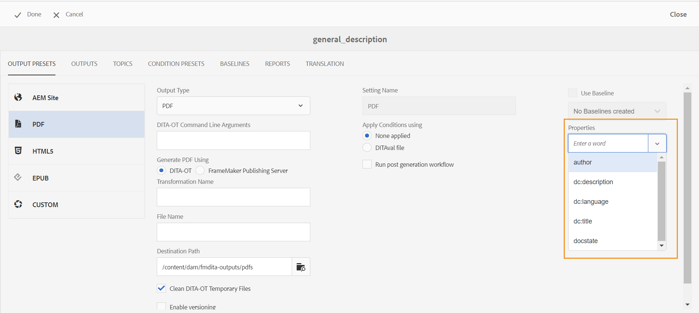
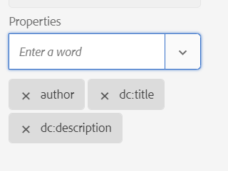

# 使用DITA-OT将元数据传递到输出 {#id21BJ00QD0XA}

元数据是有关输出的其他信息。 在AEM Guides中，您可以传递现有元数据或创建自定义元数据标记。 您可以使用DITA-OT发布将元数据传递到AEM、PDF、HTML5、EPUB和自定义格式输出。

执行以下步骤，使用DITA-OT发布将元数据传递到输出：

1. 在 **资产UI**，导航到要为其将元数据传递到DITA-OT的DITA映射文件并单击该文件。
1. 选择并编辑要向其传递元数据字段的输出预设。 例如，选择PDF输出预设。
1. 选择 **DITA-OT** 在“生成”下 &lt;output> 使用所选输出预设中的选项。

   {width="800" align="left"}

1. 从属性下拉列表中选择要传递到DITA-OT发布的元数据。

   “属性”下拉列表同时列出了自定义属性和默认属性。 例如，在上述屏幕快照中，作者是自定义属性，而 `dc:description`， `dc:language`， `dc:title`、和 `docstate` 是默认属性。

   >[!NOTE]
   >
   > 这些属性是从位于以下位置的metadataList文件中选取的：`/libs/fmdita/config/metadataList`. 默认情况下，此文件中列出四个属性 —  `dc:description`， `dc:language`， `dc:title`、和 `docstate`.

   此文件可以覆盖在： `/apps/fmdita/config/metadataList`.

   要传递已为其定义值的自定义属性，请参阅 [在DITA-OTPDF输出中使用AEM元数据](https://experienceleaguecommunities.adobe.com/t5/xml-documentation-discussions/use-aem-metadata-in-dita-ot-pdf-output/td-p/411880).

1. 从 **属性** 在下拉列表中，选择所需的自定义属性和默认属性。 例如，选择 `author`， `dc:title`、和 `dc:description`. 这些是标准 `metadata/properties` 我们创建文件后就会创建该文件。 选定的属性列在收存箱的下方。

   {width="300" align="left"}

1. 单击 **完成** 以保存更改。
1. 生成输出。

所选的元数据属性将传递到使用DITA-OT生成的输出。

**父主题：**[&#x200B;输出生成](generate-output.md)
