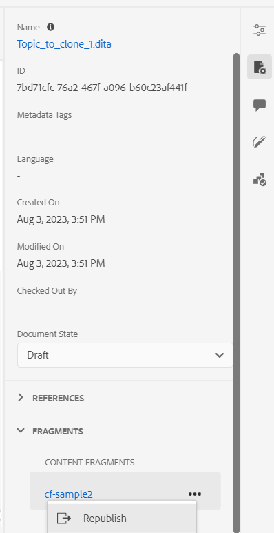

# 发布到内容片段

内容片段是AEM中的离散内容片段。 它们是基于内容模型的结构化内容。 内容片段是纯内容，没有设计或布局信息。 它们可以独立于AEM支持的渠道进行创作和管理。 内容片段是模块化的，其中的内容被划分为较小的组件。

AEM Guides允许您将主题或主题中的元素发布到内容片段。 您可以在主题和内容片段模型之间创建基于JSON的映射。 使用此映射将主题或主题中的元素发布到内容片段。 然后，您可以在任何AEM站点中使用内容片段，或通过内容片段支持的API提取详细信息。

要创建内容片段，请执行以下步骤：

1. 创建 [内容片段模型](https://experienceleague.adobe.com/docs/experience-manager-65/assets/content-fragments/content-fragments-models.html?lang=zh-Hans) 在AEM Assets中。
1. 创建一个文件夹，以保存您根据内容片段模型创建的内容片段。 例如，“stock-content-fragments”。
1. 编辑文件夹的属性（例如，“stock-content-fragments”）并添加文件夹的路径，其中包含云配置中的内容片段模型。
例如，添加 `/conf/we-retail` 在云配置中。 此配置将所有内容片段模型连接到文件夹。\
   {width="650" align="left"}
   *在文件夹属性中添加云配置，以将其与片段模型连接。*
1. 选择要在中发布的主题 **存储库视图**.
1. 从 **选项** 菜单，选择 **发布方式** > **内容片段**.
1. 在 **发布为内容片段** 对话框，请填写以下详细信息：
   {width="500" align="left"}
   *添加路径、模型和映射详细信息，将主题或其元素发布为内容片段。 您可以覆盖现有的内容片段。*

   * **路径**：浏览并选择要发布内容片段的文件夹的路径。 您还可以选择并发布现有的内容片段。
   * **标题**：输入内容片段的标题。
   * **名称**：输入内容片段的名称。
   * **模型**：选择要用于创建内容片段的内容片段模型。 将从您在云服务中配置的文件夹中选取模型。
   * **映射**：从下拉列表中选择映射。 它会从 *contentFragmentMapping.json* 文件。

     根据您的设置，管理员可以在以下位置添加映射 *contentFragmentMapping.json* 文件。

     

        
Cloud Service

     详细了解如何 [创建主题和内容片段之间的映射](../cs-install-guide/conf-content-fragment-mapping-cs.md) 《Cloud Service安装和配置指南》中的。
     

     

        
 内部部署软件

     详细了解如何 [创建主题和内容片段之间的映射](../install-guide/conf-content-fragment-mapping.md) ，请参见On-premise Installation and Configuration Guide。

     

   * 选择 **覆盖** 复选框（如果内容片段已存在且您希望覆盖它）。 如果未选中此复选框，并且您的内容片段已存在，则AEM Guides会显示错误。
1. 单击 **创建** 以发布内容片段。
1. 您可以在下查看主题的内容片段 **片段** 中的部分 **文件属性**.

   {width="300" align="left"}

   *查看某个主题存在的内容片段并重新发布它们。*

您还可以重新发布内容片段，以使用DITA主题中的最新内容更新内容片段。

发布内容片段后，还可以在任何AEM站点中使用它们。
