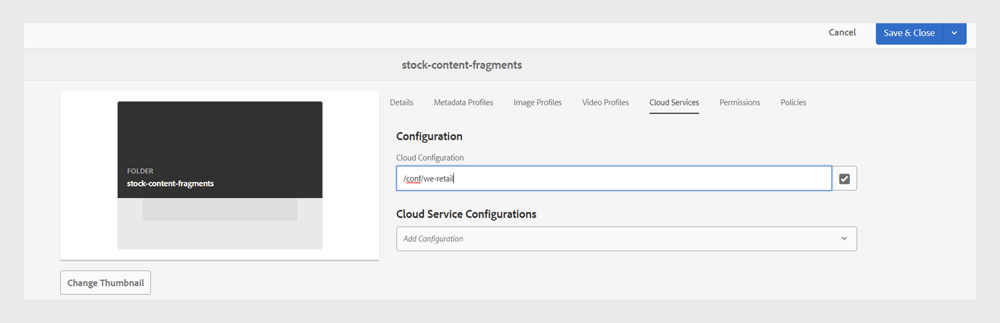
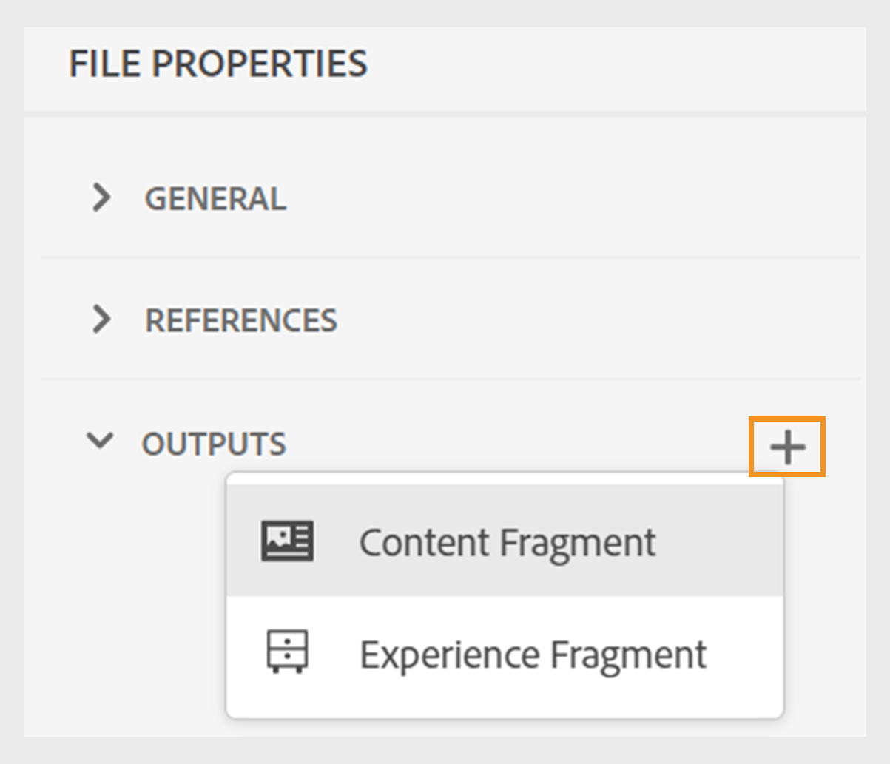
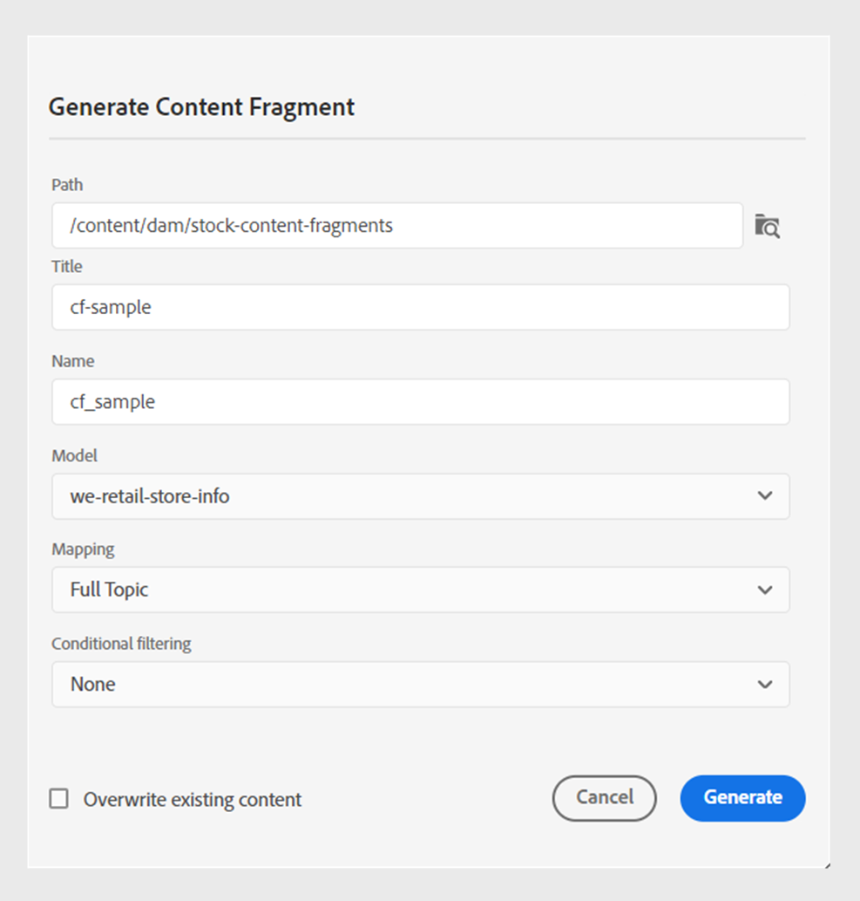
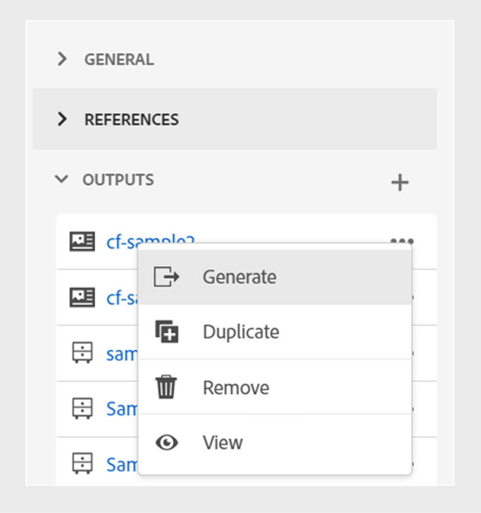

# 发布内容片段

内容片段是Adobe Experience Manager中的离散内容片段。 它们是基于内容模型的结构化内容。 内容片段是纯内容，没有设计或布局信息。 它们可以独立于AdobeExperience Manager支持的渠道进行创作和管理。 内容片段是模块化的，其中的内容被划分为较小的组件。

Adobe Experience Manager Guides允许您将主题或主题中的元素发布到内容片段。 您可以在主题和内容片段模型之间创建基于JSON的映射。 使用此映射将主题或主题中的元素发布到内容片段。 然后，您可以在任何Adobe Experience Manager站点中使用内容片段或通过内容片段支持的API提取详细信息。

要创建内容片段，请执行以下步骤：

1. 创建 [内容片段模型](https://experienceleague.adobe.com/docs/experience-manager-65/assets/content-fragments/content-fragments-models.html?lang=zh-Hans) 在Adobe Experience Manager Assets中。
1. 创建一个文件夹，以保存您根据内容片段模型创建的内容片段。 例如，“stock-content-fragments”。
1. 编辑文件夹的属性（例如，“stock-content-fragments”）并添加文件夹的路径，其中包含云配置中的内容片段模型。
例如，添加 `/conf/we-retail` 在云配置中。 此配置将所有内容片段模型连接到文件夹。\
   {width="650" align="left"}
   *在文件夹属性中添加云配置，以将其与片段模型连接。*

1. 要生成内容片段，请选择 **新建输出**  从 **输出** 中的部分 **文件属性** 主题的。
1. 选择 **内容片段**.\
   {width="300" align="left"}

   *从主题的文件属性中添加新的内容片段*.

1. 在 **生成内容片段** 对话框中，填写以下详细信息：
   {width="500" align="left"}
   *添加路径、模型和映射详细信息，将主题或其元素发布为内容片段。 您可以覆盖现有的内容片段。*

   >[!NOTE]
   >
   >您还可以从发布内容片段 **存储库视图**. 选择要作为内容片段发布的主题。 然后，从 **选项** 菜单，选择 **发布方式** > **内容片段**.

   * **路径**：浏览并选择要发布内容片段的文件夹的路径。 如果选择现有的内容片段，则会覆盖映射字段的内容。
   * **标题**：键入内容片段的标题。 默认情况下，标题中填充了主题的标题。 您可以对其进行编辑。 此标题用于生成内容片段的名称。
   * **名称**：键入内容片段的名称。 默认情况下，该名称将填充主题标题，空格将替换为“_”。 例如， *sample_content_fragment*. 您可以对其进行编辑。  此名称用于生成内容片段的URL。
   * **模型**：选择要用于创建内容片段的内容片段模型。 将从已在云服务中配置的文件夹中选取模型。
   * **映射**：从下拉列表中选择映射。 它会从 *contentFragmentMapping.json* 文件。

     您的管理员可以将映射添加到 *contentFragmentMapping.json* 文件。 详细了解如何 [创建主题和内容片段之间的映射](../cs-install-guide/conf-content-fragment-mapping-cs.md) 在《安装和配置指南》中。

   * 您还可以选择不同的条件来发布内容。  选择以下选项之一：

      * **无**：如果您不想对已发布的输出应用任何条件，请选择此选项。
      * **使用DITAVAL**：选择要生成输出（包括特定内容）的DITAVAL文件。 可使用浏览对话框或键入文件路径来选择DITAVAL文件。
      * **使用属性**：您可以在DITA主题中定义条件属性。 然后选择条件属性以发布相关内容。
     >[!NOTE]
     > 
     >仅当在主题中定义了条件属性时，才会启用条件。

   * 选择 **覆盖现有内容** 您的内容片段已存在且您希望将其覆盖。 如果未选中此复选框，并且您的Experience Manager片段已存在，则“内容指南”会显示错误。
1. 单击 **生成** 以发布内容片段。

1. 您可以在下查看主题的内容片段 **输出** 中的部分 **文件属性**.

   {width="300" align="left"}

   *查看某个主题存在的内容片段并重新发布它们。*

发布内容片段后，还可以在任何Adobe Experience Manager站点中使用它们。

## 内容片段的“选项”菜单

您还可以从以下位置对内容片段执行以下操作 **选项** 菜单：

* **生成**：重新发布内容片段，以使用DITA主题中的最新内容对其进行更新。 在重新生成输出时，无法更改内容片段的路径、名称、标题、模型和映射。 但是，在再生输出时可以选择不同的条件。

* **复制**：复制内容片段。 您可以更改路径、名称、标题、模型和映射。 在复制内容片段时，您还可以选择不同的条件。

* **移除**：从输出列表中删除内容片段。 出现确认提示。 确认后，内容片段将从 **输出** 列表。

  >[!NOTE]
  >
  > 此操作不会从内容片段中删除任何内容。

* **视图**：查看内容片段编辑器。 您还可以进行更改并保存它们。

