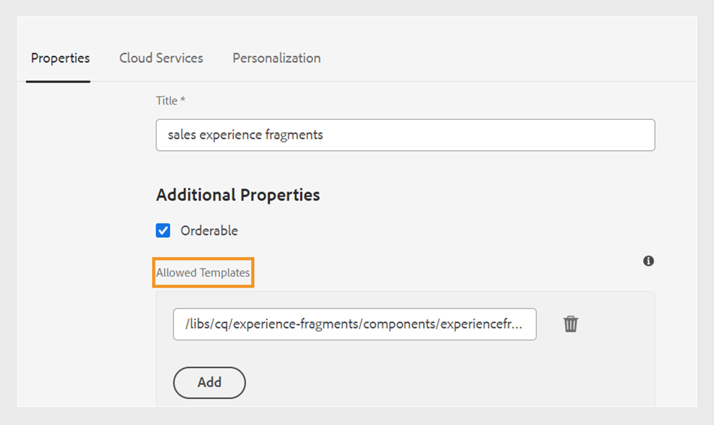
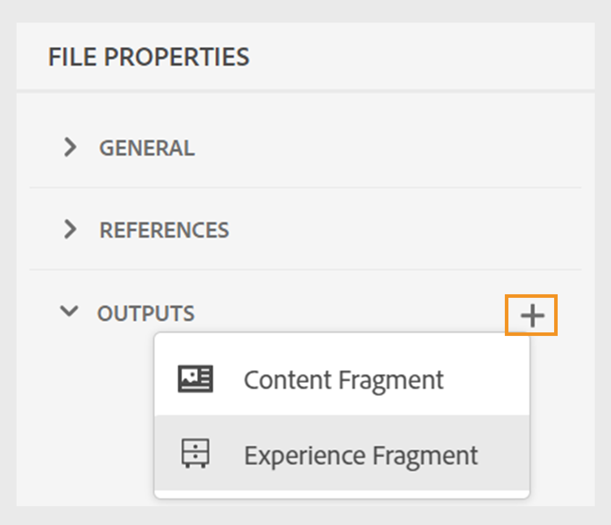
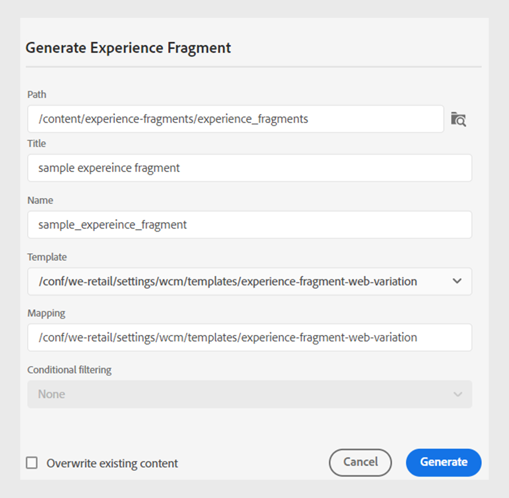
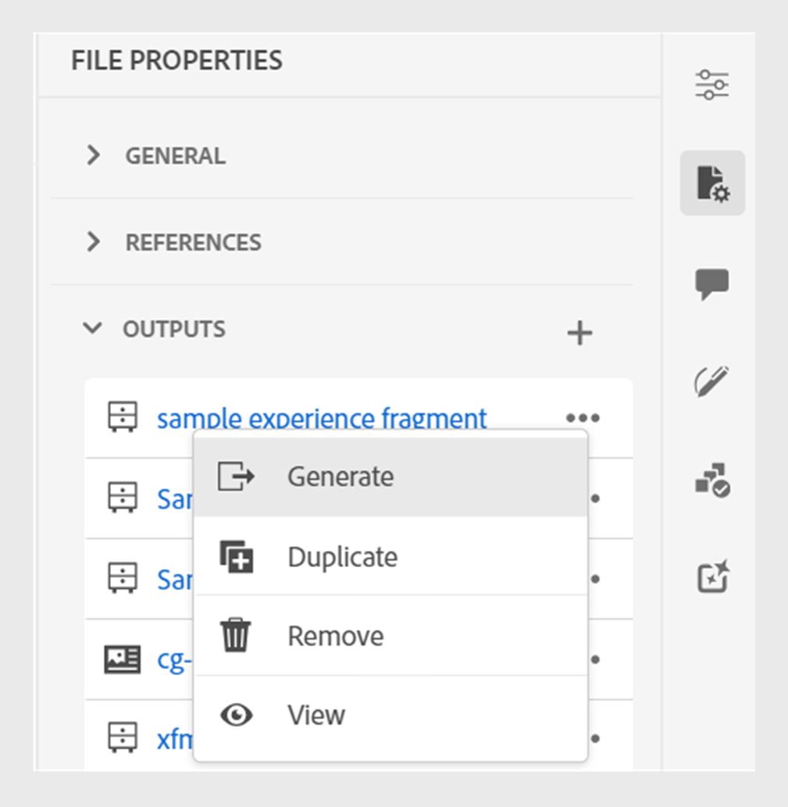

# 发布体验片段

体验片段是Adobe Experience Manager中的模块化内容片段。 这些内容块基于模板并封装内容及其布局。 这些可重复使用的内容片段允许内容创建者跨Experience Manager支持的多个渠道组合并提供一致的可扩展体验。 此功能可帮助您轻松高效地创建一致的营销体验，例如新闻稿、促销横幅和客户评价。

Experience Manager指南允许您将主题或其元素发布到体验片段。 您可以在主题及其体验片段中的元素之间创建基于JSON的映射。 然后，使用映射将主题或其元素发布到体验片段。 然后，您可以在任何Experience Manager站点中使用体验片段，或通过体验片段支持的API提取详细信息。

要生成体验片段，请执行以下步骤：

1. 在体验片段中创建文件夹。 使用此文件夹可保存您基于体验片段模板创建的体验片段。 例如， *sales-experience-fragments*.
1. 选择文件夹，然后选择 **属性** 图标。
1. 编辑文件夹的属性(例如， *sales-experience-fragments*)。

   * **标题**：查看或编辑文件夹的标题。

   * **允许的模板**：包含可添加为Experiencefragment子页面的模板列表。 要添加允许的模板，请在中指定用于检索所需模板的正则表达式 **允许的模板** 字段。
例如：
     `/libs/cq/experience-fragments/components/experiencefragment/template`

     如果没有为文件夹定义允许的模板，则默认情况下会从父文件夹或模板文件夹中选取模板。
   * **可排序**：用于更改文件夹中资产的顺序。
     {width="650" align="left"}
     *在文件夹属性中添加云配置，以将其与片段模板连接。*
1. 要生成体验片段，请选择 **新建输出**  从 **输出** 中的部分 **文件属性** 主题的。
1. 选择 **体验片段**.\
   {width="300" align="left"}

   *从主题的文件属性中添加新的体验片段*.

   >[!NOTE]
   >
   > 您还可以从发布体验片段 **存储库视图**. 选择要作为体验片段发布的主题。 然后，从 **选项** 菜单，选择 **发布方式** > **体验片段**.

1. 在 **生成体验片段** 对话框中，填写以下详细信息：
   {width="500" align="left"}

   *添加路径、模板和映射详细信息，将主题或其元素发布为体验片段。 您可以覆盖现有的体验片段。*

   * **路径**：浏览并选择要发布体验片段的文件夹的路径。 您还可以选择现有的体验片段并重新发布。
   * **标题**：键入体验片段的标题。 默认情况下，标题中填充了主题的标题。 您可以对其进行编辑。 此标题用于生成体验片段的名称。
   * **名称**：键入体验片段的名称。 默认情况下，该名称将填充主题标题，空格将替换为“_”。 例如， *sample_experience_fragment*. 您可以对其进行编辑。 此名称用于生成体验片段的URL。
   * **模板**：选择要用于创建体验片段的体验片段模板。 模板是从您在属性中配置的文件夹中选取的。
   * **映射**：它会从以下位置选取映射 *experienceFragmentMapping.json* 文件并显示它。

     您的管理员可以将映射添加到 *experienceFragmentMapping.json* 文件。  详细了解如何 [创建主题和体验片段之间的映射](../cs-install-guide/conf-experience-fragment-mapping-cs.md) 在《安装和配置指南》中。

   * 您还可以选择不同的条件来发布内容。  选择以下选项之一：

      * **无**：如果您不想对已发布的输出应用任何条件，请选择此选项。
      * **使用DITAVAL**：选择DITAVAL文件以生成个性化内容。 可使用浏览对话框或键入文件路径来选择DITAVAL文件。
      * **使用属性**：您可以在DITA主题中定义条件属性。 然后选择条件属性以发布相关内容。

     >[!NOTE]
     > 
     >仅当在主题中定义了条件属性时，才会启用条件。

   * 选择 **覆盖现有内容** 复选框（如果体验片段已存在且您希望覆盖它）。 如果您未选中复选框并且您的Experience Manager片段已存在，则体验指南会显示错误。
1. 单击 **生成** 以发布体验片段。
1. 您可以在下查看主题的体验片段 **输出** 中的部分 **文件属性**. 体验片段会根据其发布的日期和时间显示，最新的体验片段显示为第一个体验片段。

   {width=300 align=&quot;left&quot;}

   *查看某个主题存在的体验片段并重新发布它们。*

发布体验片段后，您还可以在任何Adobe Experience Manager网站上使用它们。

## 体验片段的“选项”菜单

您还可以从为体验片段执行以下操作 **选项** 菜单：

* **生成**：重新发布体验片段，以使用DITA主题中的最新内容对其进行更新。 在重新生成输出时，无法更改体验片段的路径、名称、标题和模板。 但是，在再生输出时可以选择不同的条件。

* **复制**：复制体验片段。 您可以更改路径、名称、标题和模板。 您还可以在复制体验片段时选择不同的条件。

* **移除**：从输出列表中删除体验片段。 出现确认提示。 确认后，体验片段将从 **输出** 列表。 但不会从文件夹中删除体验片段。

* **视图**：查看体验片段编辑器。 您还可以进行更改并保存它们。

