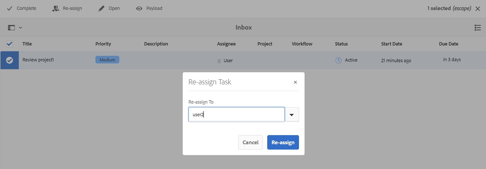

# 使用通知重新分配审核任务 {#id21BNH03M0KS}

您可以将分配给您的审阅任务重新分配给已添加到同一审阅项目的其他用户。 可以从收件箱中提供的审阅通知轻松地完成审阅任务重新分配。 但是，作为审阅人，您只能将审阅任务重新分配给个人用户，而不能使用通知将审阅任务重新分配给用户组。

请注意，重新分配只能为审阅者任务完成，不能为所有者任务完成。

1. **查看者任务**：分配给审阅人进行审阅的任何任务。
1. **所有者任务**：仅为所有者创建的任务。 创建审阅任务并将审阅任务分配给审阅人时，所有者还会收到名为Close &lt;审阅任务名称\> \（例如close-reviewtask1\）的所有者任务，但此所有者任务无法重新分配给任何人。

执行以下步骤以重新分配收件箱通知中的审阅任务：

1. 选择“收件箱”中的审阅任务通知。
1. 选择 **重新分配** 图标。
1. 选择要为其重新分配任务的用户名。

   >[!IMPORTANT]
   >
   > 审阅人必须具有重新分配的权限，并且应属于用户管理员组。

   {width="800" align="left"}

1. 选择 **重新分配**.

重新分配复查任务后，“任务接受者”列将显示任务被重新分配到的复查者的姓名。

分配的审阅人将在收件箱中收到重新分配的审阅任务的通知。

**父主题：**[&#x200B;查看主题或映射](review.md)
