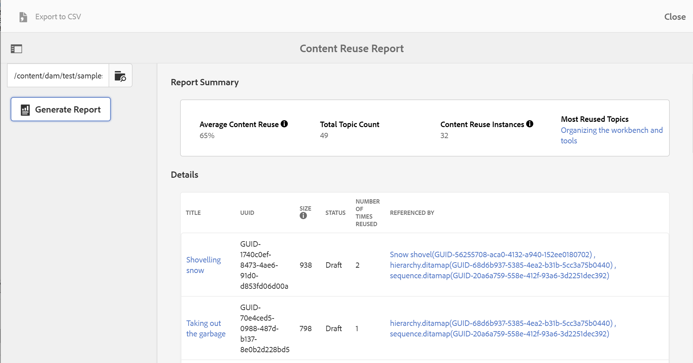

# 内容重用报告 {#id205BB900OQD}

可以生成的另一个有用报告是“内容重用报告”。 此报表计算平均内容使用百分比，这对于项目经理和业务所有者查看正在重复使用的内容量非常有用。

>[!TIP]
>
> 要确保内容重用报表正常工作，必须启用后处理工作流。 请与系统管理员联系以启用后处理工作流。

执行以下步骤以查看内容重用报告：

1. 单击顶部的Adobe Experience Manager链接，然后选择 **工具**.

1. 选择 **指南**&#x200B;工具列表中。

1. 单击 **内容重用报告** 磁贴。

1. 单击 **浏览** 选择主题所在的路径，或手动输入路径。

   报告通过扫描父文件夹和所有子文件夹中的内容生成。

1. 单击 **生成报告** 以获取“内容重用报告”。

   {width="800" align="left"}

   报告页面分为两个部分：

   - **报告摘要：**

     列出平均内容重复使用，其计算公式为“内容重复使用实例数/主题总数”。 此报表会考虑用于计算的所有第一级直接内容引用和主题引用。 内容重用实例的计算方式为重用次数字段中的值总和。 “报告摘要”中还列出了重复使用最广泛的主题。 单击最重复使用主题中的主题链接可打开主题预览。

   - **详细信息：**

     “详细信息”部分包含以下列：

      - **标题**：主题的标题。 单击主题的标题链接将打开主题预览。

      - **UUID**：文件的通用唯一标识符\(UUID\)。

      - **大小**：文件大小（字节）。

      - **状态**：文档的当前状态 — 草稿、正在审阅或已审阅。

      - **重复使用的次数**：相应主题被重复使用的次数。 此计算公式为“引用者”列中的条目总数减去1。

      - **引用者**：引用了相应主题的主题。 在此，仅考虑直接\（第一级\）引用。 多个主题用逗号分隔。 引用的文件的UUID也在方括号中提及。单击主题标题链接将打开主题预览。

>[!NOTE]
>
> 您还可以将“内容重用报表”导出为CSV格式。 为此，请单击屏幕左上角的导出到CSV链接，然后选择要保存CSV文件的位置。 然后，您可以使用任何CSV编辑器打开此CSV文件。

**父主题：**[&#x200B;报表](reports-intro.md)
