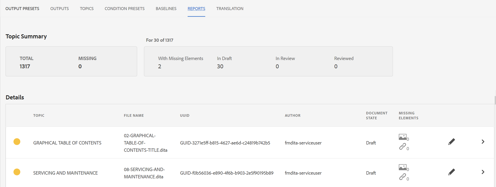
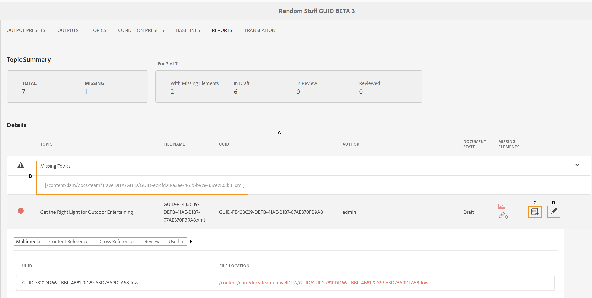
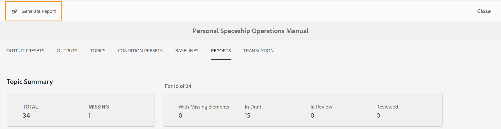
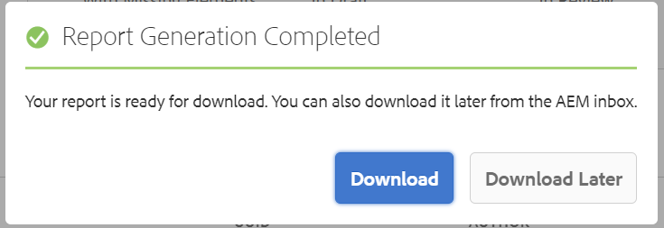
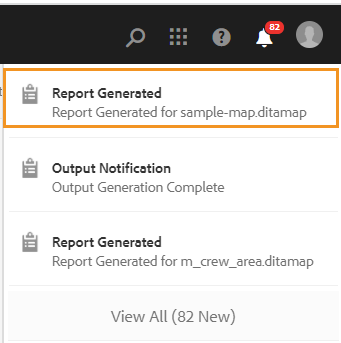

# 映射仪表板中的DITA映射报表 {#id205BB800EEN}

AEM Guides为管理员提供了报告功能，可在文档上线或提供给最终用户之前检查文档的整体完整性。 AEM Guides中映射仪表板的DITA映射报告提供了有价值的信息，例如缺少的主题、缺少元素的主题、引用的主题和媒体文件的UUID以及每个主题的审阅状态。 详细的单个主题级报告还提供与DITA内容相关的信息，例如内容引用和缺少的图像或交叉引用。

>[!NOTE]
>
> AEM Guides会在每次导致映射文件发生更改或主题文件中的任何引用发生更新时，刷新此报表。

执行以下步骤以查看DITA映射报表：

1. 在资产UI中，导航到要查看其报表的DITA映射文件并单击该文件。

1. 单击 **报表**.

   {width="800" align="left"}

   “报告”页面分为两个部分：

   - **主题摘要：**

     列出所选映射文件的总体摘要。 通过查看“摘要”，您可以快速了解地图中的主题总数、缺少的主题、具有缺少元素的主题数、主题的状态 — “草稿”、“审阅”或“审阅”状态。

   - **详细信息：**

     单击某个主题时，将显示选定主题的详细报告。

     {width="800" align="left"}

     下高亮显示的项目 **A**， **B**， **C** 和 **D** 如下所述：

      - **主题**：在DITA映射中指定的主题的标题。 将鼠标指针悬停在主题的标题上会显示主题的完整路径。 如果主题中存在问题（如缺少引用或图像），则会在主题标题之前显示一个红点。

      - **文件名**：文件的名称。

      - **UUID**：文件的通用唯一标识符\(UUID\)。

      - **作者**：上次处理此主题的用户。

      - **文档状态**：文档的当前状态 — 草稿、正在审阅或已审阅。

      - **缺少主题\(B\)**：如果存在包含断开引用的主题，则这些主题会列在缺少的主题列表下。

      - **缺少元素**：列出缺少图像或交叉引用损坏的数量（如果有）。

      - **在编辑器中打开\(D\)**：单击此图标将在Web编辑器中打开主题。

   下高亮显示的项目 **E** 如下所述：

   - **多媒体**：主题中使用的图像的路径及其UUID一起显示。 如果单击图像路径，将在弹出窗口中打开相应的图像。 断开的图像链接以红色列出。

   - **内容引用**：本主题中引用内容的路径及其UUID一起显示。 如果单击引用内容的标题，则相应的主题将在预览模式下打开。

   - **交叉引用**：交叉引用内容的路径及其UUID一起显示。 如果单击引用内容的标题，则相应的主题将在预览模式下打开。 中断的交叉引用以红色列出。

   - **审核**：显示主题审阅任务的状态。 您可以查看所审核主题的状态\（打开或关闭\）、截止日期和被分配人。 如果单击主题链接，它将在审阅模式下打开主题。

   - **使用位置**：显示使用主题的其他主题或映射的列表。 还列出了所有此类主题和映射的UUID。

除了每个主题的报告之外，管理员还可以访问信息，例如DITA映射的发布历史记录。 有关生成的输出的历史记录的更多信息，请参见 [查看输出生成任务的状态](generate-output-for-a-dita-map.md#viewing_output_history).

## 生成DITA映射的CSV报告

您可以下载和导出DITA映射报表的CSV。 CSV包含详细的DITA映射报表。

执行以下步骤以生成DITA映射报告的CSV：

1. 单击 **生成报告** 以生成DITA映射报表。

   {width="800" align="left"}

1. 报告可供下载后，您将收到通知。 单击 **下载** 以下载所生成报表的CSV文件。

   {width="550" align="left"}

   您也可以稍后从AEM通知收件箱中下载所生成报告的CSV文件。

   单击收件箱中生成的报告以下载报告。

   {width="300" align="left"}

报告在收件箱中下载后，您还可以选择报告，并使用顶部的打开图标打开所选报告。

**父主题：**[&#x200B;报表](reports-intro.md)
