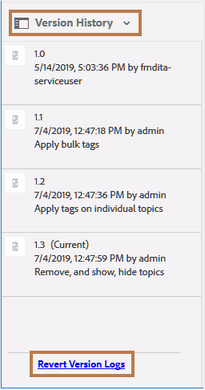
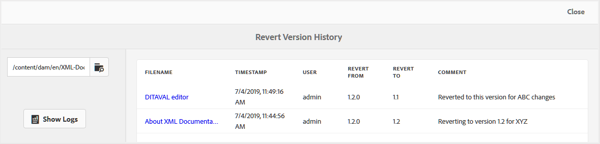

# 还原文件版本历史记录报告 {#id205BBC00PRK}

当您同时处理多个发行版本和多位作者时，您的内容将绑定有多个版本。 多个版本中可能存在一些常见信息，不同作者可在他们的项目中使用这些信息。 要处理此类工作任务，作者最终可能会拥有多个版本的文件。 此类版本可能只是文件的较新版本或恢复到较早版本。 确定文件还原时间和原因是一项复杂的任务。

AEM Guides允许您为单个文件或文件夹中的所有文件生成版本历史记录报告。 此版本历史记录为您提供了已还原的文件的所有版本、创建这些版本的人以及创建这些版本的原因的合并视图。

您可以从以下位置访问此报表：

- **资产UI**：通过选择文件并打开 **版本历史记录** 从左边栏开始。 此 **版本历史记录** 视图包含 **还原版本日志** 面板底部的链接。 单击此链接时，将显示所选文件的还原版本历史记录。

  {width="300" align="left"}

- **主题预览**：在预览主题时，您还可以在该处调出 **版本历史记录** 面板中。 您将获得一个与资产UI类似的面板，您可以从中单击 **还原版本日志** 用于访问活动文档的还原版本历史记录的链接。

- **“AEM工具”部分**：您还可以从AEM工具部分访问此报表。 以下过程说明了如何从“AEM工具”部分访问还原版本历史记录。

执行以下步骤以访问还原历史记录报告：

1. 单击顶部的Adobe Experience Manager链接，然后选择 **工具**.

1. 选择 **指南** 工具列表中。

1. 单击 **版本还原历史记录** 磁贴。

   屏幕上会显示一个空白的“还原版本历史记录”页面，您需要在该页面中浏览并选择文件或文件夹以生成报告。

1. 单击 **显示日志** 为选定的文件或文件夹生成报告。

   {width="800" align="left"}

   该报告包含以下详细信息：

   - **文件名**：主题的标题。 单击主题的标题链接将打开主题预览。

   - **时间戳**：将主题还原到早期版本的日期和时间。

   - **用户**：还原到早期版本的用户的名称。

   - **还原自**：还原时所在文件的原始版本号。

   - **恢复为**：文件还原到的版本。

   - **注释**：还原文件的用户提供的任何评论。

**父主题：**[&#x200B;报表](reports-intro.md)
