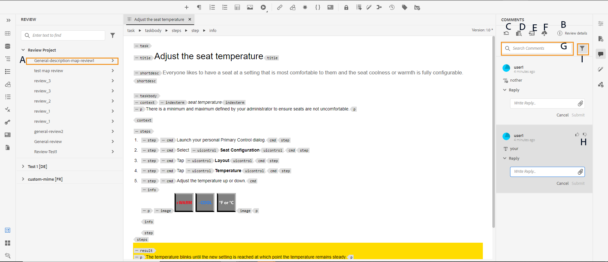
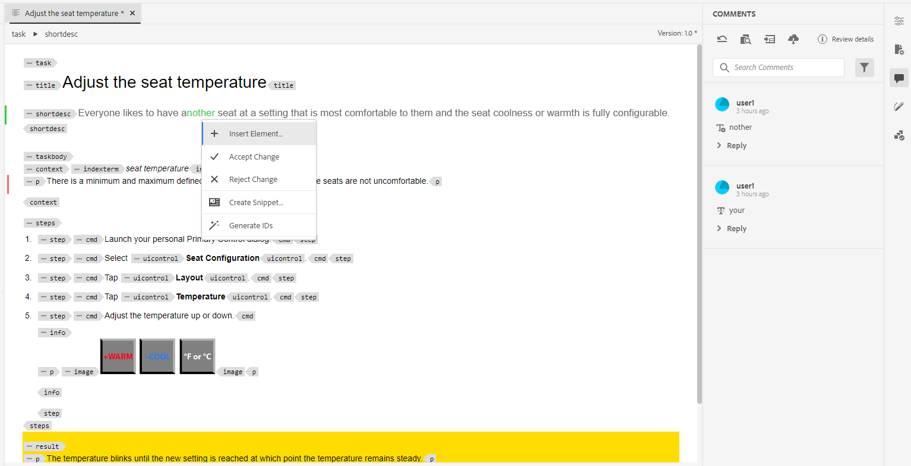
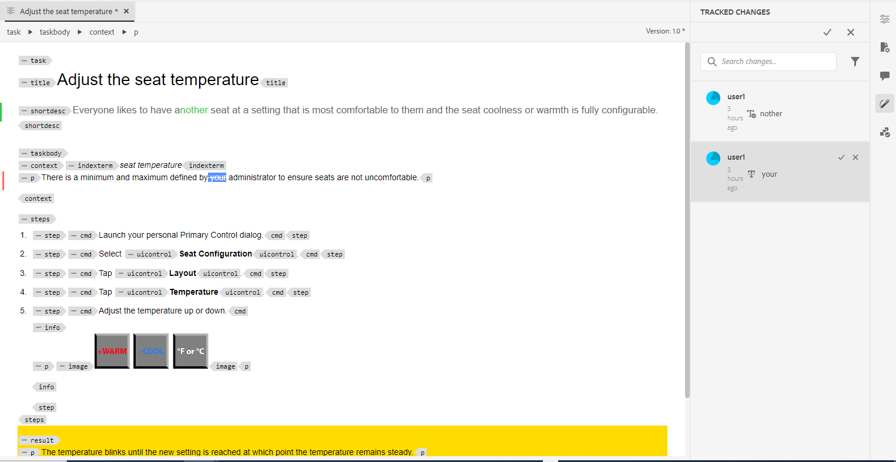

# 地址审核注释 {#id2056B0X0KBI}

作为作者，您可以使用Web编辑器在主题中处理注释。 根据在“审阅”面板中选择的审阅任务载入注释。 有关更多详细信息，请查看 **审核** 面板  中的功能描述 [左侧面板](../user-guide/web-editor-features.md#id2051EA0M0HS) 部分。

以下各节介绍在Web编辑器中编辑注释的方法。

作者可以在Web编辑器的文档中处理注释。 提供了视觉指示器，用于指示已插入\(text\)、删除还是高亮显示注释。 每个注释条目的顶部还会提及注释的类型。

>[!NOTE]
>
> 处理审阅注释\（对于活动审阅文档\）时，请确保不要在启用了完整标记视图的多个选项卡中打开审阅中主题，也不要在“作者”和“源”视图模式之间切换。

{width="800" align="left"}

在Web编辑器模式中，右侧面板包含审阅和跟踪的更改图标。 “审阅”面板显示审阅者在您的文档中所做的所有注释。 此 **跟踪的更改** 面板显示文档中所有插入和删除的注释的状态。

- **A**：选择审核任务以查看审核注释。 如果您的主题已在多个审阅任务中共享以供审阅，您将看到这些任务在此下拉列表中列出。

  从列表中选择审阅任务时，您可以查看审阅人在该任务中所做的评论。 您可以在任务中单独处理审阅注释，这意味着对注释的任何更新仅对相应任务的审阅者可见。

- **B：**  选择 **查看详细信息**  在 **评论** 查看有关审阅任务的详细信息：

   - **名称**：审核任务的名称。
   - **审核版本**：显示与所选审阅任务关联的版本。 这有助于跟踪您共享以供审阅的版本
   - **状态**：审核任务的当前状态。

  >[!NOTE]
  >
  > 如果审核任务的根映射与创作根映射不同，则会显示有关该任务的信息，以指示创作根映射与审核根映射不匹配。

- **C**：如果在启动审阅后更新了主题，则单击将主题还原为审阅版本图标会将工作副本还原为共享以供审阅的版本。 这样，您就可以更轻松地直接将审阅反馈合并到共享以供审阅的版本中。 在合并反馈后，可将更改保存在还原版本中或创建主题的新修订版本。 如果选择创建主题的新修订版本，则会从共享以供审阅的主题版本创建一个新分支。 例如，如果您共享版本 `1.2` 当前创作版本为时审阅的主题 `1.3`，然后您可以使用此图标切换回版本 `1.2` 用于合并审阅注释。 如果选择在将更改合并到版本后创建新修订版本 `1.2`，然后是版本为的新分支 `1.2.0` 为主题创建。

  通常，在合并审阅反馈后，您希望合并来自主题最新版本的更改。 要执行此操作，请使用 [合并](web-editor-features.md#id205DF04E0HS) 用于获取共享主题以供审阅后所做的所有更新的功能。

- **D**：打开并排视图以显示主题的注释版本。 如上面的屏幕快照所示，最左边的部分是可在其中进行更改的主题的最新版本。 下一部分是该主题的注释版本。 在主题中的注释之间导航时，侧视图会更改并显示在其中添加注释的主题版本。 评论面板中的每个评论都链接到此部分中的相应文本。 它有助于您识别注释的文本。 注释按文档中注释文本的顺序显示。

  您可以在侧视图顶部看到版本号。 再次单击此图标将隐藏该主题的注释版本。

- E：直接在主题中导入插入和删除的\（或删除线\）注释。 单击“导入”图标后，所有文本插入和删除都将显示在主题的工作副本中。 现在，可以通过两种方式接受或拒绝评论。

  如果要一次合并一个建议的更改\（插入或删除\），只需右键单击内容中的注释并选择“接受更改”或“拒绝更改”。 根据您的选择，可接受或拒绝评论。 如果接受评论，内容会添加到内容中；如果拒绝，则会从内容中删除。 此外，评论的状态在“审阅”面板中更改。

  {width="800" align="left"}

  也可使用右侧面板中的审阅功能来接受或拒绝注释。 单击任何注释会突出显示文档中的注释。

  {width="800" align="left"}

  >[!IMPORTANT]
  >
  > 导入注释功能仅适用于那些自共享以供审阅后未更改的文档。 如果在发送文档以供审阅后进行了任何更改，您将会收到通知 **强制导入** 在文档中添加备注。 但是，这样做会导致丢失您在文档中所做的所有更新。 此 **强制导入** 如果在外部创建文档，然后共享该文档以供审阅，则也会显示警报。 您可以导入注释。

  当您接受或拒绝注释时，会将其从“跟踪的更改”列表中删除。 这还可以作为文件中需要处理多少评论的指标。

- **F**：从更多选项菜单中，下载审阅主题中所有可用的附件。
- **G**：在注释中搜索文本。
- **H**：接受或拒绝评论。

- **I**：对评论应用过滤器。 您可以根据审阅类型\（全部、高亮显示、删除、插入或附注\）、审阅状态\（全部、接受、拒绝或无\）、审阅者\(全部或特定审阅者\(s\)\)或主题版本来筛选以查看注释。

**父主题：**[&#x200B;查看主题或映射](review.md)
