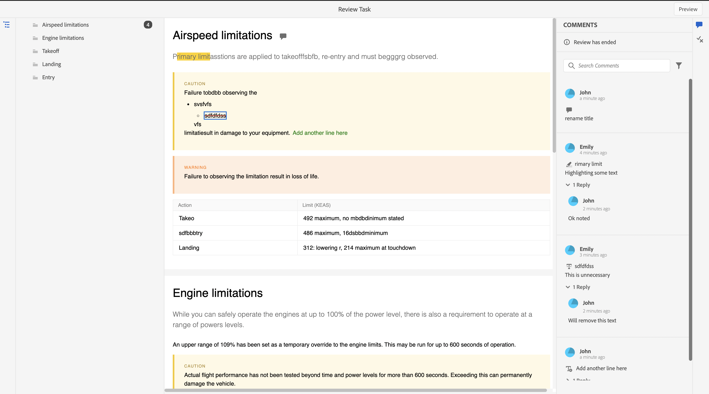
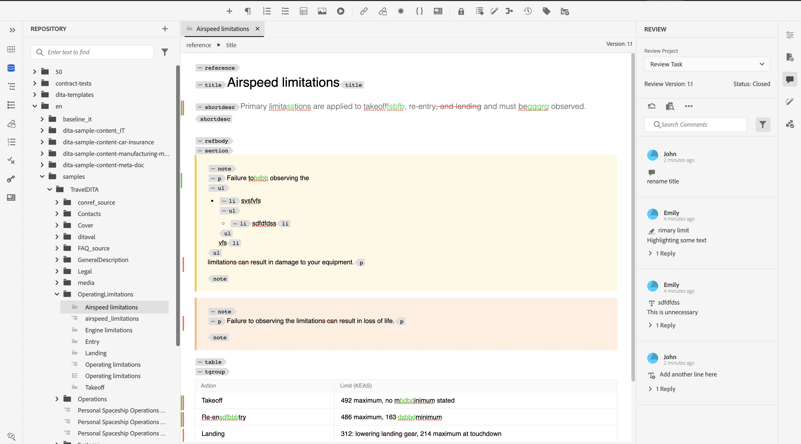

# 查看已完成的审核任务

对于您是作者（或发起人）的项目，您可以完成审阅任务。 审核任务完成后，您和所有审核者都可以在只读模式下访问它。

## 作为审阅者

作为审阅人，您可以在评论面板中看到一个指示器，指示审阅已结束。 注释工具栏不显示，因此您无法高亮显示、删除线、插入文本或添加注释。 您可以读取注释，但无法编辑或删除任何注释。 您也无法向评论添加回复。 您无法看到上下文工具栏（用于高亮显示或删除任何文本）。 已完成的审阅任务中也不会显示过时的注释图标。

但是，您可以搜索或过滤任何注释。 您还可以选择显示或隐藏条件，并相应地显示条件化内容。 您可以下载任何附件，但不能上载或删除注释的任何附件。

{width="800" align="left"}

## 作为作者

作为作者，您可以在“审阅”面板中看到状态为“已关闭”。 您可以读取注释，但无法接受或拒绝注释。 不能编辑或删除任何注释。 您也无法添加评论的回复。 已过时的注释图标和将注释导入到作者视图图标未显示在已完成的审阅任务中。

但是，您可以搜索或过滤任何注释。 您可以下载任何附件，但不能上载或删除注释的任何附件。

{width="800" align="left"}

因此，无论是作为审阅人还是作者，您都可以查看审阅的内容以及注释，但不能在已完成的审阅任务中进行任何更改。
