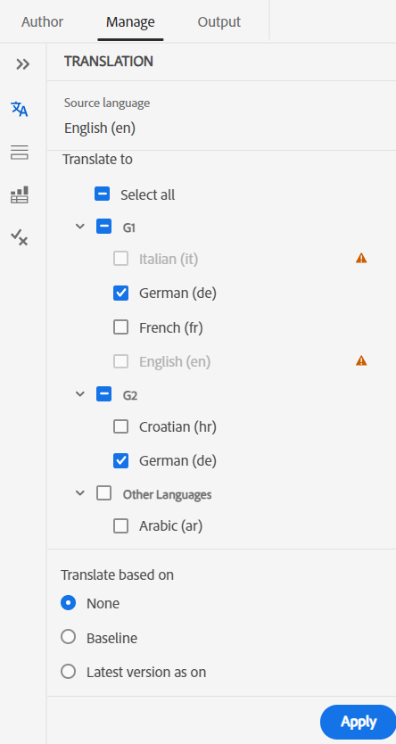
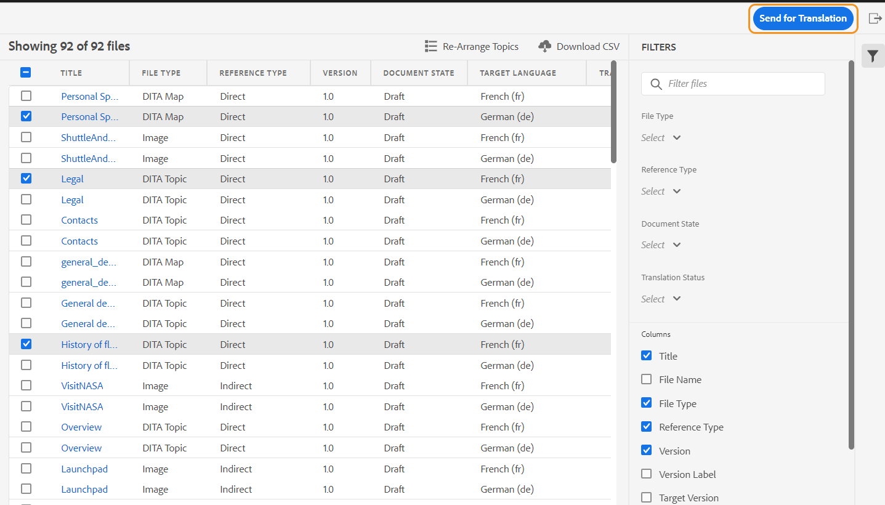
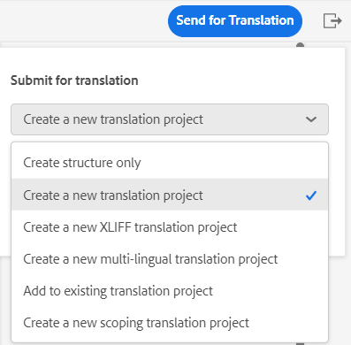
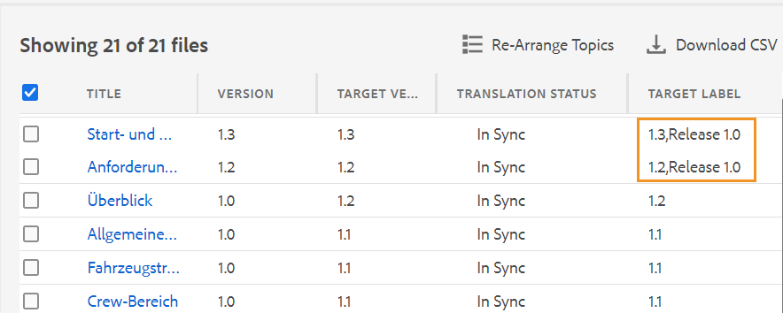
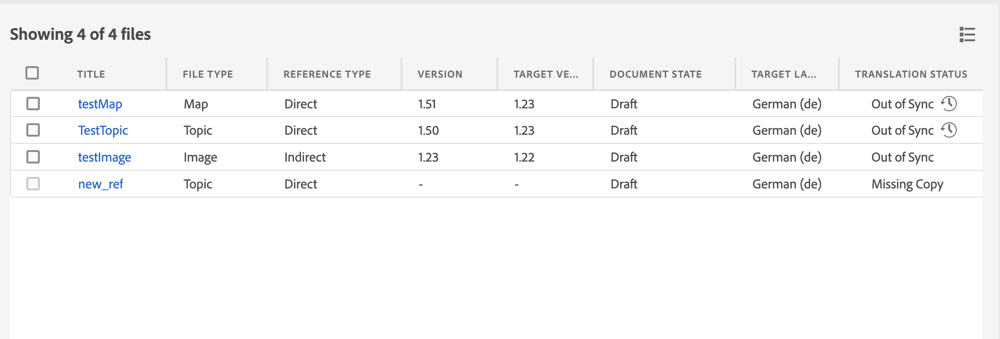
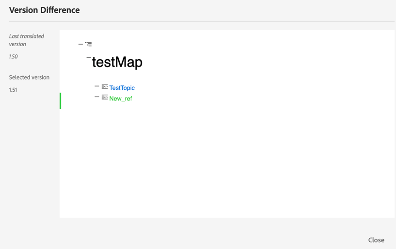
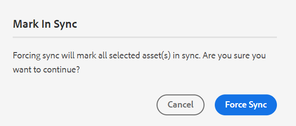
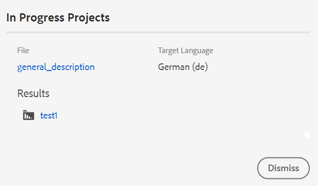

# 从Web编辑器翻译文档 {#id21BKF0Z0YZF}

>[!TIP]
>
> 如果您已升级到AEM Guides 2022年2月as a Cloud Service版或更高版本，则建议从Web编辑器使用此翻译功能。

AEM Guides在Web编辑器中提供了强大的功能，使您能够把内容翻译成多种语言。 您可以创建新翻译项目，稍后将翻译作业添加到现有翻译项目。 您还可以创建多语言翻译项目，该项目包含所有选定语言的翻译作业。

>[!NOTE]
>
> 您的管理员可以在Web编辑器中配置管理选项卡\（用于翻译\）。 有关更多详细信息，请参阅 *在Web编辑器中配置翻译功能* 安装和配置Adobe Experience Manager Guidesas a Cloud Service中的部分。

## 开始之前

在执行此过程中的步骤之前，请确保已创建所需的语言根目录和目标文件夹

1. 创建根文件夹以存储源内容。 必须使用语言名称\（例如English\）或语言代码\(en\)创建根文件夹。
1. 创建要将内容翻译到的目标文件夹。 例如，如果要将内容翻译为德语或法语，则必须创建名为 — de \（表示德语\）或 — fr \（表示法语\）的文件夹。

>[!NOTE]
>
> 根文件夹和目标文件夹必须在同一级别创建。

## 创建翻译项目

1. 在存储库面板中，在映射视图中打开DITA映射文件。
1. 单击 **管理** 选项卡。 “翻译”面板显示 **可用语言** 列表。
1. 从 **可用语言** 列表，选择要将项目翻译到的区域设置。 您可以选择 **全选** 将您的项目翻译为所有可用的语言。

   >[!NOTE]
   >
   > 该列表包含语言文件夹及其语言代码。 例如，法语\(fr\)和德语\(de\)。

   >[!IMPORTANT]
   >
   > 该列表仅显示其语言文件夹平行于源语言创建的语言。 在任何其他级别（例如从源语言文件夹往下一个级别）创建的语言文件夹也不显示。 请确保创建的所有目标语言文件夹与源语言文件夹处于同一级别。

   {width="300" align="left"}

1. 您还可以选择以下选项之一来翻译项目：

   **无** 选择此选项可翻译文件的默认版本。 默认情况下，该选项处于选中状态。

   **使用基线：** 您可以选择基线来翻译项目。 单击使用基线，然后选择在映射中创建的基线。 属于所选基线的所有文件都会显示在翻译页面中。 翻译内容后，即可导出已翻译的基线。 有关导出转换后的基线的详细信息，请参见 [导出已翻译基线](generate-output-use-baseline-for-publishing.md#id196SE600GHS).

   **在上使用最新版本**：选择根据主题的创建日期和时间筛选主题的版本。 当您选择日期和时间时，只显示所选日期和时间或之前创建的文件的最新版本。

1. 单击 **应用**. 此时将显示一个列表，其中包含主题和相关资源的详细信息。
1. 选择要发送以进行翻译的主题。 您还可以对以下列使用主题过滤选项：

   - **标题**：源文件的标题。  将鼠标悬停在源文件的标题上可查看目标或翻译文件的标题。
   - **文件名**：源文件的名称
   - **文件类型**：源文件的类型。 可用的选项有“映射”、“主题”和“图像”。
   - **引用类型**：直接或间接引用
   - **版本**：源文件的版本号
   - **版本标签**：源文件的选定版本的标签
   - **目标版本**：目标文件的版本号
   - **文档状态**：源文件的状态。 可用的选项包括草稿、正在审阅和已审阅。
   - **目标语言**：要将源文件翻译成的语言
   - **翻译状态**：可用选项为：不同步、缺少副本、正在进行中和正在同步。
   - **目标标签**：目标文件的选定版本的标签
1. 单击 **发送以供翻译** 在右上角。

   {width="800" align="left"}

1. 从下拉菜单中，选择 **创建新翻译项目**.

   {width="350" align="left"}

   除了新的翻译项目外，您还可以从以下选项中进行选择：

   - 您可以选择 **创建结构** 仅适用于翻译项目。
   - 您可以选择 **创建新的XLIFF翻译项目** 将XML内容转换为XML本地化交换文件格式(XLIFF)。 XLIFF是一种基于XML的开放格式，用于标准化内容翻译过程中使用的各种工具之间的数据传输。 AEM Guides支持XLIFF版本1.2。在XLIFF项目中，内容将导出为行业标准XLIFF格式，可提供给翻译供应商。 XLIFF格式使您在翻译阶段已翻译的区段有可能得到重用。\
     在翻译XLIFF内容后，可将其导入AEM Guides中，从而创建原始DITA项目的翻译版本。

     >[!NOTE]
     >
     > XLIFF导出仅适用于人工翻译配置。

   - 您可以选择 **创建新的多语言翻译项目** 其中包含您选择进行翻译的所有语言的翻译作业。 例如，如果您选择了法语、德语和西班牙语，则会创建一个项目，其中包含所有三种语言的翻译作业。
   - 如果您已经有一个翻译项目，则可以向该项目添加主题。 选择添加至 **现有翻译项目** 选项，然后从现有翻译项目列表中选择一个项目。 您可以按最近、升序或降序对这些项目排序。

     >[!NOTE]
     >
     > 如果现有项目是范围项目，则其名称中会附加“\(Scoping\)”。

   - 如果需要为要翻译的项目创建范围，则可以选择 **创建新的范围设定翻译项目**. 这不会发送副本以供翻译，并且文件的原始翻译状态将保持不变。 对于为了设定范围而发送的引用主题的目标语言副本，不会造成任何影响。
1. 在&#x200B;**项目标题**&#x200B;字段中，输入项目标题。
1. 单击 **创建** 以创建新的翻译项目。

   将使用所选主题版本创建新翻译项目。 此时，会显示一个弹出消息，确认已创建翻译项目。 一旦翻译项目中的所有目标语言副本均可用，您即会在收件箱中收到通知。 一旦目标语言副本在翻译项目中可用，您就可以开始翻译作业。 有关详细信息，请参阅， [开始翻译作业](translation-first-time.md#id225IK030OE8).

   >[!NOTE]
   >
   > 如果您拒绝翻译作业中一个或多个主题的翻译，则 **进行中** 所有被拒绝主题的翻译状态都将恢复到其原始状态。 将根据最新翻译状态检查并还原所引用主题的状态。 此外，即使为目标项目创建的翻译被拒绝，也不会删除这些翻译文件。

## 添加翻译规则

AEM Guides允许管理员配置翻译规则。 SRX（分段规则交换）格式是在不同用户和不同翻译环境之间交换分段规则的标准。 您可以创建一个文件夹并将自定义SRX文件添加到其中。

SRX文件应命名为 `<language-code>.srx`. 例如，en-US或ar-AE。

>[注意]
>标题不区分大小写，因此您可以具有“en-US”、“en-us”或“EN-us”。 此外，AEM guides可以解析“ — ”（连字符）或“_”（下划线）。 因此，您可以设置“en-US”或“en_US”。

此外，您还可以将这些文件放入AEM资源根目录下的任何文件夹中， `./content/dam`.

创建包含SRX文件的文件夹后，您可以在文件夹配置文件的翻译SRX位置配置中添加文件夹路径。

建议为了获得更好的性能，应仅将SRX文件保留在文件夹配置文件中配置的文件夹中。

AEM Guides根据翻译项目的源语言选择SRX规则。 它会查找某种语言的自定义SRX文件，如果您未定义自定义SRX文件，则它会根据现成的翻译规则选取规则。

有关设置全局和文件夹级别配置文件的详细信息，请参阅 *配置创作模板* 安装和配置Adobe Experience Manager Guidesas a Cloud Service部分中的。

## 将版本标签传递到目标版本

AEM Guides允许您将源文件的标签传递到目标文件。 这将帮助您轻松识别已翻译文件的源版本。

要在目标副本中添加源版本标签，系统管理员必须选择选项 **将源版本标签传播到目标版本** 在 **翻译** tab in **编辑器设置**.

例如，如果您有一些源文件带有版本标签 `Release 1.0` 应用于这些字段，则也可以传递源标签\(`Release 1.0`\)到已翻译文件。

{width="650" align="left"}

>[!NOTE]
>
> 源标签仅附加到一个目标版本。 如果将源标签移动到另一个版本，它会自动反映在最新的目标标签中。

## 查看不同步文件的版本差异 

AEM Guides提供了用于检查主题的选定版本与上次翻译的源版本之间的差异的功能。 您可以选择翻译 **不同步** 基于所做更改的文件。

{width="650" align="left"}

选择 **显示差异**&#x200B;图标\(\)查看所选文件上次翻译版本与当前版本之间的差异。

>[!NOTE]
>
> **显示差异** 图标\(\)仅对翻译状态为的DITA文件显示 **不同步**.

此 **版本差异** 出现对话框。 它显示 **上次翻译的版本** 和 **选定的版本** 左边的号码。 预览窗口显示上次翻译版本与所选主题版本之间的差异。

{width="650" align="left"}

## 关闭不同步的资产

如果对某些资产进行更改，则这些资产会变为不同步。 您可以重新翻译修改的资产，也可以选择取消不同步状态。 例如，如果您进行了一些非常次要的更改，而这些更改真的不需要翻译，则可以将它们的状态标记为同步。

要取消不同步状态，请执行以下步骤：

1. 选择要更改其状态的不同步资产。
1. 选择 **标记为同步** 按钮\(\)在顶部。 此 **标记为同步** 出现对话框。

   {width="550" align="left"}

1. 单击 **强制同步**. 它会将选定的“不同步”资产的状态设置为“同步”。

>[!NOTE]
>
> **标记为同步** 按钮\(\)仅对翻译状态为不同步的资产显示。

## 查看映射或主题的正在进行中的翻译项目

翻译仪表板上的某些引用可能处于正在进行状态。 这些参考资料具有 **进行中** 链接在 **翻译状态** 列。 单击该链接时， **进行中的项目** 对话框打开。 在对话框中，您可以看到包含所选引用的所有正在进行的翻译项目\（以及目标语言\）的列表。

>[!NOTE]
>
> 您可以看到在AEM Guides 2023年2月as a Cloud Service版或更高版本中创建的已翻译项目的正在进行中链接。

在对话框中单击参照的名称，以在预览模式下将其打开。 您还可以单击翻译项目以开始翻译。

{width="550" align="left"}

**父主题：**[&#x200B;使用Web编辑器](web-editor.md)
