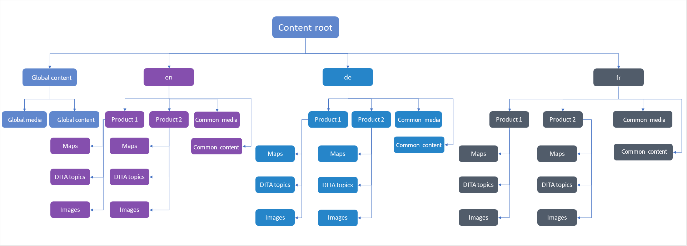
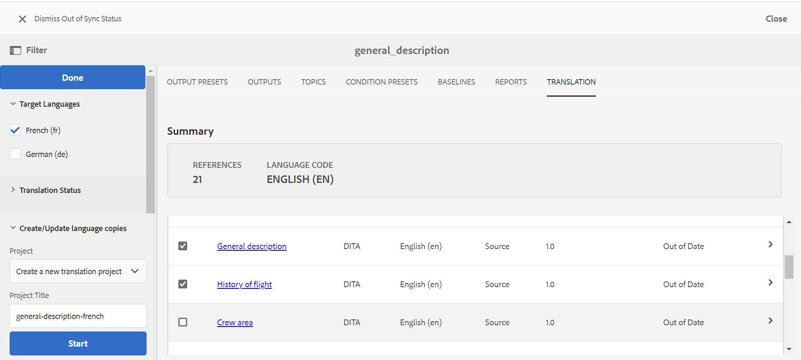

# 内容翻译的最佳实践 {#id1678G0S702F}

翻译内容时请考虑以下几点：

- 文件夹和文件名必须符合文件命名标准，例如 — 不应有空格、撇号、大括号、等号、特殊或非ASCII字符。

- 如果您翻译不同语言的内容，则必须创建与每种语言对应的文件夹。 其中每个语言文件夹都将包含与该语言对应的内容。 例如，您可以使用语言指示符（如）创建文件夹 `de` 对于德语， `fr` 法语，等等。 或者，您也可以使用语言和区域指示符（如）创建文件夹 `fr-FR` 对于法国使用的法语或 `fr-CA` 加拿大使用的法语。
- 目标语言还应根据其实例上的目标语言文件夹选择实际区域设置。
- 云配置应与源文件夹的云配置相同，并且一个文件夹中应该只有一个云配置。 如果要使用多个翻译连接器，则可以在/conf下创建多个文件夹。
- 一个文件夹中的文件不应超过1000个。
- 确保负责启动翻译流程的用户对源语言文件夹和目标语言文件夹具有读取、修改、创建和删除权限。
- 由于翻译内容需要创建翻译项目，因此用户必须有权在AEM中创建项目。
- 如果要在映射中使用条件预设，则必须在启动翻译过程之前创建这些预设。 由于条件预设也捆绑在映射的翻译版本中，因此在启动翻译过程之前创建预设，可以确保它们在翻译版本中可用。
- 内容翻译过程必须从DITA映射控制台而不是AEM Assets UI启动。
- 如果通过人工翻译来翻译内容，则不得使用基于组件的DITA翻译工作流。 但是，此选项必须用于机器翻译。
- 不需要本地化的全局使用内容和媒体应放在语言副本之外。
- 所有必须本地化的常用内容都应保存在语言文件夹下的公用文件夹中。

下图显示了在全局使用内容和三个语言副本时AEM中的文件夹结构示例。

{width="800" align="left"}

## 配置翻译服务

执行以下步骤以配置要使用的人工翻译服务或机器翻译服务：

1. 在Assets UI中，选择源语言文件夹。

1. 打开文件夹属性，然后转到 **Cloud Service** 选项卡。

1. 在 **Cloud Service** 选项卡，配置要使用的翻译服务。

   您可以配置机器翻译或人工翻译。

   确保一个文件夹中只有翻译连接器的一个配置。 如果有多个翻译连接器，则可以在/conf下创建多个文件夹。 在开始翻译过程之前，源语言文件夹必须选择云配置。

   >[!NOTE]
   >
   > 请参阅 [配置翻译集成框架](https://experienceleague.adobe.com/docs/experience-manager-cloud-service/sites/administering/reusing-content/translation/integration-framework.html?lang=en) 请参阅AEM文档，了解有关与第三方翻译服务集成的详细信息。

1. 单击 **保存并关闭** 以保存更新的文件夹属性。

>[!TIP]
>
> 请参阅 *翻译* 部分，了解翻译内容的最佳实践。

## 创建新翻译项目

执行以下步骤可创建翻译项目：

>[!NOTE]
>
> 在执行此过程中的步骤之前，请确保已创建所需的语言根和目标文件夹，如 [内容翻译的最佳实践](#id1678G0S702F).

1. 在资产UI中，单击DITA映射文件。

1. 单击 **翻译** 选项卡。

1. 从 **目标语言** 列表，选择要将项目翻译到的区域设置，然后单击 **完成**.

   此时将显示主题和相关资源的摘要和详细信息。

   >[!IMPORTANT]
   >
   > 此 **目标语言** 仅显示其语言文件夹是与源语言并行创建的那些语言。 在任何其他级别（例如从源语言文件夹往下一个级别）创建的语言文件夹也不显示。 请确保创建的所有目标语言文件夹与源语言文件夹处于同一级别。

1. 选择要发送以进行翻译的主题。

   您还可以使用以下主题过滤选项：

   >[!NOTE]
   >
   > 应用所需的过滤器后，单击 **完成** 在过滤器面板中，根据您的选择过滤主题。

   - **翻译状态**：选择根据主题的翻译状态筛选主题。 可用选项包括：不同步、缺少副本、进行中和同步。
   - **Search**：输入一个或多个要在主题标题中搜索的词语。
   - **源类型**：选择根据主题的文件类型对其进行筛选。 可用选项有：全部、DITA、DITA映射、资源。
   - **在以下时间后修改了源版本：**：选择根据主题的修改日期和时间筛选主题。 在指定日期和时间之后修改的所有主题都会显示在列表中。
   - **基线**：单击使用基线，然后选择在映射中创建的基线。 属于所选基线的所有文件都会显示在翻译页面中。 您可以从基线中选择所需的文件并继续翻译过程。 翻译内容后，即可导出已翻译的基线。 有关导出转换后的基线的详细信息，请参见 [导出已翻译基线](generate-output-use-baseline-for-publishing.md#id196SE600GHS).
1. 单击 **创建/更新语言副本** （位于“筛选器”面板底部）。

1. 从 **项目** 列表，选择 **创建新翻译项目**.

   >[!NOTE]
   >
   > 如果您已经有一个翻译项目，则可以向该项目添加主题。 选择 **添加到现有翻译项目** 选项来自 **项目** 列出并从中选择一个项目 **现有翻译项目** 列表。

1. 在&#x200B;**项目标题**&#x200B;字段中，输入项目标题。

1. 选择 **包括DITA映射** 用于发送映射进行翻译的选项。
1. 单击 **开始** 以创建新的翻译项目。

   将使用所选主题版本创建新翻译项目。 此时，会显示一个弹出消息，确认已创建翻译项目。 一旦翻译项目中的所有目标语言副本均可用，您即会在收件箱中收到通知。 一旦翻译项目中提供了目标语言副本区域，您就可以开始翻译作业。

   {width="800" align="left"}

翻译选项卡包含以下部分：

- **摘要**：显示引用的主题数、源语言及其代码。
- **详细信息**：显示主题标题、主题类型、主题的语言代码、源语言、源主题的版本、添加到主题的标签以及翻译状态。

## 开始翻译作业 {#id225IK030OE8}

执行以下步骤以启动翻译作业：

1. 在 **项目** 在控制台中，导航到您为本地化而创建的项目文件夹。

1. 单击本地化项目以打开详细信息页面。

1. 单击 **翻译作业** 图块，并选择 **开始** 以启动翻译工作流。

   >[!NOTE]
   >
   > 如果您使用的是人工翻译服务，则需要导出内容以供翻译。 获得已翻译内容后，您需要将其导入回翻译项目。

1. 要查看翻译作业的状态，请单击 **翻译作业** 磁贴。

翻译完成后，翻译作业的状态将更改为 *准备审查*. 要完成翻译过程，您需要在项目控制台中接受翻译作业拼贴中的已翻译副本和资产元数据。

>[!NOTE]
>
> 如果您拒绝翻译作业中一个或多个主题的翻译，则 **进行中** 所有被拒绝主题的翻译状态都将恢复到其原始状态。 将根据最新翻译状态检查并还原所引用主题的状态。 此外，即使为目标项目创建的翻译被拒绝，也不会删除这些翻译文件。

**父主题：**[&#x200B;翻译内容](translation.md)
