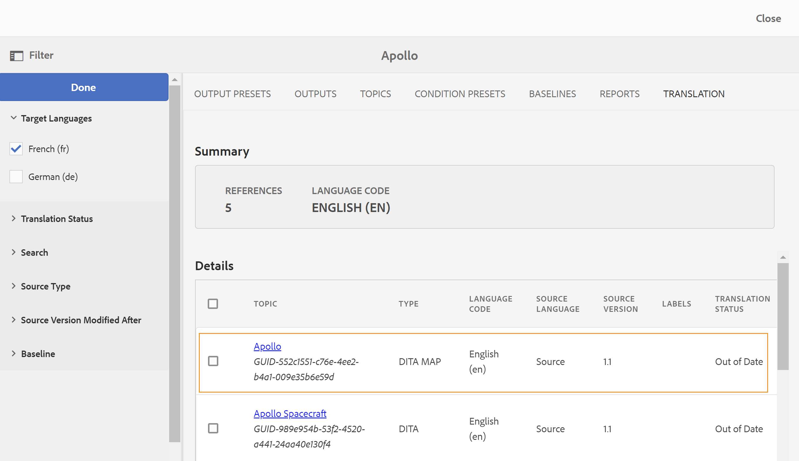

# 翻译修改的主题 {#id16A5A0B6072}

如果对某些主题进行了更改，则需要重新翻译这些主题。 您可以从DITA映射中跟踪修改的主题。 在源语言副本文件夹中，单击DITA映射文件，然后单击翻译选项卡。 您可以查看每个主题的状态，无论它是否需要重新翻译。

执行以下步骤可发送修改的主题以进行重新翻译：

1. 单击源语言复制文件夹中的DITA映射文件。

1. 单击 **翻译** 选项卡。

1. 在 **筛选** 面板中，选择 **翻译语言** 要检查其状态并单击 **完成**.

   您可以查看每个主题的翻译状态。 对于有其他可用修订版主题的主题（而不是发送进行翻译的内容），显示 **已过期** 状态。

   >[!NOTE]
   >
   > 翻译工作流会将源语言文件夹中主题文件上次保存的修订版本与翻译版本进行比较。

   如果单击箭头查看更多详细信息。 您可以看到已过期的特定语言副本。

   {width="800" align="left"}

1. 单击复选框以选择要发送以供重新翻译的主题。

   当您选择不同步日期时， **创建/更新语言副本** 选项将出现在“引用”面板中，并且 **取消不同步状态** 按钮上方的 **筛选** 图标。

   您可以使用 **取消不同步** 按钮覆盖DITA映射中主题的“过期”状态。 例如，如果在英文版的主题中进行了一些不需要翻译的更改，则可以使用此按钮并更改所选主题的“过期”状态。

   >[!NOTE]
   >
   > 如果您单击 **取消不同步状态** 按钮时，会将所选过期主题的主题状态设置为最新。

1. 单击 **更新语言副本** 并配置翻译作业。

1. 您可以选择创建新翻译项目或将主题添加到现有翻译项目。 提供配置翻译项目所需的详细信息。

1. 单击 **开始**.

   此时将显示一条确认消息，表明已发送主题进行翻译。

1. 在项目控制台中导航到翻译项目。 将在文件夹中创建新翻译作业信息卡。 单击省略号可查看文件夹中的资产。

   {width="300" align="left"}

1. 要开始翻译，请单击翻译作业信息卡上的箭头，然后选择 **开始** 从名单上。 此时将显示一条消息，通知作业已启动。

   单击翻译作业信息卡底部的省略号时，您还可以查看正在翻译的主题的状态。

   >[!NOTE]
   >
   > 如果您使用的是人工翻译服务，则需要导出内容以供翻译。 获得已翻译内容后，您需要将其导入回翻译项目。

1. 翻译完成后，状态将更改为 **准备审查**. 单击省略号可查看主题详细信息，并从工具栏中执行以下操作之一：

   - 单击 **在资产中展现** 以查看和验证翻译。

   - 单击 **接受翻译** 如果您认为已正确翻译了更改。 将显示确认消息。

   - 单击 **拒绝翻译** 如果你认为这项工作需要重新完成。 此时会显示拒绝消息。

   >[!NOTE]
   >
   > 接受或拒绝已翻译的资产很重要，否则文件将保留在临时位置，并且不会被复制到DAM。

1. 在Assets UI中导航回源语言文件夹中的DITA映射文件。 重新翻译的主题现在已同步。

**父主题：**[&#x200B;翻译内容](translation.md)
