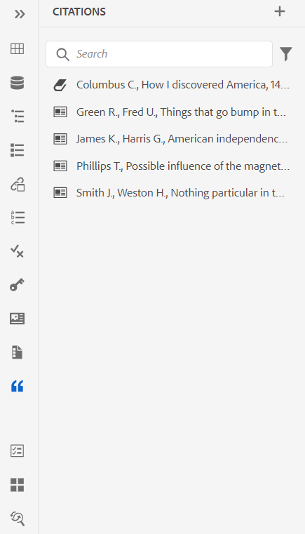
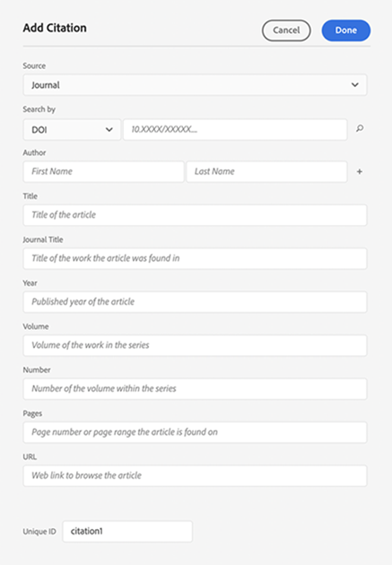
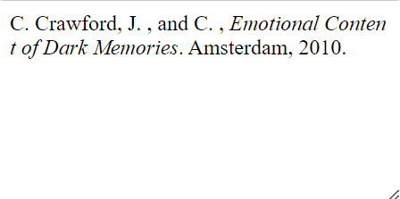
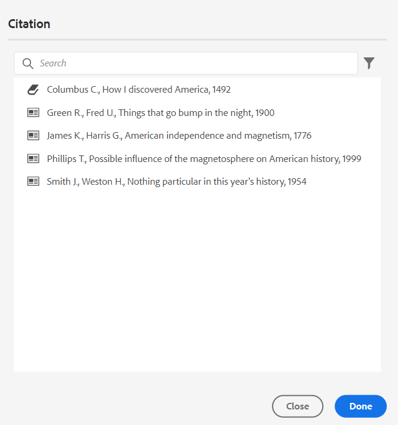
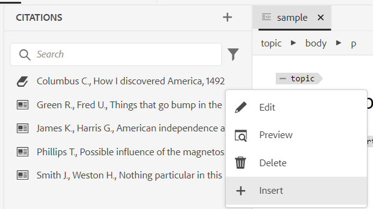
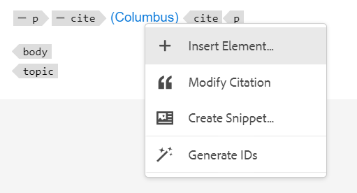

# 在内容中添加和管理引文

引用是指对添加到内容的信息源的引用。 通过使用引文，您可以对源信息的作者进行评分，并帮助读者跟进源信息。 添加引文可让您的内容更可靠并防止抄袭。 它们还允许您显示经过仔细研究的内容。

在AEM Guides中，您可以添加和导入引文，并将其应用到您的内容。 您可以从任何书籍、网站和日记帐来源添加这些引文。

AEM Guides可帮助您编辑、预览和排序您的引用。 将引用添加到内容中后，您可以使用本机PDF生成输出。 您还可以在本机PDF输出中添加书目或引用页面。

AEM Guides支持多种类型的引用，例如现代语言协会(MLA)、美国心理协会(APA)、芝加哥、电气和电子工程师协会(IEEE)和美国心脏协会(AHA)。 建议明确和一致地使用这些指标。

>[!NOTE]
>
>目前，AEM Guides仅支持对引文进行本机PDF。

## 添加引文

要添加引文，请执行以下步骤：

1. 选择 **引用**  图标。
此 **引用** 面板打开。

   {width="300" align="left"}

1. 在 **引用** 面板，选择 . 从下拉菜单中，您可以选择添加新引文或导入引文。

1. 选择 **新建引用** 以添加新的引用。
此 **添加引用** 对话框打开。

    {width="300" align="left"}

1. 填写 **添加引用** 对话框。

   >[!NOTE]
   >
   >您还可以添加ISBN、DOI或PubMed ID。 AEM Guides会自动填充其他字段。

   | 书籍 | 网站 | 日志 |
   | --- | ---|---|
   | **来源**   从下拉菜单中，选择作为“Book”的引文源。 | **来源** &#x200B;从下拉列表中，选择作为网站的引文来源。 | **来源**   从下拉列表中，选择作为日记帐的引用来源。 |
   | **搜索依据**   选择 **ISBN** 或 **DOI** 以搜索与引文关联的数字ID。    DOI：数字对象标识符   ISBN：唯一数字帐簿标识符 | **搜索依据**   选择 **DOI** 以搜索与引文关联的数字ID。 | **搜索依据**   选择 **DOI** 或PubMed ID，以搜索链接到引文的数字ID。      |
   | **作者**   添加引文作者的名字和姓氏。 选择  以添加更多名称。 | **作者**   添加引文作者的名字和姓氏。 选择   以添加更多名称。 | **作者**   添加引文作者的名字和姓氏。 选择 以添加更多名称。 |
   | **标题**   添加书名。 | **标题**   添加网页标题。 | **标题**   添加文章的标题。 |
   | **编辑者**   添加书本的编辑器。 | **网站名称**   添加网站的名称。 | **日志标题**   添加文章所在工作的标题。 |
   | **版本**   添加书的版本。 | **URL**   添加网站的Web链接以浏览内容。 | **年**   添加文章发布的年份。 |
   | **城市**   添加出版物的城市。 | **访问日期**  添加访问网站内容的日期。 | **音量**   添加系列中的工作量。 |
   | **发布者**   添加书籍发布者的名称。 | **发布日期**   添加发布网站内容的日期。 | **数字**   添加系列中卷的编号。 |
   | **年**   添加这本书出版的年份。 | **更新日期**   添加更新网站内容的日期。 | **页面**   添加找到文章的页码或页面范围。 |
   | **版本**   添加书的版本。 | **唯一标识符**   为引文添加唯一ID。 唯一ID是该引文的唯一标识符。 | **URL**  添加指向日志的Web链接。 |
   | **系列**  添加书系列。 |  | **唯一标识符**   为引文添加唯一ID。唯一ID是该引文的唯一标识符。 |
   | **URL**     添加指向书籍的Web链接。 |
   | **唯一标识符**   为引文添加唯一ID。 唯一ID是该引文的唯一标识符。 |

1. 选择&#x200B;**完成**。

   新的引文将添加到“引文”面板。

>[!NOTE]
>
> 必须为引文字段添加唯一ID。  添加引文后，便无法更改唯一ID。

## 导入引文

要导入引文，请执行以下步骤：

1. 在左侧面板中，选择 **引用** .

   此 **引用** 面板打开。

1. 在 **引用** 面板，选择 ，然后选择 **导入** 从下拉菜单中查找。
1. 从系统中浏览.bib文件并将其导入。

   >[!TIP]
   >
   > .bib文件扩展名是BibTeX文献数据库文件。 它是一个特殊格式化的文本文件，列出了有关特定信息源的引用。

   成功导入文件后，您可以在引用面板中查看引用。

   >[!NOTE]
   > <ol><li> AEM Guides仅导入唯一且尚不存在的引用。
    &gt; <li> AEM Guides可以从书籍、日记本或网站导入引文。 目前不支持来自其他来源的引用。

## 管理引文

引用在左侧面板中按字母顺序排序。 根据要在主题中使用的源搜索引文。

### 过滤器

选择 **筛选**  图标，并从下拉列表中选择源选项以筛选引用列表。 它允许进行单选和多选。

* **所有源**：它显示完整的引用列表，包括所有源。

* **书籍**：它显示源自书籍的引用列表。

* **网站**：它显示源自网站的引用列表。

* **日志**：它显示源自日记帐的引用列表。

### 搜索

在引文中搜索您的内容。

1. 在左侧面板中，选择“引文”。
此 **引用** 面板打开。

1. 使用搜索栏从长列表中搜索相应的引用。

### 更改引用样式 {#change-citation-style}

您的系统管理员可以从以下位置更改引文样式： **引用**  中的下拉菜单 **常规设置** 选项卡 **编辑器设置**.
这些样式决定引文在预览窗格或本机PDF输出中的显示方式。

下拉菜单中提供了以下选项：

| MLA | APA | 芝加哥 | IEEE | AHA |
|---|---|---|---|---|
| 现代语言关联样式   | 美国心理协会风格 | 《芝加哥风格手册》 | 电气和电子工程师风格研究所 | 美国心脏协会风格 |
| 示例：  克劳福德，克莱尔等 *黑暗记忆的情感内涵*《记忆编辑》，第16卷，2010年，阿姆斯特丹。 | 示例：   克劳福德(Crawford， C.， J.， &amp;， C.) (2010)。 *黑暗记忆的情感内涵* （505-16版）。 10.1080/09658210902067289 | 示例：   克劳福德，克莱尔等 *黑暗记忆的情感内涵*. 2010年5月16日。 | 示例：   C. Crawford， J.和C. ， *黑暗记忆的情感内涵*. 阿姆斯特丹，2010年。 | 示例：   C. Crawford， J.和C. ， *黑暗记忆的情感内涵*. 阿姆斯特丹，2010年。 |

## 编辑引文

要编辑该引文，请执行以下步骤：

1. 将鼠标悬停在列表中引文的名称上。 选择   该 **选项** 图标。

1. 选择  **编辑**.

此 **编辑引文** 对话框打开。

1. 进行所需的更改。 选择 **完成**.
将编辑选定的引文。

>[!NOTE]
>
>添加引文后，便无法更改唯一ID。

## 预览引用

要预览引用，请执行以下步骤：

将鼠标悬停在列表中引文的名称上。 选择      **选项** 图标。

1. 选择 **预览**.
您可以在预览窗格中预览引文的内容和格式。

   >[!NOTE]
   >
   >预览基于管理员在 **编辑器设置**.

1. 单击屏幕上的任意位置以关闭预览框。

   {width="550" align="left"}

>[!NOTE]
>
> 您还可以从Assets UI或Web编辑器的“预览”选项卡预览在主题中插入的引文。

## 插入引文

执行以下步骤将引用插入到主题：
1. 在存储库面板中选择主题，然后双击以在编辑窗口中将其打开。
1. 将光标放在要添加引文的主题位置。

您可以从主工具栏或左侧面板将引用插入到主题。

### 从主工具栏

1. 选择 **引用**  图标。
1. 在 **引用** 对话框，选择引用。 您还可以选择多个引文。
   {width="300" align="left"}
1. 您可以过滤引文，方法是在的搜索面板中键入前几个字母 **引用** 对话框。

1. 单击 **完成**.
所选引文将添加到主题中的光标位置。

### 从左侧面板

>[!NOTE]
> 
>要查看 **引用** 图标时，系统管理员必须选择 **引用** 中的选项 **面板** tab in **编辑器设置**.

1. 选择 **引用**  图标。
1. 将引文从 **引用** 面板并将其放到主题中的适当位置。

   您还可以选择 **插入** 从   **选项** 插入引文。

   
1. 要选择多个引文，请右键单击主题中的引文，然后选择 **修改引用** 从快捷菜单中。
1. 从中选择要插入的引用 **引用** 对话框。
1. 选择 **完成** 以将其添加到主题。

在主题中插入引文后，可以在Web编辑器中预览它们。 您还可以使用本机PDF发布包含引文的内容。

## 删除引文

您可以从“引文”面板或插入的主题中删除引文。

### 从“引用”面板中删除引用

要从“引文”面板中删除引文，请执行以下步骤：

1. 将鼠标悬停在列表中引文的名称上。
1. 选择  **选项** 图标。
1. 选择   **删除** .
确认对话框打开。
1. 选择 **是**.
所选引文将从引文面板中删除。

### 从主题中删除引用

要删除主题中已使用的引用，请执行以下步骤：

在主题中，将光标放在引文的末尾。

1. 右键单击主题中的引文并选择 **修改引用** 从快捷菜单中。 将打开“引文”对话框。
   

1. 您可以选择要插入到文档中的引文。

   >[!NOTE]
   >
   >主题中已使用的引文将替换为您从对话框中选择的引文。

1. 选择&#x200B;**完成**。

## 生成包含引文的内容输出

在主题中插入引文后，您可以使用本机PDF发布包含引文的内容。

在本机PDF输出中，引文会出现在您插入它们的内容中。 您还可以创建“书目”页面。 当您单击任何引文时，您将被重定向到文献目录页面。

创建 **引用** PDF模板中的页面布局，并将其包含在您的文档中。 书中使用的所有引文都会列在PDF输出中的一个页面上。 要了解有关创建页面布局的更多信息，请查看 [创建页面布局](../native-pdf/components-pdf-template.md#create-page-layout).

要更改引文页面的视图和感觉，请查看 [自定义PDF模板](../native-pdf/pdf-template.md).

### 将内容样式应用于引用

将格式添加到主题后，应用于引文。

1. 选择 **样式表** 在 **模板** 原生PDF输出预设的面板。   它会打开 **样式** 包含所有样式选项的面板。

1. 在搜索面板中，搜索 `<cite>`.

要了解有关样式的更多信息，请查看 [使用常见的内容样式](../native-pdf/stylesheet.md).
