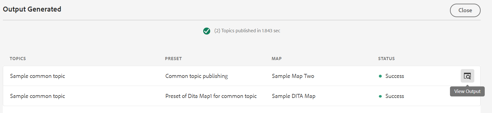

# 从“存储库”面板或“映射视图”面板生成输出 {#id218CL6010AE}

也可以使用为DITA映射创建的输出预设从“存储库”面板或“映射视图”面板生成输出。

- 使用 **快速生成** 存储库面板或“映射视图”面板中的功能，用于为选定的单个主题或整个DITA映射生成输出。

  >[!NOTE]
  >
  > 您还可以访问 **快速生成** 收藏夹面板或搜索面板中的功能。

- 使用 **生成输出** “映射视图”面板中的功能，用于为选定的多个主题生成输出。

## 发布在一个或多个DITA映射中使用的主题

执行以下步骤为DITA映射中的一个或多个主题生成输出：

1. 在 **作者** 选项卡，在DITA映射中选择要发布的主题。

1. 选择 **快速生成** 从选定主题的“选项”菜单中。
   {width="650" align="left"}

1. 要发布在单个DITA映射中使用的主题，请选择要用于发布的映射的输出预设，然后单击 **生成**.
   {width="350" align="left"}

1. 您将看到输出生成过程的状态。 要查看输出，请将鼠标指针悬停在主题上，然后单击“查看输出”。

1. 如果您有一个在多个主题中使用的公共主题，请选择各种DITA映射以及要用于发布和单击的输出预设 **生成。**

   {width="350" align="left"}

1. 您将看到输出生成过程的状态。

   - **主题**：列出为其生成输出的选定主题。
   - **预设**：显示包含所选主题的输出预设。
   - **地图**：列出包含选定主题的DITA映射。
   - **状态**：显示每个主题的发布状态。
要查看输出，请将鼠标指针悬停在主题上，然后单击“查看输出”。
     {width="800" align="left"}

## 从Web编辑器生成DITA映射的输出

执行以下步骤可生成整个DITA映射的输出：

1. 在 **作者** 选项卡，选择要发布的DITA映射。

1. 选择 **快速生成** 从DITA映射的“选项”菜单中。

   {width="650" align="left"}

1. 选择要用于发布的DITA映射的输出预设，然后单击 **生成。**

1. 您将看到输出生成过程的状态。 要查看输出，请将鼠标指针悬停在主题上，然后单击“查看输出”。

## 生成多个主题的输出

从“映射视图”面板执行以下步骤来为DITA映射中的多个主题生成输出：

1. 在 **作者** 选项卡，选择要发布的主题。

1. 选择 **生成输出** 从底部的“选项”菜单中。

1. 选择要用于发布的DITA映射的输出预设。

   >[!NOTE]
   >
   > 您将只看到包含所有选定主题的当前DITA映射的输出预设。

   {width="650" align="left"}

1. 您将看到输出生成过程的状态。要查看输出，请将鼠标指针悬停在主题上，然后单击“查看输出”。

**父主题：**[&#x200B;从Web编辑器中基于文章的发布](web-editor-article-publishing.md)
